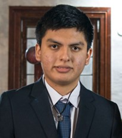

# Capítulo I: Introducción

## 1.1. StartUp Profile

### 1.1.1. Descripción de la StartUp

### 1.1.2. Perfiles de Integrantes del equipo

| Nombre Completo del integrante       | Descripcion de Carrera                                                                           | Fotografía                                   | Conocimientos y Habilidades a apuntar                                                                                                                                                                                                                                               |
| ------------------------------------ | ------------------------------------------------------------------------------------------------ | -------------------------------------------- | ----------------------------------------------------------------------------------------------------------------------------------------------------------------------------------------------------------------------------------------------------------------------------------- |
|                                      |                                                                                                  |                                              |                                                                                                                                                                                                                                                                                     |
| Noriega Suschenko Anatoly Andrey     | Ingeniería de Software  5to Ciclo 2024-1 Universidad Peruana de Ciencias Aplicadas      |  | - Conocimientos en lenguajes de Programación como C++, Python, HTML, CSS. -Considero que soy una persona muy perseverante y que sabe trabajar en equipo.                                                                                                                         |
| Garcia Rodriguez Gabriel Stefano     | Ingeniería de Software  5to Ciclo 2024-1 Universidad Peruana de Ciencias Aplicadas      |   | - Conocimientos de lenguajes de programación c++, python, html y css. - Habilidades de liderazgo y contribución en equipo.                                                                                                                                                       |
| Apaza Morales Fabricio Josué Emanuel | Ingeniería de Software  5to Ciclo   2024-01   Universidad Peruana de Ciencias aplicadas |      | - Conocimientos en lenguajes de programación como C++, Python, Html y CSS.Considero que puedo aportar en el equipo, ya que soy responsable y trato de cumplir con las partes que se delegan en el equipo. A la vez, colaboro con ideas para poder lograr un buen trabajo en equipo. |
| Flores Avalos Diego                  | Ingeniería de Software  5to Ciclo 2024-1 Universidad Peruana de Ciencias Aplicadas      |         | - Conocimientos de programación en los lenguajes C++, HTML, CSS y JavaScript.  - Considero que soy una persona responsable y que se esfuerza en lograr un buen desempeño en los trabajos grupales.                                                                               |

## 1.2. Solution Profile

### 1.2.1. Antecedentes y Problemática

Los antecedentes son esenciales para una comprensión más profunda de la problemática en cuestión. Por esta razón, hemos aplicado la técnica de las "5W 2H":

### 1.2.2. Lean UX Process

#### 1.2.2.1. Lean UX Problem Statements

#### 1.2.2.2. Lean UX Assumptions

#### 1.2.2.3. Lean UX Hypothesis Statements

### 1.2.2.4. Lean UX Canvas

## 1.3. Segmento Objetivo
