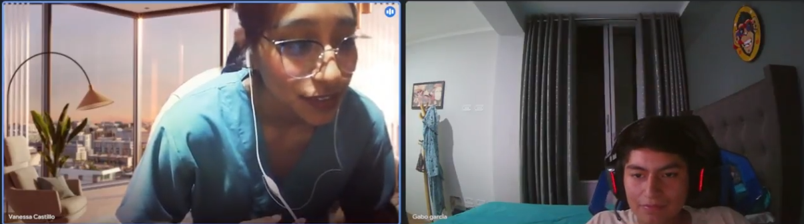

# Capítulo II: Requirements Elicitation & Analysis

## 2.1. Competidores

### 2.1.1 Análisis Competitivo
<table>
  <tr>
    <th colspan="22">Competitive Analysis Landscape</th>
  </tr>
  <tr>
    <td colspan="1">¿Por qué llevar a cabo el análisis?</td>
    <td colspan="17">Este análisis nos ayuda a entender las particularidades de cada sitio web o aplicación, identificar la competencia en el mercado y planificar cómo abordar las oportunidades. También nos permite trabajar en la mejora continua de nuestras áreas de desarrollo.</td>
  </tr>
  <tr>
    <td colspan="2">(En la cabecera colocar por cada competidor nombre y logo)</td>
    <td>Macconsultor </td>
    <td>SEPSA Abogados </td>
    <td>Legify </td>
    <td>Meeting Pros </td>
</tr>
  <tr>
    <td rowspan="2">Perfil</td>
    <td>Overview</td>
    <td>Una firma con experiencia desde 2006, Maconsultor combina conocimientos médicos y legales para ofrecer asesoría jurídica y representación legal a profesionales de la salud, así como gestión de riesgos médico-legales y recursos humanos en el sector salud.</td>
    <td>Especializados en la protección jurídica y económica de los profesionales sanitarios, SEPSA Abogados se dedica a la defensa frente a las denuncias y demandas originadas por la práctica médica.</td>
    <td>Legify es una plataforma global que facilita la búsqueda y consulta de abogados online para un amplio rango de necesidades legales, incluyendo pero no específicamente en el área de la salud.</td>
    <td>Esta web ofrece acceso instantáneo a profesionales de diversas disciplinas, incluidos médicos y abogados, para atender consultas, con una alta disponibilidad y volumen de atención diaria.</td>
  </tr>
  <tr>
  <td>Ventaja Competitiva</td>
  <td>Proporciona un asesoramiento especializado en el cruce del derecho y la medicina, ideal para casos médico-legales complejos.</td>
    <td>Ofrece protección jurídica especializada a profesionales de la salud, con enfoque en defensa legal en litigios.</td>
    <td>Facilita la búsqueda de abogados especializados en diversas áreas, incluida la medicina, mediante consultas online.</td>
    <td>Asegura disponibilidad inmediata de profesionales para consultas, con un alto volumen de atención diaria.</td>
    </tr>
<tr>
    <td rowspan="2">Perfil de Marketing</td>
    <td>Mercado Objetivo</td>
    <td>Profesionales de la salud que necesitan asesoramiento jurídico con base médica.</td>
    <td>Médicos en busca de defensa legal ante demandas profesionales.</td>
    <td>Usuarios que requieren consultas legales accesibles en línea.</td>
    <td>Médicos y abogados que buscan respuestas rápidas a consultas profesionales urgentes.</td>
  </tr>
  <tr>
  <td>Estrategias de Marketing</td>
  <td>Publicidad en línea.</td>
    <td>Publicidad en revistas digitales.</td>
    <td>Publicidad en línea y redes sociales.</td>
    <td>Publicidad en línea y redes sociales.</td>
    </tr>
<tr>
    <td rowspan="3">Perfil de Producto</td>
    <td>Productos y Servicios</td>
    <td>Ofrece un conjunto integrado de servicios que combinan asesoría legal y consultoría en gestión para profesionales del sector salud. Se especializa en representación judicial, gestión de recursos humanos, cartera y riesgo médico legal, apuntando a una solución completa para las necesidades jurídicas y administrativas de sus clientes.</td>
    <td>Se centra en brindar protección jurídica y económica a profesionales de la salud. Ofrece defensa legal contra demandas y denuncias relacionadas con la práctica profesional, además de asesoramiento sobre prevención de riesgos legales, asegurando una cobertura amplia para enfrentar los desafíos jurídicos del ámbito médico.</td>
    <td>Facilita el acceso a servicios de asesoría legal a través de su plataforma online, conectando a usuarios con abogados especializados en diversas áreas, incluida la medicina. Destaca por ofrecer consultas legales digitales que permiten una comunicación eficaz y directa, satisfaciendo las necesidades legales de un amplio espectro de clientes.</td>
    <td>Proporciona un servicio de consultas online que conecta a usuarios con expertos en distintas áreas, como medicina y derecho, enfocado en ofrecer respuestas inmediatas a situaciones urgentes. Es ideal para profesionales que buscan asesoramiento rápido y fiable, ofreciendo un acceso fácil y rápido a expertos calificados.</td>
  </tr>
  <tr>
  <td>Precios y Costos</td>
  <td>- Tarifas fijas para servicios específicos. - Tarifas por hora para asesoría - Paquetes para servicios de gestión integrados.</td>
    <td>- Tarifas fijas para servicios específicos. - Tarifas por hora para asesoría - Suscripciones para asesoramiento preventivo</td>
    <td>- Tarifas de acuerdo al abogado elegido. - Consultas iniciales gratuitas - Pago por servicio o suscripciones. </td>
    <td>- Tarifas por consulta - Sistema de créditos para servicios. - Paquetes de créditos o suscripciones.</td>
    </tr>
<td>Canales de distribución (Web y/o Móvil)</td>
  <td>Sitio Web</td>
    <td>Sitio Web</td>
    <td>Sitio Web y móvil</td>
    <td>Sitio Web y Aplicación móvil</td>
    </tr>
<tr>
    <td rowspan="4">Análisis SWOT</td>
    <td>Fortalezas</td>
    <td>- Especialización dual en medicina y derecho. - Amplia experiencia desde 2006. - Servicios integrados de gestión y asesoría.</td>
    <td>- Especialización en protección jurídica de la salud. - Enfoque en prevención y defensa legal. - Experiencia en litigios complejos.</td>
    <td>- Acceso fácil a consultas legales online. - Amplia gama de especialidades legales. - Plataforma intuitiva y fácil de usar.</td>
    <td>- Respuesta inmediata a consultas. - Diversidad de profesionales disponibles. - Accesibilidad a través de web y móvil.</td>
  </tr>
  <tr>
  <td>Debilidades</td>
  <td>- Enfoque limitado a profesionales de la salud. - Posible limitación geográfica de servicios. - Competencia con plataformas más accesibles digitalmente.</td>
    <td>- Oferta limitada a servicios legales. - Menor visibilidad digital. - Enfoque en un segmento de mercado específico.</td>
    <td>- Falta de especialización en sector salud. - Competencia con servicios legales gratuitos. - Dependencia de la tecnología para la prestación de servicios.</td>
    <td>- Posible sobrecarga por demanda de consultas. - Calidad variable de las consultas. - Dependencia de la tecnología.</td>
    </tr>
<td>Oportunidades</td>
  <td>- Expansión a mercados internacionales. - Desarrollo de una plataforma móvil. - Alianzas con instituciones médicas y legales.</td>
    <td>- Expansión de servicios online. - Colaboración con asociaciones médicas. - Ofrecer talleres y formación en riesgo legal.</td>
    <td>- Especialización en nichos de mercado como el sector salud. - Expansión global del servicio. - Desarrollo de aplicaciones móviles específicas.</td>
    <td>- Integración de IA para filtrar consultas. - Expansión de servicios a nuevas áreas profesionales. - Alianzas con instituciones educativas y hospitales.</td>
    </tr>
<td>Amenazas</td>
  <td>- Cambios regulatorios en el sector salud. - Nuevos competidores digitales. - Riesgo de obsolescencia tecnológica.</td>
    <td>- Aumento de la competencia. - Cambios en la legislación del sector salud. - Percepción pública negativa de litigios médicos.</td>
    <td>- Cambios en la regulación de consultas legales online. - Competencia de plataformas con modelos gratuitos. - Riesgos de seguridad y privacidad de datos.</td>
    <td>- Aumento de competidores en el espacio online. - Problemas de confidencialidad y privacidad. - Cambios tecnológicos rápidos que requieren actualizaciones constantes.</tr>
</table>

### 2.1.2. Estrategias y tácticas frente a competidores.
Para enfrentar a los competidores establecidos en el mercado de asesoramiento legal para profesionales de la salud, nuestra estrategia se centra en la diferenciación mediante la especialización en el nicho de derecho médico. Planeamos ofrecer contenido educativo especializado, una plataforma fácil de usar y acceso a una red de expertos en litigios de salud. Además, implementaremos estrategias de marketing digital focalizadas, estableceremos alianzas estratégicas con instituciones médicas y mantendremos un modelo de precios competitivo. A través de estas tácticas, nuestra aplicación buscará establecerse como una autoridad en el campo, proporcionando soluciones personalizadas y efectivas para las necesidades legales de médicos y estudiantes de medicina.
## 2.2. Entrevistas
La entrevista se realiza con el objetivo de obtener mayor información acerca de los usuarios y del servicio de tecnología. De este modo, podremos conocer cuál es sus puntos de vista respecto a los servicios electrónicos, qué problemas tuvieron y cuáles son sus expectativas frente a los nuevos servicios educativos virtuales.

### 2.2.1 Diseño de entrevistas  
**Preguntas para Doctores**
- Presentación (Nombre, lugar en el que trabaja y rol que desempeña)
- ¿Cuánto tiempo lleva ejerciendo la carrera de medicina y/o su especialidad?
- ¿Cómo se siente cada vez que tiene que realizar una intervención quirúrgica?
- ¿Alguna vez ha enfrentado algún problema médico con un paciente? En caso no, ¿conoce algún caso?
- ¿Conoce a algún colega que haya tenido problemas con un paciente o con la familia de este debido al resultado de una cirugía?
- Si tuviera algún problema con el resultado de la cirugía de su paciente, ¿que haría? ¿Buscaría ayuda profesional?

**Preguntas para Estudiantes Medicinas**

- Presentación(Nombre, edad, centro de estudios)  
- ¿Cuánto tiempo llevas estudiando medicina?  
- ¿Estás desempeñando practicas médicas en algún Hospital? ¿En que hospital?  
- ¿Has tenido alguna mala experiencia mientras realizabas tus practicas médicas? ¿Conociste a alguien que haya tenido una mala experiencia?  
- ¿Alguna vez has escuchado sobre las negligencias médicas que ocurren en el país? ¿Qué opinas sobre eso?  
- ¿Qué conocimientos tienes sobre la responsabilidad médica y las posibles implicaciones legales que pueden surgir durante la práctica clínica?  
- ¿Has recibido alguna formación o orientación específica sobre cómo evitar situaciones que puedan llevar a denuncias por negligencia médica durante tu formación médica? ¿Cómo cuales?  
- ¿Algún profesor de tu facultad les ha comentado sobre si tuvo alguna negligencia? En caso de si, ¿que hizo al respecto?  
- ¿Te gustaría tener acceso a servicios legales especializados en el campo de la medicina para obtener asesoramiento o defensa en caso de enfrentar una denuncia por negligencia médica en el futuro? ¿Cómo cuales: asesorías, cursos, talleres, etc?

### 2.2.2. Registro de entrevistas  

#### Entrevista 1: Mision Augusto Noriega Ambulodegui
Link de la entrevista: https://drive.google.com/file/d/1VNhL-g8b2xTTzm53uix9knN78Enx8its/view?usp=sharing

#### Presentación (Nombre, lugar en el que trabaja y rol que desempeña)
El nombre del entrevistado es Mision Augusto Noriega Ambulodegui, trabaja en el hospital Guillermo Almenara Irigoyen como anestesiólogo.
#### ¿Cuánto tiempo lleva ejerciendo la carrera de medicina y/o su especialidad?
Lleva ejerciendo como médico por más de 30 años y 22 años aproximadamente en su especialidad.
#### ¿Cómo se siente cada vez que tiene que realizar una intervención quirúrgica?
El doctor Mision Noriega, como anestesiologo, se encarga de administrar la anestesia en intervenciones quirúrgicas en una variedad de especialidades médicas donde su presencia es necesaria. Es consciente de que todos los procedimientos quirúrgicos y anestésicos conllevan riesgos inherentes y entiende que, aunque la probabilidad puede ser pequeña, siempre existe la posibilidad de enfrentar complicaciones. A pesar de que se pueden conocer los antecedentes del paciente, subraya que cada caso es único y hay eventualidades que, aunque improbables, pueden ocurrir durante una cirugía.
#### ¿Alguna vez ha enfrentado algún problema médico con un paciente? En caso no, ¿conoce algún caso?
Menciona que en su caso nunca ha tenido un problema legal respecto al tema, pero que si ha tenido un suceso en el que uno de sus pacientes había fallecido a causa de la enfermedad que este tenía. Comenta también que son situaciones que podrían pasar ya sea antes, durante o después de una cirugía y que es un problema que varios médicos se enfrentan día a día. También ha oído casos, especialmente en las noticias, donde se logran apreciar casos que aparentemente son de negligencia médica, pero que, a veces, no se evaluan varios factores o que no se difunden correctamente.
#### ¿Conoce a algún colega que haya tenido problemas con un paciente o con la familia de este debido al resultado de una cirugía?
El Dr. Mision Augusto Noriega Ambulodegui fue involucrado en un caso legal tras una denuncia contra un colega ginecólogo por olvidar una gasa dentro de una paciente tras un procedimiento quirúrgico. Aunque no participó en la cirugía, su implicación surgió por haber otorgado el alta a la paciente. Ante la denuncia, y sin conocimiento previo del error, tuvo que contactar a un abogado para esclarecer su limitada responsabilidad en el cuidado postoperatorio. Finalmente, el caso se resolvió a su favor, pero el desenlace del caso contra su colega le quedó desconocido.
#### Si tuviera algún problema con el resultado de la cirugía de su paciente, ¿que haría? ¿Buscaría ayuda profesional?
El Dr. Mision destacó que en su institución existe un mecanismo de asesoría para el asegurado que incluye la evaluación de la seguridad del paciente en casos de fallecimiento. Este proceso es particularmente riguroso en situaciones de mortalidad materna e infantil; cualquier deceso materno, independientemente de la causa, desencadena automáticamente una investigación de auditoría médica. Esta práctica subraya el compromiso de la institución con la seguridad del paciente y la mejora continua de la calidad del cuidado médico.

#### Entrevista 2: Augusto Manuel Vasquez Carrasco (Medico)
Link de la entrevista: https://youtu.be/X4m2RZOYVh0
 
#### Presentación (Nombre, lugar en el que trabaja y rol que desempeña)
El nombre del entrevistado es Augusto ,Manuel Vasquez Carrasco , trabaja en el INSN en San borja, y varias clinias en el sector privado.
#### ¿Cuánto tiempo lleva ejerciendo la carrera de medicina y/o su especialidad?
#### ¿Cómo se siente cada vez que tiene que realizar una intervención quirúrgica?
#### ¿Alguna vez ha enfrentado algún problema médico con un paciente? En caso no, ¿conoce algún caso?
#### ¿Conoce a algún colega que haya tenido problemas con un paciente o con la familia de este debido al resultado de una cirugía?
#### Si tuviera algún problema con el resultado de la cirugía de su paciente, ¿que haría? ¿Buscaría ayuda profesional?

#### Entrevista 3: Liliana Edith Requejo Lozada (Medico)
Link de la entrevista: https://youtu.be/YS7eacvd0Jg 

#### Presentación (Nombre, lugar en el que trabaja y rol que desempeña)
#### ¿Cuánto tiempo lleva ejerciendo la carrera de medicina y/o su especialidad?
#### ¿Cómo se siente cada vez que tiene que realizar una intervención quirúrgica?
#### ¿Alguna vez ha enfrentado algún problema médico con un paciente? En caso no, ¿conoce algún caso?
#### ¿Conoce a algún colega que haya tenido problemas con un paciente o con la familia de este debido al resultado de una cirugía?
#### Si tuviera algún problema con el resultado de la cirugía de su paciente, ¿que haría? ¿Buscaría ayuda profesional?

**Entrevista 2: Vanessa Castillo (Estudiante de Medicina)**

Link de la entrevista: https://drive.google.com/file/d/1mJLBE8t4ly_WCAdv1KpC0yVjmPrivafv/view?usp=sharing

#### Presentación(Nombre, edad, centro de estudios)

Vanessa Castillo, 21 años, Universidad Privada del Norte

#### ¿Cuánto tiempo llevas estudiando medicina?

2 años y medio estudiando

#### ¿Estás desempeñando practicas médicas en algún Hospital? ¿En que hospital?

Si, actualmente en una clinica de Los Olivos.

#### ¿Has tenido alguna mala experiencia mientras realizabas tus practicas médicas? ¿Conociste a alguien que haya tenido una mala experiencia?

No tuve una mala experiencia como tal, pero si compañeros y profesores contaron sus malas experiencias que tuvieron en el transcurso de su formacion academica.

#### ¿Alguna vez has escuchado sobre las negligencias médicas que ocurren en el país? Que opinas sobre eso?

Si, ahora ultimo en las noticias mas que todo, y bueno yo opino ue es muy triste, ¿no? Un acto inhumano por parte de los médicos que, no sé, es es un trabajo mal, ya que, necesitamos prepararnos constantemente como profesionales de la salud, ya que estamos tratando con seres vivos, personas o animales, y es importante prevalecer la salud en ellos. Y bueno, más que todo porque nos dan la confianza

#### ¿Qué conocimientos tienes sobre la responsabilidad médica y las posibles implicaciones legales que pueden surgir durante la práctica clínica?

No tengo muchos conocimientos acerca de la responsabilidad medica salvo un curso que tome en los primeros ciclos.

#### ¿Has recibido alguna formación o orientación específica sobre cómo evitar situaciones que puedan llevar a denuncias por negligencia médica durante tu formación médica? ¿Cómo cuales?

Si he tenido alguna formación de, este, directamente todavía, obviamente, me falta del el transcurso del de mi preparación, pero poco a poco los profesores eso nos inculcan, más que todo el el abordaje, para el abordaje de un paciente. Como paso básico siempre nos mandan, este, más que todo los primeros auxilios en los pacientes. Desde el primer paso y y lo más importante es siempre estar en en capacitación. Si los profesores no nos lo dan, buscar por nosotros mismos los medios.
  
#### ¿Algún profesor de tu facultad les ha comentado sobre si tuvo alguna negligencia? En caso de si, que hizo al respecto?

Más que todo como negligencia no suena así, pero sí nos contó una experiencia así mi profesor, que era mi profesor de anatomía y fisiología. Como primer año de estudiante, nos contó una pequeña historia que bueno, pasamos cualquier estudiante de salud, nos contó esa anécdota como para estar preparado para todos, en ese caso se presentó en un accidente y él estaba ahí y la persona creo que se estaba atragantando, y bueno, al no tener claro cómo actuar por este y el mismo entorno,la gente que se asusta, la presión que siente uno, la ansiedad, nervios, tal vez, no se pudo concentrar en ayudar a la persona, pero ya a lo largo del tiempo pudo controlar ese tipo de actitudes y ya poder enfrentar mejor esa situación, si es que en caso vuelva a pasar.

#### ¿Te gustaría tener acceso a servicios legales especializados en el campo de la medicina para obtener asesoramiento o defensa en caso de enfrentar una denuncia por negligencia médica en el futuro? ¿Como cuales: asesorías, cursos, talleres, etc?

Sí, claro que sí, a cualquier estudiante de salud le gustaría. Citas asesoradas por especialistas, con mayor experiencia, los profesores que sepan, Incluso talleres, cursos, reforzamientos, todo. Creo que no soy la única. Ya todas las personas necesariamente que están estudiando áreas de la salud deberían saberlo. Y y bueno, las personas de no solamente del área de salud, sino todos, porque es importante. Pero en en el área de la salud creo que es indispensable que lo sepa.

### 2.2.3. Análisis de entrevistas
#### Entrevista 1: Mision Augusto Noriega Ambulodegui
#### Hallazgos:
Mision Augusto Noriega Ambulodegui compartió experiencias significativas relacionadas con los desafíos legales y médicos en su práctica como anestesiólogo. Destacó la importancia de la asesoría experta en casos de complicaciones médicas y denuncias. La mención de un mecanismo institucional para revisar casos de mortalidad materna e infantil refleja la necesidad crítica de contar con recursos educativos y de asesoramiento profesional para médicos. La ausencia de uso previo de aplicaciones especializadas en el ámbito del peritaje médico por parte del Dr. Noriega sugiere una oportunidad de mercado para una solución digital que facilite el acceso a conocimientos y asesoramiento en esta área crucial.
#### Conclusiones:
La entrevista con el Dr. Noriega destaca una clara oportunidad de mercado para una aplicación que proporcione asesoramiento experto y recursos educativos en peritaje médico. Su experiencia subraya la necesidad entre profesionales y estudiantes de medicina por una herramienta que facilite la comprensión y manejo de desafíos legales y médicos. La ausencia de uso previo de soluciones digitales en este ámbito sugiere una fuerte potencial de adopción para la aplicación propuesta.

**Entrevista 2: Vanessa Castillo**

**Conclusiones:**

Después de realizar las entrevistas, se obtuvo información valiosa sobre las experiencias y perspectivas de los usuarios en relación a los servicios de tecnología. En el caso de la entrevista con Vanessa Castillo, una estudiante de medicina, se destacó su interés en tener acceso a servicios legales especializados en el campo de la medicina para obtener asesoramiento o defensa en caso de enfrentar una denuncia por negligencia médica en el futuro. Además, mencionó la importancia de recibir formación y orientación específica sobre cómo evitar situaciones que puedan llevar a denuncias por negligencia médica durante su formación médica. Estos hallazgos nos permiten comprender mejor las necesidades y expectativas de nuestros usuarios y nos ayudarán a diseñar soluciones que satisfagan sus requerimientos.

## 2.3. Needfinding
Posteriormente a las entrevistas, pudimos obtener la información sobre sus deseos, frustraciones, situación y múltiples datos que nos van a servir para satisfacer sus necesidades, mejorando la experiencia a nuestros usuarios. 
Esta información también nos ayudará a realizar los esquemas para las secciones de User Personas, User Task Matrix, User Journey Maps y el Empathy Mapping.

### 2.3.1. User Persona
En el proceso de desarrollo de un sitio web para ayudar a médicos que sufren demandas por las familias de sus pacientes debido a problemas que no pueden ser principalmente del médico como negligencias del hospital, etc. Es fundamental comprender en profundidad las necesidades y preferencias de los usuarios finales. Con este fin, hemos llevado a cabo un detallado análisis de entrevistas tanto con potenciales usuarios como con competidores en el ámbito de la seguridad y protección contra incendios. Los datos valiosos obtenidos de estas entrevistas nos han proporcionado información crucial sobre las expectativas y obstáculos de nuestra audiencia objetivo.

Los textos que se presentaron anteriormente detallan las entrevistas realizadas con dos individuos distintos. A través de estas entrevistas, hemos identificado características y necesidades esenciales que guiarán la creación de las fichas de User Persona.

En las fichas de User Persona que se presentarán a continuación, se ampliarán y detallarán las características individuales de estos usuarios ficticios, incluyendo aspectos como su edad, ocupación, habilidades, frustraciones y objetivos. Estas fichas de User Persona servirán como representaciones detalladas de nuestros usuarios objetivo y nos permitirán tomar decisiones informadas en el diseño y desarrollo que se adapten de manera efectiva a sus necesidades y preferencias.

En resumen, los artefactos a presentar en esta sección están estrechamente relacionados con las principales características identificadas en los textos, y las fichas de User Persona son herramientas esenciales para garantizar que nuestras soluciones se centren en los usuarios y se ajusten a sus perfiles y requisitos específicos

**_Segmento Objetivo 1: Medicos_**

**_Segmento Objetivo 2: Estudiante de Medicina_**

### 2.3.2. User Task Matrix

| Task Matrix             | Clara Frecuencia| Clara Importancia| Carlos Frecuencia | Carlos Importancia |
|-----------------------------|---------|-------------|-------------|-------|
| Búsqueda de un entorno seguro | Siempre | A veces     | Siempre | Alta  |
| Interfaz y entorno amigable  | Casi nunca | A veces | A veces       | A veces |
| Registrarse                 | A veces | Bajo        | A veces     | Bajo  |
| Iniciar sesión              | Siempre | Medio       | Siempre     | Medio |
| Explorar casos de estudio   | A veces | Alto        | Siempre     | Alto  |
| Solicitar asesoramiento     | A veces | Medio       | Siempre     | Medio |
| Suscribirse a un plan de servicio | Siempre | Medio | Siempre     | Medio |
| Participar en foros de discusión | A veces | Medio | Siempre     | Medio |
| Actualizar información de perfil | A veces | Alto | A veces     | Alto  |
| Leer artículos y guías      | Siempre | Medio       | Casi nunca  | Medio |

### 2.3.3. User Journey Mapping

### 2.3.4. Empathy Mapping

**_Segmento Objetivo 1: Medicos_**

**_Segmento Objetivo 2: Estudiante de Medicina_**

### 2.3.5. As-is Scenario Mapping

**_Segmento Objetivo 1: Medicos_**

**_Segmento Objetivo 2: Estudiante de Medicina_**

### 2.3.6. Ubiquitous Language

**Lex Artis:** Es un término legal que se utiliza para evaluar si un médico ha actuado de acuerdo con los estándares aceptados de la práctica médica.

**Negligencia médica:** Se refiere a un tipo de error médico en el que un médico o profesional de la salud comete un error o actúa de manera negligente en la atención de un paciente, lo que resulta en daño o lesión para el paciente.

**Praxis médica:** Se refiere al conjunto de acciones y procedimientos que un médico realiza en la práctica diaria para diagnosticar, tratar y cuidar a los pacientes.

**Lex artis ad hoc:** Se refiere al conjunto de reglas y estándares que se aplican en una situación específica o ad hoc. En este contexto, se refiere a los estándares y prácticas médicas que se aplican en casos particulares.
