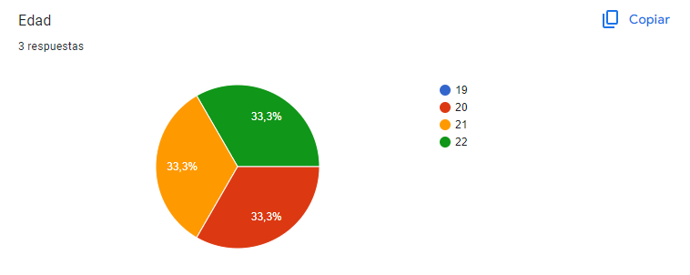

# Capítulo II: Requirements Elicitation & Analysis

## 2.1. Competidores

### 2.1.1 Análisis Competitivo
<table>
  <tr>
    <th colspan="22">Competitive Analysis Landscape</th>
  </tr>
  <tr>
    <td colspan="1">¿Por qué llevar a cabo el análisis?</td>
    <td colspan="17">Este análisis nos ayuda a entender las particularidades de cada sitio web o aplicación, identificar la competencia en el mercado y planificar cómo abordar las oportunidades. También nos permite trabajar en la mejora continua de nuestras áreas de desarrollo.</td>
  </tr>
  <tr>
    <td colspan="2">(En la cabecera colocar por cada competidor nombre y logo)</td>
    <td>Macconsultor </td>
    <td>SEPSA Abogados </td>
    <td>Legify </td>
    <td>Meeting Pros </td>
</tr>
  <tr>
    <td rowspan="2">Perfil</td>
    <td>Overview</td>
    <td>Una firma con experiencia desde 2006, Maconsultor combina conocimientos médicos y legales para ofrecer asesoría jurídica y representación legal a profesionales de la salud, así como gestión de riesgos médico-legales y recursos humanos en el sector salud.</td>
    <td>Especializados en la protección jurídica y económica de los profesionales sanitarios, SEPSA Abogados se dedica a la defensa frente a las denuncias y demandas originadas por la práctica médica.</td>
    <td>Legify es una plataforma global que facilita la búsqueda y consulta de abogados online para un amplio rango de necesidades legales, incluyendo pero no específicamente en el área de la salud.</td>
    <td>Esta web ofrece acceso instantáneo a profesionales de diversas disciplinas, incluidos médicos y abogados, para atender consultas, con una alta disponibilidad y volumen de atención diaria.</td>
  </tr>
  <tr>
  <td>Ventaja Competitiva</td>
  <td>Proporciona un asesoramiento especializado en el cruce del derecho y la medicina, ideal para casos médico-legales complejos.</td>
    <td>Ofrece protección jurídica especializada a profesionales de la salud, con enfoque en defensa legal en litigios.</td>
    <td>Facilita la búsqueda de abogados especializados en diversas áreas, incluida la medicina, mediante consultas online.</td>
    <td>Asegura disponibilidad inmediata de profesionales para consultas, con un alto volumen de atención diaria.</td>
    </tr>
<tr>
    <td rowspan="2">Perfil de Marketing</td>
    <td>Mercado Objetivo</td>
    <td>Profesionales de la salud que necesitan asesoramiento jurídico con base médica.</td>
    <td>Médicos en busca de defensa legal ante demandas profesionales.</td>
    <td>Usuarios que requieren consultas legales accesibles en línea.</td>
    <td>Médicos y abogados que buscan respuestas rápidas a consultas profesionales urgentes.</td>
  </tr>
  <tr>
  <td>Estrategias de Marketing</td>
  <td>Publicidad en línea.</td>
    <td>Publicidad en revistas digitales.</td>
    <td>Publicidad en línea y redes sociales.</td>
    <td>Publicidad en línea y redes sociales.</td>
    </tr>
<tr>
    <td rowspan="3">Perfil de Producto</td>
    <td>Productos y Servicios</td>
    <td>Ofrece un conjunto integrado de servicios que combinan asesoría legal y consultoría en gestión para profesionales del sector salud. Se especializa en representación judicial, gestión de recursos humanos, cartera y riesgo médico legal, apuntando a una solución completa para las necesidades jurídicas y administrativas de sus clientes.</td>
    <td>Se centra en brindar protección jurídica y económica a profesionales de la salud. Ofrece defensa legal contra demandas y denuncias relacionadas con la práctica profesional, además de asesoramiento sobre prevención de riesgos legales, asegurando una cobertura amplia para enfrentar los desafíos jurídicos del ámbito médico.</td>
    <td>Facilita el acceso a servicios de asesoría legal a través de su plataforma online, conectando a usuarios con abogados especializados en diversas áreas, incluida la medicina. Destaca por ofrecer consultas legales digitales que permiten una comunicación eficaz y directa, satisfaciendo las necesidades legales de un amplio espectro de clientes.</td>
    <td>Proporciona un servicio de consultas online que conecta a usuarios con expertos en distintas áreas, como medicina y derecho, enfocado en ofrecer respuestas inmediatas a situaciones urgentes. Es ideal para profesionales que buscan asesoramiento rápido y fiable, ofreciendo un acceso fácil y rápido a expertos calificados.</td>
  </tr>
  <tr>
  <td>Precios y Costos</td>
  <td>- Tarifas fijas para servicios específicos. - Tarifas por hora para asesoría - Paquetes para servicios de gestión integrados.</td>
    <td>- Tarifas fijas para servicios específicos. - Tarifas por hora para asesoría - Suscripciones para asesoramiento preventivo</td>
    <td>- Tarifas de acuerdo al abogado elegido. - Consultas iniciales gratuitas - Pago por servicio o suscripciones. </td>
    <td>- Tarifas por consulta - Sistema de créditos para servicios. - Paquetes de créditos o suscripciones.</td>
    </tr>
<td>Canales de distribución (Web y/o Móvil)</td>
  <td>Sitio Web</td>
    <td>Sitio Web</td>
    <td>Sitio Web y móvil</td>
    <td>Sitio Web y Aplicación móvil</td>
    </tr>
<tr>
    <td rowspan="4">Análisis SWOT</td>
    <td>Fortalezas</td>
    <td>- Especialización dual en medicina y derecho. - Amplia experiencia desde 2006. - Servicios integrados de gestión y asesoría.</td>
    <td>- Especialización en protección jurídica de la salud. - Enfoque en prevención y defensa legal. - Experiencia en litigios complejos.</td>
    <td>- Acceso fácil a consultas legales online. - Amplia gama de especialidades legales. - Plataforma intuitiva y fácil de usar.</td>
    <td>- Respuesta inmediata a consultas. - Diversidad de profesionales disponibles. - Accesibilidad a través de web y móvil.</td>
  </tr>
  <tr>
  <td>Debilidades</td>
  <td>- Enfoque limitado a profesionales de la salud. - Posible limitación geográfica de servicios. - Competencia con plataformas más accesibles digitalmente.</td>
    <td>- Oferta limitada a servicios legales. - Menor visibilidad digital. - Enfoque en un segmento de mercado específico.</td>
    <td>- Falta de especialización en sector salud. - Competencia con servicios legales gratuitos. - Dependencia de la tecnología para la prestación de servicios.</td>
    <td>- Posible sobrecarga por demanda de consultas. - Calidad variable de las consultas. - Dependencia de la tecnología.</td>
    </tr>
<td>Oportunidades</td>
  <td>- Expansión a mercados internacionales. - Desarrollo de una plataforma móvil. - Alianzas con instituciones médicas y legales.</td>
    <td>- Expansión de servicios online. - Colaboración con asociaciones médicas. - Ofrecer talleres y formación en riesgo legal.</td>
    <td>- Especialización en nichos de mercado como el sector salud. - Expansión global del servicio. - Desarrollo de aplicaciones móviles específicas.</td>
    <td>- Integración de IA para filtrar consultas. - Expansión de servicios a nuevas áreas profesionales. - Alianzas con instituciones educativas y hospitales.</td>
    </tr>
<td>Amenazas</td>
  <td>- Cambios regulatorios en el sector salud. - Nuevos competidores digitales. - Riesgo de obsolescencia tecnológica.</td>
    <td>- Aumento de la competencia. - Cambios en la legislación del sector salud. - Percepción pública negativa de litigios médicos.</td>
    <td>- Cambios en la regulación de consultas legales online. - Competencia de plataformas con modelos gratuitos. - Riesgos de seguridad y privacidad de datos.</td>
    <td>- Aumento de competidores en el espacio online. - Problemas de confidencialidad y privacidad. - Cambios tecnológicos rápidos que requieren actualizaciones constantes.</tr>
</table>

### 2.1.2. Estrategias y tácticas frente a competidores.
Para enfrentar a los competidores establecidos en el mercado de asesoramiento legal para profesionales de la salud, nuestra estrategia se centra en la diferenciación mediante la especialización en el nicho de derecho médico. Planeamos ofrecer contenido educativo especializado, una plataforma fácil de usar y acceso a una red de expertos en litigios de salud. Además, implementaremos estrategias de marketing digital focalizadas, estableceremos alianzas estratégicas con instituciones médicas y mantendremos un modelo de precios competitivo. A través de estas tácticas, nuestra aplicación buscará establecerse como una autoridad en el campo, proporcionando soluciones personalizadas y efectivas para las necesidades legales de médicos y estudiantes de medicina.
## 2.2. Entrevistas

La entrevista se realiza con el objetivo de obtener mayor información acerca de los usuarios y del servicio de tecnología. De este modo, podremos conocer cuál es sus puntos de vista respecto a los servicios electrónicos, qué problemas tuvieron y cuáles son sus expectativas frente a los nuevos servicios educativos virtuales.

### 2.2.1 Diseño de entrevistas  

**Preguntas para ambos segmentos**
- Presentación:
    - ¿Cual es su nombre y que edad tiene?
    - Actualmente, ¿Donde vive?
    - En el aspecto profesional, ¿Cómo se ve a ud mismo(a)?
    - Vamos relacionandonos un poco mas al tema tecnologico ¿Cuál es la herramienta tecnologica que mas usa?
    - ¿Cuáles son las aplicaciones que mas ha usado en este ultimo tiempo?
    - ¿Considera que la propaganda que se expone hoy en dia en las apps mas usadas es invasiva?

**Preguntas para Doctores**
- ¿Cuánto tiempo lleva ejerciendo la carrera de medicina y/o su especialidad?
- ¿Cómo se siente cada vez que tiene que realizar una intervención quirúrgica?
- ¿Alguna vez ha enfrentado algún problema médico con un paciente? En caso no, ¿conoce algún caso?
- ¿Conoce a algún colega que haya tenido problemas con un paciente o con la familia de este debido al resultado de una cirugía?
- Si tuviera algún problema con el resultado de la cirugía de su paciente, ¿que haría? ¿Buscaría ayuda profesional?

**Preguntas para Estudiantes Medicinas**

- ¿Cuánto tiempo llevas estudiando medicina?  
- ¿Estás desempeñando practicas médicas en algún Hospital? ¿En que hospital?  
- ¿Has tenido alguna mala experiencia mientras realizabas tus practicas médicas? ¿Conociste a alguien que haya tenido una mala experiencia?  
- ¿Alguna vez has escuchado sobre las negligencias médicas que ocurren en el país? ¿Qué opinas sobre eso?  
- ¿Qué conocimientos tienes sobre la responsabilidad médica y las posibles implicaciones legales que pueden surgir durante la práctica clínica?  
- ¿Has recibido alguna formación o orientación específica sobre cómo evitar situaciones que puedan llevar a denuncias por negligencia médica durante tu formación médica? ¿Cómo cuales?  
- ¿Algún profesor de tu facultad les ha comentado sobre si tuvo alguna negligencia? En caso de si, ¿que hizo al respecto?  
- ¿Te gustaría tener acceso a servicios legales especializados en el campo de la medicina para obtener asesoramiento o defensa en caso de enfrentar una denuncia por negligencia médica en el futuro? ¿Cómo cuales: asesorías, cursos, talleres, etc?

### 2.2.2. Registro de entrevistas 

En el proceso de investigación para nuestro proyecto, se llevaron a cabo entrevistas del público objetivo. Cada entrevista se documentó en video y se registraron los siguientes detalles:

Link de la entrevista: https://upcedupe-my.sharepoint.com/:v:/g/personal/u20221a955_upc_edu_pe/EY0EEih9gSFFtx3i-ZEJrs8BvrigbkrnpZoWK7KLuCWRjg?e=mStiDh&nav=eyJyZWZlcnJhbEluZm8iOnsicmVmZXJyYWxBcHAiOiJTdHJlYW1XZWJBcHAiLCJyZWZlcnJhbFZpZXciOiJTaGFyZURpYWxvZy1MaW5rIiwicmVmZXJyYWxBcHBQbGF0Zm9ybSI6IldlYiIsInJlZmVycmFsTW9kZSI6InZpZXcifX0%3D

#### Entrevista 1: Mision Augusto Noriega Ambulodegui

**Nombre y Apellido:** Mision Augusto Noriega Ambulodegui

**Edad:** 54

**Distrito:** Breña

**Screenshot de la Entrevista:**

**Timelapse:** [Inicio: 00:00, Fin: 09:11]

**Resumen de la Entrevista:**

Misión Augusto Noriega Ambulodegui, un experimentado anestesiólogo en el Hospital Guillermo Almenara Irigoyen, con más de tres décadas de experiencia médica general y alrededor de 22 años dedicados a su especialidad, describe detalladamente su proceso mental y protocolos de actuación ante intervenciones quirúrgicas. Reconoce la inherente incertidumbre y los riesgos asociados con cualquier procedimiento quirúrgico, enfatizando que cada caso es único y puede presentar eventualidades imprevistas. A pesar de no haber enfrentado problemas legales personalmente, comparte un caso donde estuvo involucrado en una denuncia contra un colega ginecólogo debido a un incidente quirúrgico, resaltando la complejidad y las implicaciones de tales situaciones. Además, subraya la importancia de buscar asesoramiento profesional en caso de enfrentar problemas relacionados con los resultados de una cirugía, destacando los procedimientos establecidos en su institución para garantizar la seguridad del paciente y la calidad del cuidado médico, como la auditoría médica en casos de mortalidad materna.

#### Entrevista 2: Augusto Manuel Vasquez Carrasco (Medico)
 
**Nombre y Apellido:** Augusto Manuel Vasquez Carrasco

**Edad:** 46

**Distrito:** San Borja

**Screenshot de la Entrevista:**

**Timelapse:** [Inicio: 09:11, Fin: 21:11]

**Resumen de la Entrevista:**

Augusto Manuel Vásquez Carrasco, un médico cirujano con una vasta experiencia desde que se graduó en el 2005 y se especializó en Anestesiología desde el 2010, con una posterior subespecialización en Anestesiología Pediátrica, desempeña su labor en el INSN en San Borja y en diversas clínicas privadas. Él enfatiza la complejidad y singularidad de cada intervención quirúrgica, especialmente en cirugías de alto nivel que realiza en instituciones reconocidas por realizar procedimientos complejos. Destaca que cada paciente es único y requiere una atención personalizada y concentrada, aunque pueda haber casos clínicos similares. Aunque no ha enfrentado problemas médicos legales, reconoce que las complicaciones son una parte esperada en su campo y que siempre está preparado para manejarlas. Además, menciona que ha sido testigo de la falta de comunicación entre médicos y familias de pacientes en situaciones críticas, y en esos casos, ha brindado apoyo médico para la defensa de sus colegas. Para enfrentar problemas legales, Augusto ha ampliado su formación y se ha capacitado como perito en anestesiología, lo que le proporciona las habilidades necesarias para defenderse con mayor eficacia.

#### Entrevista 3: Liliana Edith Requejo Lozada (Medico)

**Nombre y Apellido:** Liliana Edith Requejo Lozada

**Edad:** 48

**Distrito:** San Borja

**Screenshot de la Entrevista:**

**Timelapse:** [Inicio: 21:20, Fin: 26:57]

**Resumen de la Entrevista:**

Liliana Requejo, obstetra con 20 años de experiencia, 13 de los cuales se han dedicado a la obstetricia, trabaja en el Centro de Salud de Jesús María, donde se especializa en atención prenatal, parto y posparto. Además, participa en cirugías menores como la colocación de métodos anticonceptivos y otros procedimientos ginecológicos. A lo largo de su carrera, ha enfrentado algunas complicaciones durante los partos, como hemorragias o distocias de hombros, pero ha logrado resolverlas con éxito. En cuanto a problemas legales, menciona un caso en el que un colega enfrentó demandas debido al fallecimiento de un bebé durante un parto complicado, aunque ella no estuvo directamente involucrada en el caso. Si ella enfrentara un problema similar en el futuro, buscaría asesoramiento legal y profesional para manejar la situación de manera adecuada y ética, reconociendo sus limitaciones y buscando la mejor solución para el paciente y su familia.

**Entrevista 4: Vanessa Castillo (Estudiante de Medicina)**

**Nombre y Apellido:** Vanessa Castillo

**Edad:** 21 años

**Distrito:** La Victoria

**Screenshot de la Entrevista:**

**Timelapse:** [Inicio: 26:58, Fin: 33:10]

**Resumen de la Entrevista:**

Vanessa Castillo, una estudiante de 21 años de la Universidad Privada del Norte, lleva estudiando medicina durante los últimos 2 años y medio. Actualmente, está haciendo prácticas en una clínica en Los Olivos como parte de su formación.

Aunque no ha tenido malas experiencias personales durante sus prácticas, ha escuchado historias de compañeros y profesores sobre situaciones difíciles que han enfrentado en el camino. Esto le ha hecho darse cuenta de la importancia de estar bien preparados como médicos para evitar problemas y cuidar a los pacientes.

Siente tristeza y preocupación por las noticias sobre negligencias médicas en el país. Cree que es fundamental que los médicos estén bien entrenados y actualizados para evitar este tipo de situaciones y garantizar la seguridad de los pacientes.

Aunque reconoce que no sabe mucho sobre temas legales relacionados con la medicina, ha recibido algunas clases sobre primeros auxilios y cómo tratar a los pacientes. Está interesada en aprender más sobre este tema y cree que sería útil tener acceso a asesoramiento legal especializado en medicina en caso de necesitarlo en el futuro.

En resumen, Vanessa muestra un fuerte compromiso con su carrera médica y un interés genuino en mejorar sus habilidades y conocimientos. Está dispuesta a aprender y buscar recursos adicionales para asegurarse de ser una profesional médica preparada y responsable.

**Entrevista 5: Sara Rojas (Estudiante de Medicina)**

**Nombre y Apellido:** Sara Rojas

**Edad:** 22 años

**Distrito:** Miraflores

**Screenshot de la Entrevista:**

.png>)

**Timelapse:** [Inicio: 33:13, Fin: 40:39]

**Resumen de la Entrevista:**

Sara Rojas Sojo, de 22 años y estudiante de la Universidad San Martín de Porres, lleva aproximadamente 4 años y medio estudiando medicina. Actualmente realiza prácticas médicas en el hospital Guillermo Armenara de Irigoyen. Aunque no ha tenido problemas con los doctores durante sus prácticas, ha enfrentado algunas dificultades con pacientes que tienen problemas neurológicos. Sara está al tanto de los casos de negligencia médica que se reportan en las noticias y considera que pueden deberse a una falta de evaluación adecuada por parte de algunos médicos. Recientemente, ha recibido formación en ética médica, que incluye aspectos como la comunicación con los pacientes, el respeto a sus derechos y la confidencialidad de la información médica. Aunque no ha tenido experiencia personal con casos de negligencia, cree que sería útil recibir asesoramiento legal especializado en el campo de la medicina en caso de enfrentar una situación similar en el futuro. Considera que talleres o asesorías que promuevan el manejo adecuado de situaciones delicadas en la práctica médica serían beneficiosos para los estudiantes de medicina.

**Entrevista 6: Patrick Gómez (Estudiante de Medicina)**

**Nombre y Apellido:** Patrick Gómez

**Edad:** 20 años

**Distrito:** San Luis

**Screenshot de la Entrevista:**

.png>)

**Timelapse:** [Inicio: 40:42, Fin: 46:43]

**Resumen de la Entrevista:**

Patrick Gómez Palomino, un estudiante de 20 años de la Universidad Norbert Wiener, ha estado estudiando medicina durante aproximadamente cuatro años, encontrándose actualmente en su octavo ciclo académico. Durante su formación, ha participado en prácticas médicas en varios hospitales, incluyendo el Jorge Voto Bernales, El Sabogal y Luis Negreiros. Aunque no ha experimentado incidentes adversos con pacientes durante estas prácticas, ha observado la exigencia de algunos doctores. Aunque no está muy al tanto de los casos de negligencia médica en el país, Patrick reconoce la importancia de la documentación adecuada, como la historia clínica, para respaldar la responsabilidad médica y prevenir consecuencias legales. Destaca la necesidad de cumplir con las normativas legales y éticas en el ejercicio de la medicina. Recuerda una ocasión en la que un profesor mencionó un caso de problemas durante un parto, aunque no puede proporcionar detalles específicos. Además, Patrick considera que sería beneficioso tener acceso a servicios legales especializados en medicina para obtener orientación adicional y continuar aprendiendo sobre responsabilidad y defensa médica. Expresa su interés en recibir charlas y asesoramiento práctico durante su formación, así como en consultar a colegas para obtener diferentes perspectivas sobre situaciones clínicas complejas.

### 2.2.3. Análisis de entrevistas

**Segmento 1: Doctores**

Se procede a recopilar las estadísticas de las respuestas de los entrevistados para representarlas mediante gráficos proporcionados por la herramienta, Google Forms.

**Segmento 2: Estudiantes de Medicina**
Se procede a recopilar las estadísticas de las respuestas de los entrevistados para representarlas mediante gráficos proporcionados por la herramienta, Google Forms.

## 2.3. Needfinding
Posteriormente a las entrevistas, pudimos obtener la información sobre sus deseos, frustraciones, situación y múltiples datos que nos van a servir para satisfacer sus necesidades, mejorando la experiencia a nuestros usuarios. 
Esta información también nos ayudará a realizar los esquemas para las secciones de User Personas, User Task Matrix, User Journey Maps y el Empathy Mapping.

### 2.3.1. User Persona
En el proceso de desarrollo de un sitio web para ayudar a médicos que sufren demandas por las familias de sus pacientes debido a problemas que no pueden ser principalmente del médico como negligencias del hospital, etc. Es fundamental comprender en profundidad las necesidades y preferencias de los usuarios finales. Con este fin, hemos llevado a cabo un detallado análisis de entrevistas tanto con potenciales usuarios como con competidores en el ámbito de la seguridad y protección contra incendios. Los datos valiosos obtenidos de estas entrevistas nos han proporcionado información crucial sobre las expectativas y obstáculos de nuestra audiencia objetivo.

Los textos que se presentaron anteriormente detallan las entrevistas realizadas con dos individuos distintos. A través de estas entrevistas, hemos identificado características y necesidades esenciales que guiarán la creación de las fichas de User Persona.

En las fichas de User Persona que se presentarán a continuación, se ampliarán y detallarán las características individuales de estos usuarios ficticios, incluyendo aspectos como su edad, ocupación, habilidades, frustraciones y objetivos. Estas fichas de User Persona servirán como representaciones detalladas de nuestros usuarios objetivo y nos permitirán tomar decisiones informadas en el diseño y desarrollo que se adapten de manera efectiva a sus necesidades y preferencias.

En resumen, los artefactos a presentar en esta sección están estrechamente relacionados con las principales características identificadas en los textos, y las fichas de User Persona son herramientas esenciales para garantizar que nuestras soluciones se centren en los usuarios y se ajusten a sus perfiles y requisitos específicos

**_Segmento Objetivo 1: Medicos_**

.png>)

**_Segmento Objetivo 2: Estudiante de Medicina_**

.png>)

### 2.3.2. User Task Matrix

Elaboramos los User Task Matrix  del Usuario con el propósito de determinar la frecuencia con la que los usuarios llevan a cabo diversas actividades, lo que nos permite visualizar la importancia de ciertas tareas.

**Segmento 1: Médicos**
| Tareas                                                        | Médico/a  Importancia   | Médico/a  Frecuencia               |
|---------------------------------------------------------------|--------------------------|--------------------------
| Acceder a recursos educativos en línea                        |Media                     | Casi siempre                  
| Participar en prácticas clínicas y adquirir habilidades prácticas |Media                 | A veces                  
| Estudiar y comprender implicaciones legales y éticas de la práctica médica |Alta         | Siempre                  
| Mantenerse actualizado/a en avances médicos y tecnológicos    |Alta                     | Siempre                  
| Buscar apoyo legal en caso de necesidad                       |Alta                    | Siempre                  
| Colaborar con otros profesionales de la salud                 |Alta                     | Siempre               
| Realizar investigaciones médicas                              |Alta                    | Siempre                  
| Asistir a conferencias y eventos académicos                   |Alta                    | Siempre                  
| Participar en actividades extracurriculares relacionadas con la medicina |Media            | A veces                  
| Cumplir con requisitos académicos (exámenes, trabajos)        |Media                     | A veces                  
| Utilizar tecnología médica avanzada en prácticas clínicas     |Alta                    | Siempre                  
| Gestionar el tiempo de estudio y prácticas                    |Media                     | A veces     

 

**Segmento Objetivo 2:**
| Tareas                                                        | Estudiante de Medicina  Importancia   | Estudiante de Medicina Frecuencia               |
|---------------------------------------------------------------|--------------------------|--------------------------
| Acceder a recursos educativos en línea                        |Alta                     | Siempre                  
| Participar en prácticas clínicas y adquirir habilidades prácticas | Alta                 | Siempre                  
| Estudiar y comprender implicaciones legales y éticas de la práctica médica | Alta         | Siempre                  
| Mantenerse actualizado/a en avances médicos y tecnológicos    |Alta                     | Siempre                  
| Buscar apoyo legal en caso de necesidad                       |Media                    | A veces                  
| Colaborar con otros profesionales de la salud                 |Baja                     | Casi nunca               
| Realizar investigaciones médicas                              |Media                    | A veces                  
| Asistir a conferencias y eventos académicos                   |Media                    | A veces                  
| Participar en actividades extracurriculares relacionadas con la medicina |Alta            | Siempre                  
| Cumplir con requisitos académicos (exámenes, trabajos)        |Alta                     | Siempre                  
| Utilizar tecnología médica avanzada en prácticas clínicas     |Media                    | A veces                  
| Gestionar el tiempo de estudio y prácticas                    |Alta                     | Siempre                  

#### **Explicación y análisis**

**Realizar investigaciones médicas:** Esta tarea es más relevante para el Médico/a, pero el Estudiante de Medicina también puede realizar investigaciones como parte de su formación.

**Asistir a conferencias y eventos académicos:** Ambos User Personas encuentran importante mantenerse al tanto de los avances médicos y participar en eventos académicos para ampliar sus conocimientos.

**Participar en actividades extracurriculares relacionadas con la medicina:** Esta tarea es más relevante para el Estudiante de Medicina, ya que puede participar en actividades extracurriculares para complementar su formación.

**Cumplir con requisitos académicos (exámenes, trabajos):** Esta tarea es de alta importancia para ambos User Personas, ya que necesitan cumplir con los requisitos académicos para avanzar en su formación.

**Utilizar tecnología médica avanzada en prácticas clínicas:** Esta tarea es más relevante para el Médico/a, pero el Estudiante de Medicina también puede tener la oportunidad de utilizar tecnología médica avanzada durante sus prácticas clínicas.

**Gestionar el tiempo de estudio y prácticas:** Esta tarea es crucial para ambos User Personas, ya que necesitan administrar su tiempo eficientemente para cumplir con sus responsabilidades académicas y profesionales.

### 2.3.3. User Journey Mapping

Creamos los User Journey Maps con el objetivo de comprender la experiencia de nuestro cliente al utilizar nuestra aplicación. Por ende, cada paso que el cliente realiza se detalla minuciosamente, incluyendo el proceso, los obstáculos encontrados y los pensamientos o emociones que surgen a raíz de ello.

**_Segmento Objetivo 1: Medicos_**

**_Segmento Objetivo 2: Estudiante de Medicina_**

### 2.3.4. Empathy Mapping
Para el desarrollo de los Empathy Map hemos utilizado la información recopilada en base a nuestros dos User Personas que representan nuestro segmento.

**_Segmento Objetivo 1: Medicos_**

**_Segmento Objetivo 2: Estudiante de Medicina_**

### 2.3.5. As-is Scenario Mapping
Realizamos una lluvia de ideas e identificamos las fases de acorde a lo propuesto en los User Persona. De tal modo, hemos conseguido realizar los As-Is mapping para los segmentos dados.

**_Segmento Objetivo 1: Medicos_**

**_Segmento Objetivo 2: Estudiante de Medicina_**

### 2.3.6. Ubiquitous Language

**Lex Artis:** Es un término legal que se utiliza para evaluar si un médico ha actuado de acuerdo con los estándares aceptados de la práctica médica.

**Negligencia médica:** Se refiere a un tipo de error médico en el que un médico o profesional de la salud comete un error o actúa de manera negligente en la atención de un paciente, lo que resulta en daño o lesión para el paciente.

**Praxis médica:** Se refiere al conjunto de acciones y procedimientos que un médico realiza en la práctica diaria para diagnosticar, tratar y cuidar a los pacientes.

**Lex artis ad hoc:** Se refiere al conjunto de reglas y estándares que se aplican en una situación específica o ad hoc. En este contexto, se refiere a los estándares y prácticas médicas que se aplican en casos particulares.
