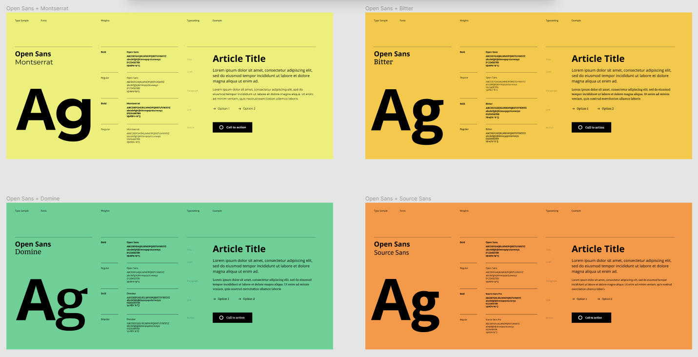
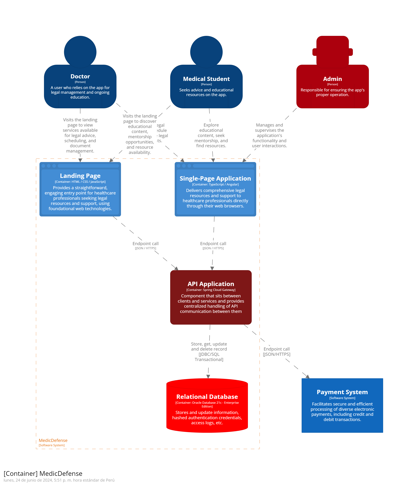
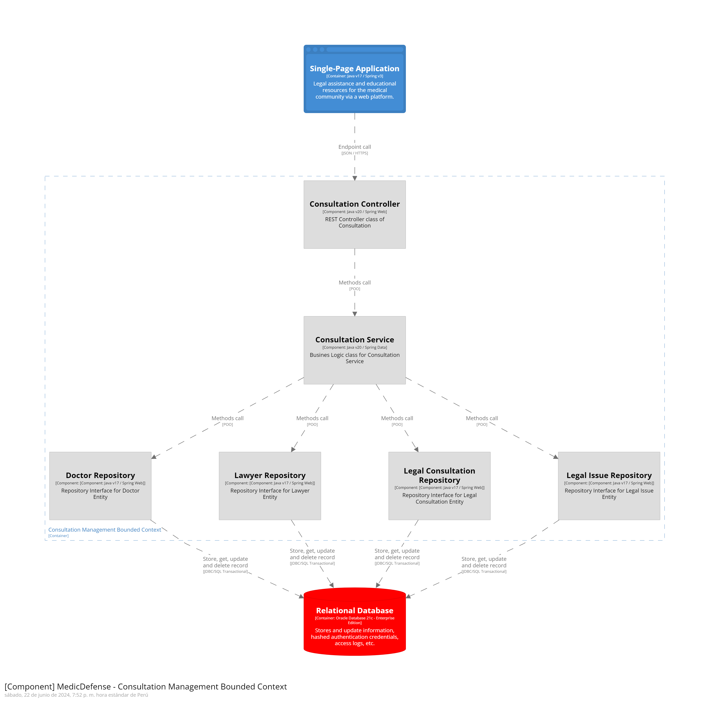
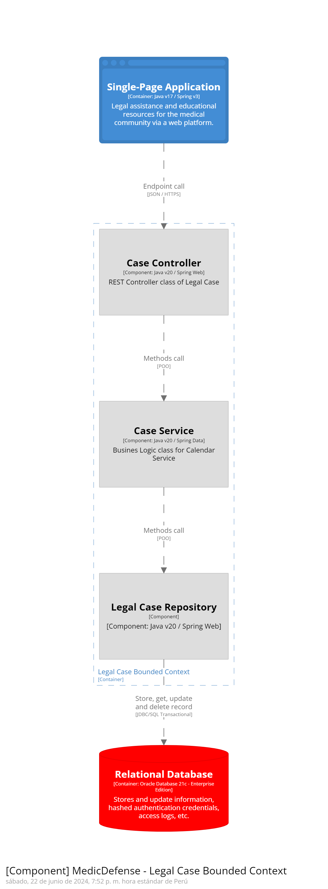
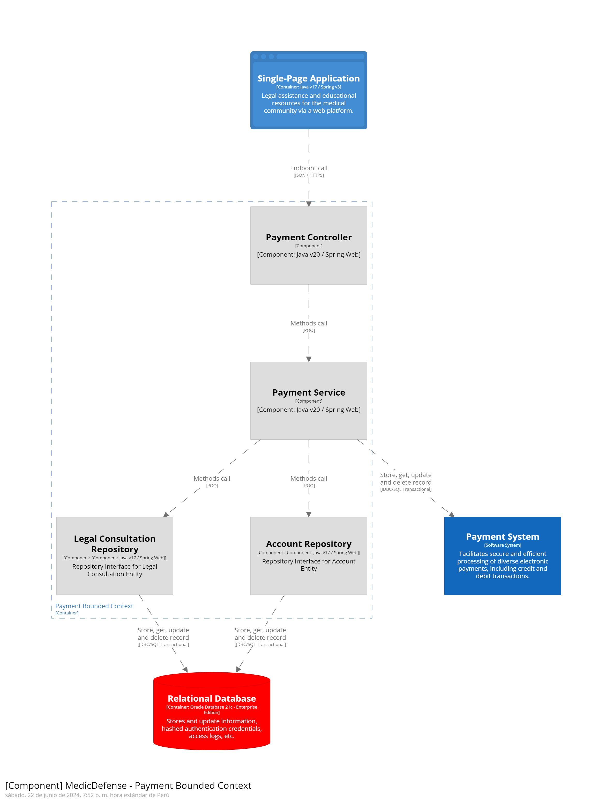

# Capítulo IV: Product Design

## 4.1. Style Guidelines

Las guías de estilo serán la base para dar forma a nuestro producto, utilizando patrones que consideren los aspectos de arquitectura de la información y accesibilidad necesarios para la implementación exitosa de UrProvider tanto en una Landing Page como en una Aplicación Web.

### 4.1.1. General Style Guidelines

- **Branding**:
  El branding del logo de nuestra plataforma “MedicDefense” es una combinación de elementos que transmiten una imagen sólida y confiable. La estructura dentro del triángulo simboliza la justicia y el respaldo legal que ofrece a los médicos, lo que se asocia con la confianza en los servicios que ofrece nuestra plataforma. Además, el triángulo también puede simbolizar protección o advertencia, lo que es relevante para una marca relacionada con la medicina y la defensa. El nombre “MedicDefense” se presenta en una tipografía elegante y profesional, mientras que la paleta de colores crea un contraste visual claro y transmite una sensación de calma y profesionalismo. En resumen, este logo tiene un enfoque clásico y profesional, y podría ser un elemento distintivo en nuestro sitio web.

- **Typography**: Al seleccionar la tipografía para nuestro proyecto, hemos optado por utilizar Open Sans siguiendo las pautas de estilo general. Ya que ofrece una combinación única de legibilidad, versatilidad y modernidad que se alinea perfectamente con la identidad visual y los objetivos de MedicDefense. Su diseño limpio y contemporáneo proporciona una excelente lectura en una amplia gama de dispositivos, lo que garantiza una experiencia de usuario óptima para nuestros clientes, que incluyen tanto a profesionales médicos como a estudiantes de medicina. Además, la variedad de pesos y estilos disponibles nos permite crear una jerarquía visual clara y coherente en nuestro contenido, facilitando la navegación y la comprensión de la información.
  

- **Colors**:

Hemos escogido una paleta basada en colores suaves y elegantes, el cual consiste en tonos neutros y cálidos. De tal modo, estos generan un ambiente profesional y acogedor para el usuario final.

Los tonos más claros pueden ser utilizados para fondos o elementos de diseño amplios, mientras que los colores más oscuros serán para textos o detalles más específicos asegurando legibilidad y contraste entre ellos.

De tal modo, se presentan nuestros 5 colores principales:

1. #F2EFDC: Beige Claro
2. #F2C6AC: Melocotón Suave
3. #F29979: Coral Claro
4. #A67360: Marrón Suave
5. #403A3A: Gris oscuro

### 4.1.2. Web Style Guidelines

Para el Web Style Guidelines del sitio web MedicDefense se utilizó con mayor presencia los colores pasteles en base a una paleta de colores que genere confianza y un ambiente acogedor para el usuario. El logo genera presencia por la combinación de elementos que transmiten una imagen sólida y confiable. A su vez, se ideó un estilo minimalista en el desarrollo del Landing Page para que el usuario tenga la facilidad de navegar y pueda observar las secciones con mayor orden. El tipo de Letra Open Sans combina con los colores anteriormente seleccionados, ya que brinda mayor flexibilidad y versatilidad.
Para el desarrollo de los mockups y wireframes se utilizó en base a desarrollo web para pantallas de escritorio.

## 4.2. Information Architecture

La sección de arquitectura de información tiene como objetivo organizar el contenido tanto de la aplicación web como de la página de inicio de UrProvider. Se abordarán los siguientes temas: Organization Systems, Labeling Systems, SEO
Tags and Meta Tags, Searching Systems y Navigation Systems.

### 4.2.1. Organization Systems

Consideramos que para poseer una estructura de jerarquía clara y precisa en nuestra aplicación es indispensable lograr que el usuario navegue de una forma satisfactoria. Nuestra estructura es la siguiente:

Al acceder a la plataforma de MedicDefense, los usuarios tienen la opción de iniciar sesión, registrarse si no tienen una cuenta previa, o recuperar su contraseña en caso de olvido. Una vez dentro, en la página principal, se presenta un repertorio de abogados, con un menú de navegación que incluye opciones como "Abogados", "Resumen", "Suscripción", "Perfil" y "Ajustes". Los usuarios pueden aplicar filtros para refinar su búsqueda, como años de experiencia o casos ganados. Al seleccionar un abogado, se muestra su perfil con opciones de contacto, pago directo y consulta, esta última bloqueada sin suscripción. La interfaz de pago facilita la transacción, con opciones para gestionar la suscripción actual o explorar suscripciones disponibles. El resumen proporciona una lista de consultas o servicios anteriores, mientras que una versión detallada está disponible para reportes de consultas específicas. Además, hay un proceso similar para servicios de pago único. Los usuarios pueden acceder a su perfil para ver su información registrada y ajustar preferencias en la sección de ajustes, que incluye configuración de notificaciones, gestión de pagos y opciones para modificar o eliminar la cuenta. Finalmente, una pantalla de confirmación indica el envío de solicitudes de consulta a los abogados seleccionados.

### 4.2.2. Labeling Systems

Un sistema de etiquetado efectivo es esencial para organizar y clasificar la información de manera coherente y accesible. De tal modo, se utilizarán ciertos parámetros para facilitar la experiencia del usuario.

**Inicio**

- Iniciar Sesión
- Registrarse
- Recuperar Contraseña

**Página Principal**

- Repertorio de Abogados Médicos
  - Aplicar Filtros
- Menú de Navegación
  - Abogados
  - Resumen
  - Suscripción
    -Perfil
  - Ajustes

**Perfil del Abogado Médico**

- Opciones de Contacto
- Pago Directo
- Consulta

**Interfaz de Pago**

- Gestionar Suscripción Actual
- Explorar Suscripciones Disponibles

**Resumen**

- Consultas/Servicios Anteriores
- Reporte Detallado

**Perfil del Usuario**

- Información Datos
- Ajustes
  - Configuración de Notificaciones
  - Gestión de Pagos
  - Modificar/Eliminar Cuenta

### 4.2.3. SEO Tags and Meta

Las etiquetas son representativas del contenido de nuestro proyecto, incluyendo tanto el Landing Page como el Sitio Web. Están diseñadas para potenciar la visibilidad de nuestro proyecto en los motores de búsqueda más importantes, lo que facilitará que los usuarios encuentren fácilmente nuestra plataforma de MedicDefense.

Para el Landing Page:

- **Title:** MedicDefense
- **Description:** MedicDefense - Servicios de Asistencia Legal y Peritaje en Anestesiología - Landing Page
- **Keywords:** Asistencia Legal, Peritaje Médico, Abogados de Anestesiología, Consejo Legal, Defensa Médica, Servicios Legales, Estudiantes de Medicina, Consulta Legal, Expertos Médicos, Recursos Legales, Casos Médicos, Apoyo Legal, Abogacía Médica, Consultoría Legal.
- **Authors:** Code Rush

Para el sitio web:

- **Title:** MedicDefense
- **Description:** MedicDefense - Servicios de Asistencia Legal y Peritaje en Anestesiología - Website
- **Keywords:** Asistencia Legal, Peritaje Médico, Abogados de Anestesiología, Consejo Legal, Defensa Médica, Servicios Legales, Estudiantes de Medicina, Consulta Legal, Expertos Médicos, Recursos Legales, Casos Médicos, Apoyo Legal, Abogacía Médica, Consultoría Legal.
- **Authors:** Code Rush

### 4.2.4. Searching Systems

El usuario puede utilizar la búsqueda en la sección de “Abogados Médicos”. De tal modo,
le facilitará el método de acceso para que sea más accesible y el usuario tenga más facilidad al momento de realizar su búsqueda.

Métodos de búsqueda de nuestra aplicación:

- Filtrado de Búsqueda de Abogados Médicos
  - Nombre
  - Apellido
  - Experiencia
  - Calificaciones
  - Especialidad Legal Médica

### 4.2.5. Navigation Systems

En la plataforma de MedicDefense, los usuarios pueden navegar de manera fluida a través de un menú de navegación principal ubicado en la parte superior de cada página. Este menú ofrece acceso directo a las secciones esenciales del sitio, como "Inicio", "Abogados", "Recursos", "Perfil", "Suscripción" y "Ajustes". Además, en cada página, se incluyen enlaces contextuales que permiten a los usuarios realizar acciones específicas relacionadas con el contenido actual. Por ejemplo, en la página del perfil del abogado, se ofrecen pestañas que facilitan la visualización de información personal, detalles de contacto y experiencia profesional. Los botones de llamada a la acción son visibles y accesibles, guiando a los usuarios hacia acciones importantes como iniciar sesión, registrarse o realizar pagos. Con un diseño efectivo, el sistema de navegación garantizará una experiencia de usuario óptima en todos los dispositivos, facilitando la búsqueda de información y la realización de acciones clave.

## 4.3. Landing Page UI Design

### 4.3.1. Landing Page Wireframe

### 4.3.2. Landing Page Mock-up

## 4.4. Web Applications UX/UI Design

### 4.4.1. Web Applications Wireframes

En este apartado se muestran los Wireframes de la Aplicación Web. Cada pantalla tiene un nombre y propósito específico.

**Iniciar Sesión:**

El apartado inicial de la aplicación, en la que los usuarios tienen acceso a 3 opciones: Iniciar Sesión, Registro y Olvidé Mi Contraseña. De llenar sus datos, y presionar Ingresar, ingresarán a las funcionalidades principales de la aplicación.

**Registro:**

En este apartado, los usuarios pueden ingresar todos los datos necesarios para la creación de su cuenta, la cual podrán usar para acceder a la aplicación. Los datos incluyen nombres y DNI, o Carné de Extranjería, para identificación, y pide subir una imagen que verifique su capacidad de ejercer como médico, o que es estudiante de la carrera.

**Recuperar Contraseña:**

En este apartado, los usuarios pueden ingresar el correo registrado de su cuenta para recibir un enlace de recuperación de contraseña.

**Enlace de Recuperación Enviado:**

Tras confirmar que el correo ingresado está ingresado en el sistema, se le avisa al usuario que ha recibido el enlace de recuperación.

**Repertorio de Abogados:**

El apartado principal de la aplicación, mostrado a los usuarios tras acceder a su cuenta. En éste, aparece un menú con los apartados importantes. Debajo, una cuadrícula con todos los abogados disponibles, datos relevantes de estos, y una opción de búsqueda con filtros.

**Filtros:**

En este apartado, se muestra cómo se ve la opción de filtros. Tiene opciones de ordenamiento y rangos de ciertos parámetros.

**Abogado:**

En este apartado, se muestra el perfil de un abogado del reperterio. Se puede ver su nombre, años de experiencia, casos ganados, precio habitual, canales de contacto, y las opciones de servicios.

**Pagar Servicio:**

En este apartado, se ve la interfaz de pago cuando se trata del servicio legal de un abogado.

**Solicitar Consulta:**

En este apartado, se visualiza la confirmación de que se ha enviado una solicitud de consulta al abogado seleccionado.

**Resumen:**

En este apartado, se visualizan 2 listas de los distintos servicios pagados y consultas realizadas.

**Detalle Servicio:**

En este apartado, se muestra a detalle el reporte de un servicio pagado.

**Detalle Consulta:**

En este apartado, se muestra a detalle el reporte de una consulta solicitada.

**Adquirir Suscripción:**

En este apartado, se visualiza la opción de adquirir una suscripción debajo de una descripción de la misma.

**Pagar Suscripción:**

En este apartado, se ve la interfaz de pago cuando se trata de la adquisición de una suscripción.

**Cancelar Suscripción:**

En este apartado, se visualizan los datos de la suscripción actual. Debajo, opciones de cancelar la suscripción y actualizar información de pago.

**Renovar Suscripción:**

En este apartado, se visualizan los datos de la suscripción actual. Debajo, la opción de renovar la suscripción.

**Perfil:**

En este apartado, se visualizan los datos registrados de la cuenta, y las opciones de editarlas o eliminar la cuenta.

**Editar Perfil:**

En este apartado, se pueden editar los datos de la cuenta, similar al proceso de registro. Debajo, la opción de volver o guardar los cambios.

### 4.4.2. Web Applications Wireflow Diagrams

**User Flow User Goal 1 (Como médico quiero registrarme)**

User Task: El usuario abre MedicDefense, ingresa sus datos y registra su cuenta en la aplicación.

**User Flow User Goal 2 (Como médico quiero contactar a un abogado y pagarle sus servicios)**

User Task: El usuario inicia sesión en MedicDefense, selecciona a un abogado, identifica sus canales de contacto y, posteriormente, le paga.

**User Flow User Goal 3 (Como estudiante de medicina quiero solicitar una consulta de un abogado)**

User Task: El usuario inicia sesión en MedicDefense, adquiere una suscripción, selecciona a un abogado y solicita una consulta.

**User Flow User Goal 4 (Como médico quiero cancelar mi suscripción según mis gastos)**

User Task: El usuario inicia sesión en MedicDefense, revisa su resumen, abre el detalle de su último servicio y cancela su suscripción.

**User Flow User Goal 5 (Como estudiante de medicina quiero cambiar mis datos registrados)**

User Task: El usuario inicia sesión en MedicDefense, va a su perfil, selecciona la opción de editar perfil, y guarda los cambios.

### 4.4.3. Web Applications Mock-ups

En este apartado se muestran los Mock-Ups de la Aplicación Web, con notable más detalle que los Wireframes. Cada pantalla tiene un nombre y propósito específico.

**Iniciar Sesión:**

El apartado inicial de la aplicación, en la que los usuarios tienen acceso a 3 opciones: Iniciar Sesión, Registro y Olvidé Mi Contraseña. De llenar sus datos, y presionar Ingresar, ingresarán a las funcionalidades principales de la aplicación.

**Registro:**

En este apartado, los usuarios pueden ingresar todos los datos necesarios para la creación de su cuenta, la cual podrán usar para acceder a la aplicación. Los datos incluyen nombres y DNI, o Carné de Extranjería, para identificación, y pide subir una imagen que verifique su capacidad de ejercer como médico, o que es estudiante de la carrera.

**Recuperar Contraseña:**

En este apartado, los usuarios pueden ingresar el correo registrado de su cuenta para recibir un enlace de recuperación de contraseña.

**Enlace de Recuperación Enviado:**

Tras confirmar que el correo ingresado está ingresado en el sistema, se le avisa al usuario que ha recibido el enlace de recuperación.

**Repertorio de Abogados:**

El apartado principal de la aplicación, mostrado a los usuarios tras acceder a su cuenta. En éste, aparece un menú con los apartados importantes. Debajo, una cuadrícula con todos los abogados disponibles, datos relevantes de estos, y una opción de búsqueda con filtros.

**Filtros:**

En este apartado, se muestra cómo se ve la opción de filtros. Tiene opciones de ordenamiento y rangos de ciertos parámetros.

**Abogado:**

En este apartado, se muestra el perfil de un abogado del reperterio. Se puede ver su nombre, años de experiencia, casos ganados, precio habitual, canales de contacto, y las opciones de servicios.

**Pagar Servicio:**

En este apartado, se ve la interfaz de pago cuando se trata del servicio legal de un abogado.

**Pago Efectuado:**

En este apartado, se visualiza el reporte de pago de servicio al abogado.

**Solicitar Consulta:**

En este apartado, se visualiza la confirmación de que se ha enviado una solicitud de consulta al abogado seleccionado.

**Resumen:**

En este apartado, se visualizan 2 listas de los distintos servicios pagados y consultas realizadas.

**Detalle Servicio:**

En este apartado, se muestra a detalle el reporte de un servicio pagado.

**Detalle Consulta:**

En este apartado, se muestra a detalle el reporte de una consulta solicitada.

**Adquirir Suscripción:**

En este apartado, se visualiza la opción de adquirir una suscripción debajo de una descripción de la misma.

**Pagar Suscripción:**

En este apartado, se ve la interfaz de pago cuando se trata de la adquisición de una suscripción.

**Cancelar Suscripción:**

En este apartado, se visualizan los datos de la suscripción actual. Debajo, opciones de cancelar la suscripción y actualizar información de pago.

**Renovar Suscripción:**

En este apartado, se visualizan los datos de la suscripción actual. Debajo, la opción de renovar la suscripción.

**Perfil:**

En este apartado, se visualizan los datos registrados de la cuenta, y las opciones de editarlas o eliminar la cuenta.

**Editar Perfil:**

En este apartado, se pueden editar los datos de la cuenta, similar al proceso de registro. Debajo, la opción de volver o guardar los cambios.

### 4.4.4. Web Applications User Flow Diagrams

**User Flow User Goal 1 (Como médico quiero registrarme)**

User Task: El usuario abre MedicDefense, ingresa sus datos y registra su cuenta en la aplicación.

**User Flow User Goal 2 (Como médico quiero contactar a un abogado y pagarle sus servicios)**

User Task: El usuario inicia sesión en MedicDefense, selecciona a un abogado, identifica sus canales de contacto y, posteriormente, le paga.

**User Flow User Goal 3 (Como estudiante de medicina quiero solicitar una consulta de un abogado)**

User Task: El usuario inicia sesión en MedicDefense, adquiere una suscripción, selecciona a un abogado y solicita una consulta.

**User Flow User Goal 4 (Como médico quiero cancelar mi suscripción según mis gastos)**

User Task: El usuario inicia sesión en MedicDefense, revisa su resumen, abre el detalle de su último servicio y cancela su suscripción.

**User Flow User Goal 5 (Como estudiante de medicina quiero cambiar mis datos registrados)**

User Task: El usuario inicia sesión en MedicDefense, va a su perfil, selecciona la opción de editar perfil, y guarda los cambios.

## 4.5. Web Applications Prototyping

En esta sección, se presenta el link del prototipo de la Aplicación Web, mediante la herramienta de prototipado de Figma.

https://www.figma.com/proto/DDtoiHzqyJvkeeL3M4CMG7/Testigos-de-Jehova-MU?type=design&t=dlyOvPICv7sXtodj-1&scaling=min-zoom&page-id=0%3A1&node-id=2-9087&mode=design

## 4.6. Domain-Driven Software Architecture

### 4.6.1. Software Architecture Context Diagram

#### System Context Diagram

### 4.6.2. Software Architecture Container Diagrams

#### Container Diagram

### 4.6.3. Software Architecture Components Diagrams

#### Bounded Context Access Diagram

#### Bounded Context Consultation Diagram

#### Bounded Context Educational Resource Diagram

#### Bounded Context Legal Case Diagram

#### Bounded Context Payment Diagram

#### Bounded Context Notification Diagram

## 4.7. Software Object-Oriented Design

### 4.7.1. Class Diagrams

### 4.7.2. Class Dictionary

<table>
  <tr>
    <th colspan="1">#</th>
    <th colspan="2">Entidad</th>
    <th colspan="2">Nombre de atributos</th>
    <th colspan="4">Definición</th>
    <th colspan="2">Tipo de dato</th>
  </tr>
  <tr>
    <td rowspan="5" colspan="1">1</td>
    <td rowspan="5" colspan="2">User</td>
    <td colspan="2">id</td>
    <td colspan="4">Código identificador del usuario</td>
    <td colspan="2">int</td>
    <tr>
      <td colspan="2">name</td>
      <td colspan="4">Nombre del usuario</td>
      <td colspan="2">string</td>
    </tr>
    <tr>
      <td colspan="2">email</td>
      <td colspan="4">Correo electrónico del usuario</td>
      <td colspan="2">string</td>
    </tr>
    <tr>
      <td colspan="2">password</td>
      <td colspan="4">Constraseña del usuario</td>
      <td colspan="2">string</td>
    </tr>
    <tr>
      <td colspan="2">type</td>
      <td colspan="4">Tipo de usuario</td>
      <td colspan="2">string</td>
    </tr>
  </tr>
  <tr>
    <td rowspan="4" colspan="1">2</td>
    <td rowspan="4" colspan="2">Suscription</td>
    <td colspan="2">id</td>
    <td colspan="4">Código identificador de la suscripción</td>
    <td colspan="2">int</td>
    <tr>
      <td colspan="2">typeSuscription</td>
      <td colspan="4">Tipo de suscripción</td>
      <td colspan="2">string</td>
    </tr>
    <tr>
      <td colspan="2">startDate</td>
      <td colspan="4">Fecha de inicio de la suscripción</td>
      <td colspan="2">string</td>
    </tr>
    <tr>
      <td colspan="2">endDate</td>
      <td colspan="4">Fecha de fin de la suscripción</td>
      <td colspan="2">string</td>
    </tr>
  </tr>
  <tr>
    <td rowspan="2" colspan="1">3</td>
    <td rowspan="2" colspan="2">Doctor</td>
    <td colspan="2">id</td>
    <td colspan="4">Código identificador del doctor</td>
    <td colspan="2">int</td>
    <tr>
      <td colspan="2">specially</td>
      <td colspan="4">Especialidad del doctor</td>
      <td colspan="2">string</td>
    </tr>
  </tr>
  <tr>
    <td rowspan="3" colspan="1">4</td>
    <td rowspan="3" colspan="2">Lawyer</td>
    <td colspan="2">id</td>
    <td colspan="4">Código identificador del abogado</td>
    <td colspan="2">int</td>
    <tr>
      <td colspan="2">specially</td>
      <td colspan="4">Especialidad del abogado</td>
      <td colspan="2">string</td>
    </tr>
    <tr>
      <td colspan="2">costConsultation</td>
      <td colspan="4">Costo de la consulta</td>
      <td colspan="2">double</td>
    </tr>
  </tr>
  <tr>
    <td rowspan="4" colspan="1">5</td>
    <td rowspan="4" colspan="2">Transaction</td>
    <td colspan="2">id</td>
    <td colspan="4">Código identificador de la transacción</td>
    <td colspan="2">int</td>
    <tr>
      <td colspan="2">type</td>
      <td colspan="4">Tipo de transacción</td>
      <td colspan="2">string</td>
    </tr>
    <tr>
      <td colspan="2">amount</td>
      <td colspan="4">Monto de la transacción</td>
      <td colspan="2">float</td>
    </tr>
    <tr>
      <td colspan="2">date</td>
      <td colspan="4">Fecha de la transacción</td>
      <td colspan="2">string</td>
    </tr>
  </tr>
  <tr>
    <td rowspan="3" colspan="1">6</td>
    <td rowspan="3" colspan="2">Consultation</td>
    <td colspan="2">id</td>
    <td colspan="4">Código identificador de la consulta</td>
    <td colspan="2">int</td>
    <tr>
      <td colspan="2">date</td>
      <td colspan="4">Fecha de la consulta</td>
      <td colspan="2">string</td>
    </tr>
    <tr>
      <td colspan="2">state</td>
      <td colspan="4">Estado de la consulta</td>
      <td colspan="2">string</td>
    </tr> 
  </tr>
</table>

## 4.8. Database Design

### 4.8.1. Database Diagram

