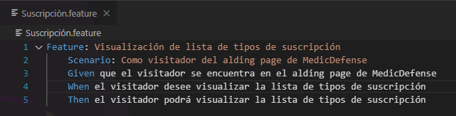
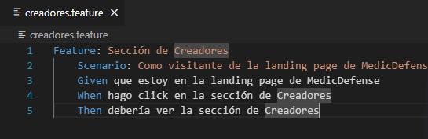

# Capítulo V: Product Implementation, Validation & Deployment

## 5.1. Software Configuration Management

En esta sección se resume toda la información recopilada, analizando el codigo que utilizamos y la arquitectura y principios de ingenieria que empleamos a lo largo de nuestro trabajo.

### 5.1.1. Software Development Environment Configuration

En la siguiente sección se describe la ruta de referencia de cada uno de los productos de software para que cualquier miembro del equipo pueda desarrollar cada punto del trabajo.

- **UXPressia:** Plataforma que nos permitirá crear los user stories y tambien poderemos realizar múltiples mapas para evaluar sus prioridades y una serie de opciones que nos aportan al aspecto grafico de nuestro trabajo.
- **Figma:** Herramienta colaborativa que nos permitirá desarrollar lo respectivos wireframes y mockups de nuestra landing page.
- **Vertabelo:** Plataforma que nos permitirá crear nuestro diagrama de base de datos.
- **LucidChart:** Aplicación web destinada a la elaboración de Wireflows, Lean UX Canvas, User Flows y diagramas de clases.
- **GitHub:** Repositorio colaborativo en la nube.
- **Visual Studio Code:** Entorno de desarrollo.
- **GitHub Pages:** Plataforma que permite hacer deployments sencillos y rapidos para nuestra páginas web.
- **HTML5:** Lenguaje para elaboración de nuestra página web.
- **CSS3:** Tecnología para darle variados estilos a nuestra página web.
- **Javascript:** Lenguaje de programación orientado a objetos, que nos sirvió para implementar funcionalidades en nuestra Landing Page.

### 5.1.2. Source Code Management

Trabajamos con tres ramas principales:

- Main: nuestra rama principal donde presentaremos nuestras
  publicaciones oficiales.

### 5.1.3. Source Code Style Guide & Conventions

Para desarrollar nuestro proyecto hemos requerido de algunas nomenclaturas, referencias y lenguajes para esta solución. 

- **Tecnologías:** Utilizamos tecnologías básicas como HTML5, CSS y JavaScript para el desarrollo web.

- **Herramientas:** Nos apoyamos en herramientas populares como Visual Studio Code, GitHub, Figma y WebStorm para facilitar el desarrollo y la colaboración en el proyecto.

- **Convenciones de Idioma:** Optamos por utilizar el inglés en todo nuestro código, incluyendo la Landing Page, para mantener la coherencia y facilitar la comunicación y colaboración con otros desarrolladores y usuarios.

### 5.1.4. Software Deployment Configuration

En la siguiente sección se explicará cómo se realizó la
implementación de nuestra landing page en la plataforma de
GitHub.

1. Establecemos un repositorio remoto en GitHub como el centro de nuestro proyecto.
2. Inicializamos el repositorio usando el comando “git init”
3. Añadimos el repositorio remoto y subimos los archivos a la nube de GitHub.
4. Configuramos GitHub Pages en la sección de configuración del repositorio en GitHub.
5. Accedemos a la URL proporcionada por GitHub Pages para verificar que nuestra página web se haya desplegado correctamente.

## 5.2. Landing Page, Services & Applications Implementation

### 5.2.1. Sprint 1

### 5.2.1.1. Sprint Planning 1

Para este primer sprint nos enfocaremos en los tasks para la
elaboración de la Landing Page. Nos dividiremos entre nosotros cada
una de las tareas identificadas para el sprint.

### 5.2.1.2. Sprint Backlog 1

<table>
<tr>
    <th colspan="3">Sprint #</th>
    <th colspan="10">Sprint 1</th>
  </tr>
      <tr>
    <td colspan="3">User Story</td>
    <td colspan="10">Work-Item/Task</td>
  </tr>
  <tr>
    <td colspan="1">Id</td>
    <td colspan="2">Title</td>
    <td colspan="1">Id</td>
    <td colspan="2">Title</td>
    <td colspan="3">Description</td>
    <td colspan="1"> Estimation</td>
    <td colspan="2">Assigned To</td>
    <td colspan="1">Status(To-do /InProcess /To-Review /Done)</td>
</tr>
  <tr>
    <td colspan="1">5</td>
    <td colspan="2">Visualización de lista de tipos de suscripción</td>
    <td colspan="1">1</td>
    <td colspan="2">Añadir funcion para mostrar lista de tipos de suscrpción</td>
    <td colspan="3">Como visitador del alding page de MedicDefense,quiero visitar la lista de tipos de suscripción para seleccionar alguno.</td>
    <td colspan="1">1</td>
    <td colspan="2">Fabricio</td>
    <td colspan="1">Done</td>
  </tr>
  <tr>
    <td colspan="1">16</td>
    <td colspan="2">Sección de Creadores</td>
    <td colspan="1">1</td>
    <td colspan="2">Añadir funcion para mostrar los creadores de la empresa</td>
    <td colspan="3">Como visitante de la landing page de MedicDefense, quiero ver una sección de creadores para facilitar tener el conocimiento de los creadores de la empresa.</td>
    <td colspan="1">1</td>
    <td colspan="2">Mathias</td>
    <td colspan="1">Done</td>
<tr>
    <td colspan="1">13</td>
    <td colspan="2">Visualización de servicios</td>
    <td colspan="1">3</td>
    <td colspan="2">Añadir sección de servicios</td>
    <td colspan="3">Como visitante de la landing page de MedicDefense, quiero ver una sección donde se expliquen los servicios para estar mejor informado a la hora de confiar en su servicio.</td>
    <td colspan="1">1</td>
    <td colspan="2">Anatoly</td>
    <td colspan="1">Done</td>
</tr>
<tr>
    <td colspan="1">14</td>
    <td colspan="2">Sección de contacto</td>
    <td colspan="1">4</td>
    <td colspan="2">Añadir sección de contacto</td>
    <td colspan="3">Como visitante de la landing page de MedicDefense, quiero ver una sección de contacto para facilitar la comunicación al momento de solicitar el servicio.</td>
    <td colspan="1">1</td>
    <td colspan="2">Gabriel</td>
    <td colspan="1">Done</td>
</tr>
<tr>
    <td colspan="1">15</td>
    <td colspan="2">Sección de about us</td>
    <td colspan="1">5</td>
    <td colspan="2">Añadir sección de about us</td>
    <td colspan="3">Como visitante de la landing page de MedicDefense, quiero ver una sección de about us para informarme sobre la empresa que está brindando los servicios.</td>
    <td colspan="1">1</td>
    <td colspan="2">Anatoly</td>
    <td colspan="1">Done</td>
</tr>
<tr>
    <td colspan="1">17</td>
    <td colspan="2">Sección de inicio</td>
    <td colspan="1">6</td>
    <td colspan="2">Añadir sección de inicio</td>
    <td colspan="3">Como visitante de la landing page de MedicDefense, quiero ver una sección de inicio con una barra de navegación para poder desplazarme mejor por la landing page.</td>
    <td colspan="1">1</td>
    <td colspan="2">Diego</td>
    <td colspan="1">Done</td>
</tr>
</table>

### 5.2.1.3. Development Evidence for Sprint Review

<table>
    <tr>
        <th colspan="2">Repository</th>
        <th colspan="2">Branch</th>
        <th colspan="2">Commit Id</th>
        <th colspan="2">Commit Message</th>
        <th colspan="2">Commit Message Body</th>
        <th colspan="2">Commited on (Date)</th>
    </tr>
        <tr>
        <td colspan="2">Open-Source-Grupo-Testigos-de-Jehova/Landing-page-MedicDefense</td>
        <td colspan="2">Main</td>
        <td colspan="2">b6d10b1</td>
        <td colspan="2">feat: added contact section</td>
        <td colspan="2">-</td>
        <td colspan="2">06/04/2024</td>
    </tr>
        <tr>
        <td colspan="2">Open-Source-Grupo-Testigos-de-Jehova/Landing-page-MedicDefense</td>
        <td colspan="2">Main</td>
        <td colspan="2">4808ace</td>
        <td colspan="2">feat: Added "Our Services" code</td>
        <td colspan="2">-</td>
        <td colspan="2">06/04/2024</td>
    </tr>
     <tr>
        <td colspan="2">Open-Source-Grupo-Testigos-de-Jehova/Landing-page-MedicDefense</td>
        <td colspan="2">Main</td>
        <td colspan="2">168d5f0</td>
        <td colspan="2">chore: initial commit</td>
        <td colspan="2">-</td>
        <td colspan="2">06/04/2024</td>
    </tr>
    <tr>
        <td colspan="2">Open-Source-Grupo-Testigos-de-Jehova/Landing-page-MedicDefense</td>
        <td colspan="2">Main</td>
        <td colspan="2">7ace2eb</td>
        <td colspan="2">fix: updated image errors</td>
        <td colspan="2">-</td>
        <td colspan="2">10/04/2024</td>
    </tr>
    <tr>
        <td colspan="2">Open-Source-Grupo-Testigos-de-Jehova/Landing-page-MedicDefense</td>
        <td colspan="2">Main</td>
        <td colspan="2">b96e52c</td>
        <td colspan="2">fix: updated menu.js</td>
        <td colspan="2">-</td>
        <td colspan="2">10/04/2024</td>
    </tr>
    <tr>
        <td colspan="2">Open-Source-Grupo-Testigos-de-Jehova/Landing-page-MedicDefense</td>
        <td colspan="2">Main</td>
        <td colspan="2">0ad72ce</td>
        <td colspan="2">feat: add 'About Us' and 'Our Services' sections to landing page</td>
        <td colspan="2">-</td>
        <td colspan="2">06/04/2024</td>
    </tr>
</table>

### 5.2.1.4. Testing Suite Evidence for Sprint Review

Para este sprint realizamos los features de nuestro Sprint Backlog con
sus respectivos criterios de aceptación.

### 5.2.1.5. Execution Evidence for Sprint Review

Para esta primera entrega, nuestro equipo a conseguido elaborar la Landing Page del proyecto "MedicDefense". De tal modo, se podrá visualizar la información necesaria de lo que ofrece nuestro proyecto.

### 5.2.1.6. Services Documentation Evidence for Sprint Review

En este sprint solo se trabajó el landing page.

### 5.2.1.7. Software Deployment Evidence for Sprint Review

Para el despliegue del Landing Page, hemos utilizado la herramienta de Github Pages para poder hacer un deployment. Para eso, hemos creado un repositorio donde hemos colocado el código de desarrollo de nuestra Landing Page.

Una vez creado el repositorio, entraremos a configuración del repositorio y escogemos el apartado de Pages. Se coloca la información necesaria, como la fuente del branch a utilizar para realizar el deployment. Luego de eso, Github Pages nos brindará el link y desplegará nuestra landing page en la Web.

### 5.2.1.8. Team Collaboration Insights during Sprint

Para el desarrollo de este primer sprint, todos los miembros del equipo desarrollaron y colaboraron de manera activa y continua. De tal modo, se muestra como evidencia los insights de cada miembro del equipo.

## 5.3. Conclusiones 

1. Existe una clara necesidad en el mercado médico de servicios especializados en asesoramiento legal y oportunidades laborales específicas en el campo de la anestesiología. La falta de acceso a expertos legales especializados y recursos para una defensa adecuada crea un ambiente de incertidumbre y estrés para los médicos que enfrentan desafíos legales, lo que afecta negativamente su bienestar emocional, su calidad de atención médica y la confianza del paciente. Esta necesidad presenta una oportunidad para la startup de llenar este vacío en el mercado, proporcionando una plataforma tecnológica que conecte a médicos, estudiantes y profesionales del peritaje en anestesiología con peritos, recursos educativos y oportunidades laborales.

2. La estrategia de la startup, que incluye ofrecer opciones de suscripción flexibles y asequibles, establecer asociaciones estratégicas con instituciones médicas y empresas del sector de la salud, y optimizar la experiencia de usuario, está diseñada para abordar las necesidades identificadas en el mercado y lograr el éxito comercial. Al centrarse en proporcionar un valor significativo a los usuarios a través de servicios especializados, contenido de alta calidad y una experiencia de usuario excepcional, la startup puede diferenciarse de la competencia y establecerse como líder en el mercado de servicios de anestesiología.

# 5.3.1 Anexos
# 5.3.2 Bibliografia
- Existe un déficit de 2417 médicos anestesiólogos en 20 regiones del país. (n.d.). Convoca.pe - Agenda Propia. Retrieved April 11, 2024, from https://convoca.pe/agenda-propia/existe-un-deficit-de-2417-medicos-anestesiologos-en-20-regiones-del-pais

