# Capítulo V: Product Implementation, Validation & Deployment

## 5.1. Software Configuration Management

En esta sección se resume toda la información recopilada, analizando el codigo que utilizamos y la arquitectura y principios de ingenieria que empleamos a lo largo de nuestro trabajo.

### 5.1.1. Software Development Environment Configuration

En la siguiente sección se describe la ruta de referencia de cada uno de los productos de software para que cualquier miembro del equipo pueda desarrollar cada punto del trabajo.

- **UXPressia:** Plataforma que nos permitirá crear los user stories y también realizar múltiples mapas para evaluar sus prioridades. Además, ofrece opciones gráficas para mejorar el aspecto de nuestro trabajo. Puedes acceder a la plataforma en el siguiente enlace: [UXPressia](https://www.uxpressia.com/)
- **Figma:** Herramienta colaborativa que nos permitirá desarrollar los respectivos Wireframes y Mockups de nuestra Landing Page. Se puede acceder a la plataforma en el siguiente enlace: [Figma](https://www.figma.com/).
- **Vertabelo:** Plataforma que nos permitirá crear nuestro Diagrama de Base de Datos. Se puede acceder a la plataforma en el siguiente enlace: [Vertabelo](https://www.vertabelo.com/).
- **LucidChart:** Aplicación web destinada a la elaboración de Wireflows, Lean UX Canvas, User Flows y Diagramas de clases. Se puede acceder a la plataforma en el siguiente enlace: [LucidChart](https://www.lucidchart.com/).
- **GitHub:** Repositorio colaborativo en la nube utilizado para almacenar los avances de nuestro proyecto. Se puede acceder a la plataforma en el siguiente enlace: [Github](https://github.com/).
- **Visual Studio Code:** Entorno de desarrollo utilizado por nuestro equipo para el desarrollo del proyecto en general, incluido el Informe. Se puede acceder a la plataforma en el siguiente enlace: [Visual Studio Code](https://code.visualstudio.com/).
- **GitHub Pages:** Plataforma que permite hacer deployments sencillos y rápidos para nuestras páginas web. Se puede acceder a la plataforma en el siguiente enlace: [Github Pages](https://pages.github.com/).

- **HTML5:** Lenguaje para la elaboración de nuestra página web.
- **CSS3:** Tecnología para darle estilos a nuestra página web.
- **JavaScript:** Lenguaje de programación orientado a objetos que nos sirvió para implementar funcionalidades en nuestra Landing Page.

### 5.1.2. Source Code Management

Para gestionar las modificaciones en nuestro proyecto, emplearemos GitHub como plataforma y sistema de control de versiones. A continuación, se detallan los repositorios de GitHub para cada uno de nuestros productos:

- Organización del Equipo: https://github.com/Open-Source-Grupo-Testigos-de-Jehova
- Repositorio del Informe: https://github.com/Open-Source-Grupo-Testigos-de-Jehova/Informe-Final
- Repositorio del Landing Page: https://github.com/Open-Source-Grupo-Testigos-de-Jehova/Landing-page-MedicDefense
- Enlace del Landing Page: https://open-source-grupo-testigos-de-jehova.github.io/Landing-page-MedicDefense/
- Repositorio del Front-End: https://github.com/Open-Source-Grupo-Testigos-de-Jehova/frontend-app

Para estructurar nuestro control de versiones, implementaremos el modelo GitFlow como nuestro flujo de trabajo estándar. Esto implicará la creación de las siguientes ramas, además de la rama principal (main):

- Develop Branch: Esta rama contendrá el código en desarrollo y servirá como base para la integración de nuevas funcionalidades.
- Feature Branches: Cada nueva característica que se implemente requerirá su propio branch. Utilizaremos la convención de nombrar los branches de características como "feature/nombre-de-la-caracteristica".
- Release Branches: Antes de lanzar una nueva versión, crearemos una rama de release para realizar pruebas finales y correcciones.
- Hotfix Branches: En caso de surgir problemas en el desarrollo, se crearán branches de hotfix para poder solucionarlos sin afectar la rama principal.

Además, seguiremos el estándar establecido por Conventional Commits para asegurar una estructura clara y consistente en nuestros Commits, facilitando la colaboración y la comprensión del historial de versiones en nuestro equipo.

### 5.1.3. Source Code Style Guide & Conventions

A continuación, se detallan las referencias y convenciones que adoptaremos para programar en los diferentes lenguajes utilizados en nuestro proyecto:

Utilizaremos las siguientes referencias para establecer nuestras convenciones.
1. **HTML**:
- "HTML Style Guide and Coding Conventions"
- "Google HTML/CSS Style Guide"

2. **CSS**:
- "Google HTML/CSS Style Guide"

3. **JavaScript**:
- "Google JavaScript Style Guide"
- "MDN JavaScript guidelines"
- "W3C JavaScript Style Guide"
- "Angular coding style guide".

4. **Gherkin**:
- "Gherkin Conventions for Readable Specifications".

Es importante destacar que todas las convenciones y referencias mencionadas están en inglés, siguiendo las prácticas comunes en el desarrollo de software. De tal modo que, al seguir estas referencias nos ayudará a mantener un código claro, coherente y fácilmente comprensible para todo el equipo de desarrollo.

### 5.1.4. Software Deployment Configuration

Para desplegar nuestra landing page en la plataforma de GitHub, seguimos los siguientes pasos:

1. Creación del Repositorio Remoto en GitHub:
- Creamos un nuevo repositorio en GitHub de nuestro proyecto, el cual se utilizará para el desarrollo y deployment.
2. Inicialización del Repositorio:
- Se utilza el comando "*git init*" para inicializar el repositorio.
3. Subida de Archivos al Repositorio Remoto:
- Añadimos los archivos de nuestra landing page al repositorio local.
- Subimos los archivos al repositorio de GitHub con el comando "*git push -u origin master*" o sino utilizando Github Desktop.
4. Configuración de GitHub Pages:
- Accedemos a la sección de configuración del repositorio en GitHub y entramos al apartado de Github Pages.
- Seleccionamos la rama de GitHub Pages (main) como fuente para el deployment de nuestra Landing Page
5. Despliegue:
- Accedemos a la URL proporcionada por GitHub Pages para verificar que nuestra landing page se haya desplegado correctamente.

De tal modo, nuestra Landing Page estará inicializada utilizando Github Pages y podrá ser visible para cualquier usuario que tenga el enlace.
Enlace del Landing Page: https://open-source-grupo-testigos-de-jehova.github.io/Landing-page-MedicDefense/

Para desplegar el primer avance del FrontEnd Web Application se utilizó la plataforma Netlify.
1. Selecciona GitHub como proveedor de Git y autorizamos a Netlify para acceder a tus repositorios.

2. Elegimos el repositorio que contiene el proyecto de Angular.

3. Configura las opciones de compilación:
- Comando de compilación: ng build --prod
- Directorio de publicación: dist/frontendApp
- Hacemos clic en "Deploy site" para iniciar el proceso de despliegue.

4. Netlify compilará y desplegará automáticamente el proyecto Angular. 
- Una vez que el despliegue esté completo, nos proporcionará una URL para el sitio.

Enlace de la primera version del Frontend App: https://medicdefense.netlify.app/

## 5.2. Landing Page, Services & Applications Implementation
En esta sección se explicará y evidenciará el proceso de implementación, pruebas,
documentación y despliegue del Landing Page.

### 5.2.1. Sprint 1

### 5.2.1.1. Sprint Planning 1

Para este primer sprint nos enfocaremos en los tasks para la
elaboración de la Landing Page. Nos dividiremos entre nosotros cada
una de las tareas identificadas para el sprint.
<table>
<tr>
    <th colspan="5">Sprint #</th>
    <th colspan="9">Sprint 1</th>
  </tr>
      <tr>
    <td colspan="13">Sprint Planning Background</td>
  </tr>
  <tr>
    <td colspan="5">Date</td>
    <td colspan="8">2024-04-12</td>
</tr>
  <tr>
    <td colspan="5">Time</td>
    <td colspan="8">11:30 PM</td>
  </tr>
  <tr>
    <td colspan="5">Location</td>
    <td colspan="8">Via Discord y Google Meet</td>
<tr>
    <td colspan="5">Prepared By</td>
    <td colspan="8">Gabriel Garcia</td>
</tr>
<tr>
    <td colspan="5">Attendees (to planning meeting)</td>
    <td colspan="8">Gabriel Garcia, Diego Flores, Fabricio Apaza, Mathias Vasquez, Anatoly Noriega</td>
</tr>
<tr>
    <td colspan="5">Sprint n – 1 Review Summary</td>
    <td colspan="8">En esta seccion se planteo el desarrollo del landing page para nuestro proyecto llamado MedicDefense</td>
</tr>
<tr>
    <td colspan="5">Sprint n – 1 Retrospective Summary</td>
    <td colspan="8">En esta seccion todos los integrantes mencionaron tener aciertos en partes del codigo y en otras partes poder mejorar sus habilidades realizando landing pages</td>
</tr>
<tr>
    <td colspan="13">Sprint Goal & User Stories</td>
</tr>
<tr>
    <td colspan="5">Sprint n Goal</td>
    <td colspan="8">Culminar el landing Page</td>
</tr>
<tr>
    <td colspan="5">Sprint n Velocity</td>
    <td colspan="8">6 story points</td>
</tr>
<tr>
    <td colspan="5">Sum of Story Points</td>
    <td colspan="8">9 Story Points</td>
</tr>
</table>

### 5.2.1.2. Sprint Backlog 1

<table>
<tr>
    <th colspan="3">Sprint #</th>
    <th colspan="10">Sprint 1</th>
  </tr>
      <tr>
    <td colspan="3">User Story</td>
    <td colspan="10">Work-Item/Task</td>
  </tr>
  <tr>
    <td colspan="1">Id</td>
    <td colspan="2">Title</td>
    <td colspan="1">Id</td>
    <td colspan="2">Title</td>
    <td colspan="3">Description</td>
    <td colspan="1"> Estimation</td>
    <td colspan="2">Assigned To</td>
    <td colspan="1">Status(To-do /InProcess /To-Review /Done)</td>
</tr>
  <tr>
    <td colspan="1">5</td>
    <td colspan="2">Visualización de lista de tipos de suscripción</td>
    <td colspan="1">1</td>
    <td colspan="2">Añadir funcion para mostrar lista de tipos de suscrpción</td>
    <td colspan="3">Como visitador del alding page de MedicDefense,quiero visitar la lista de tipos de suscripción para seleccionar alguno.</td>
    <td colspan="1">1</td>
    <td colspan="2">Fabricio</td>
    <td colspan="1">Done</td>
  </tr>
  <tr>
    <td colspan="1">16</td>
    <td colspan="2">Sección de Creadores</td>
    <td colspan="1">2</td>
    <td colspan="2">Añadir funcion para mostrar los creadores de la empresa</td>
    <td colspan="3">Como visitante de la landing page de MedicDefense, quiero ver una sección de creadores para facilitar tener el conocimiento de los creadores de la empresa.</td>
    <td colspan="1">1</td>
    <td colspan="2">Mathias</td>
    <td colspan="1">Done</td>
<tr>
    <td colspan="1">13</td>
    <td colspan="2">Visualización de servicios</td>
    <td colspan="1">3</td>
    <td colspan="2">Añadir sección de servicios</td>
    <td colspan="3">Como visitante de la landing page de MedicDefense, quiero ver una sección donde se expliquen los servicios para estar mejor informado a la hora de confiar en su servicio.</td>
    <td colspan="1">1</td>
    <td colspan="2">Anatoly</td>
    <td colspan="1">Done</td>
</tr>
<tr>
    <td colspan="1">14</td>
    <td colspan="2">Sección de contacto</td>
    <td colspan="1">4</td>
    <td colspan="2">Añadir sección de contacto</td>
    <td colspan="3">Como visitante de la landing page de MedicDefense, quiero ver una sección de contacto para facilitar la comunicación al momento de solicitar el servicio.</td>
    <td colspan="1">1</td>
    <td colspan="2">Gabriel</td>
    <td colspan="1">Done</td>
</tr>
<tr>
    <td colspan="1">15</td>
    <td colspan="2">Sección nosotros</td>
    <td colspan="1">5</td>
    <td colspan="2">Añadir sección nosotros</td>
    <td colspan="3">Como visitante de la landing page de MedicDefense, quiero ver una sección nosotros para informarme sobre la empresa que está brindando los servicios.</td>
    <td colspan="1">1</td>
    <td colspan="2">Anatoly</td>
    <td colspan="1">Done</td>
</tr>
<tr>
    <td colspan="1">16</td>
    <td colspan="2">Sección de inicio</td>
    <td colspan="1">6</td>
    <td colspan="2">Añadir sección de inicio</td>
    <td colspan="3">Como visitante de la landing page de MedicDefense, quiero ver una sección de inicio con una barra de navegación para poder desplazarme mejor por la landing page.</td>
    <td colspan="1">1</td>
    <td colspan="2">Diego</td>
    <td colspan="1">Done</td>
</tr>
</table>

### 5.2.1.3. Development Evidence for Sprint Review

<table>
    <tr>
        <th colspan="2">Repository</th>
        <th colspan="2">Branch</th>
        <th colspan="2">Commit Id</th>
        <th colspan="2">Commit Message</th>
        <th colspan="2">Commit Message Body</th>
        <th colspan="2">Commited on (Date)</th>
    </tr>
        <tr>
        <td colspan="2">Open-Source-Grupo-Testigos-de-Jehova/Landing-page-MedicDefense</td>
        <td colspan="2">Main</td>
        <td colspan="2">b6d10b1</td>
        <td colspan="2">feat: added contact section</td>
        <td colspan="2">-</td>
        <td colspan="2">06/04/2024</td>
    </tr>
        <tr>
        <td colspan="2">Open-Source-Grupo-Testigos-de-Jehova/Landing-page-MedicDefense</td>
        <td colspan="2">Main</td>
        <td colspan="2">4808ace</td>
        <td colspan="2">feat: Added "Our Services" code</td>
        <td colspan="2">-</td>
        <td colspan="2">06/04/2024</td>
    </tr>
     <tr>
        <td colspan="2">Open-Source-Grupo-Testigos-de-Jehova/Landing-page-MedicDefense</td>
        <td colspan="2">Main</td>
        <td colspan="2">168d5f0</td>
        <td colspan="2">chore: initial commit</td>
        <td colspan="2">-</td>
        <td colspan="2">06/04/2024</td>
    </tr>
    <tr>
        <td colspan="2">Open-Source-Grupo-Testigos-de-Jehova/Landing-page-MedicDefense</td>
        <td colspan="2">Main</td>
        <td colspan="2">7ace2eb</td>
        <td colspan="2">fix: updated image errors</td>
        <td colspan="2">-</td>
        <td colspan="2">10/04/2024</td>
    </tr>
    <tr>
        <td colspan="2">Open-Source-Grupo-Testigos-de-Jehova/Landing-page-MedicDefense</td>
        <td colspan="2">Main</td>
        <td colspan="2">b96e52c</td>
        <td colspan="2">fix: updated menu.js</td>
        <td colspan="2">-</td>
        <td colspan="2">10/04/2024</td>
    </tr>
    <tr>
        <td colspan="2">Open-Source-Grupo-Testigos-de-Jehova/Landing-page-MedicDefense</td>
        <td colspan="2">Main</td>
        <td colspan="2">0ad72ce</td>
        <td colspan="2">feat: add 'About Us' and 'Our Services' sections to landing page</td>
        <td colspan="2">-</td>
        <td colspan="2">06/04/2024</td>
    </tr>
</table>

### 5.2.1.4. Testing Suite Evidence for Sprint Review

**Unit Tests**

Test de visualización de lista de tipos de suscripción

- Clase relacionada: SubscriptionService

- Comportamiento: Verificar que la función para mostrar la lista de tipos de suscripción funciona correctamente.

Test de visualización de servicios

- Clase relacionada: ServiceController

- Comportamiento: Verificar que la sección de servicios se muestra correctamente en la página principal.

Test de visualización de sección de contacto

- Clase relacionada: ContactController

- Comportamiento: Verificar que la sección de contacto se muestra correctamente en la página principal.

Test de visualización de sección nosotros

- Clase relacionada: AboutUsController

- Comportamiento: Verificar que la sección nosotros se muestra correctamente en la página principal.

Test de visualización de sección de inicio

- Clase relacionada: NavigationController

- Comportamiento: Verificar que la barra de navegación se muestra correctamente en la página principal.

<table>
  <thead>
    <tr>
      <th>Repository</th>
      <th>Branch</th>
      <th>Commit Id</th>
      <th>Commit Message</th>
      <th>Commit Message Body</th>
      <th>Committed on (Date)</th>
    </tr>
  </thead>
  <tbody>
    <tr>
      <td>Open-Source-Grupo-Testigos-de-Jehova/Landing-page-MedicDefense</td>
      <td>main</td>
      <td>168d5f0532985817301307d0eb0e651ebb233a77</td>
      <td>initial commit</td>
      <td>- Created initial commit for landing page</td>
      <td>2024-04-06</td>
    </tr>
    <tr>
      <td>Open-Source-Grupo-Testigos-de-Jehova/Landing-page-MedicDefense</td>
      <td>main</td>
      <td>4808acedb5738c031b71416e6ea0fff5d057e0e5</td>
      <td>Added "Our Services"</td>
      <td>- created our services section to landing page</td>
      <td>2024-04-06</td>
    </tr>
    <tr>
      <td>Open-Source-Grupo-Testigos-de-Jehova/Landing-page-MedicDefense</td>
      <td>main</td>
      <td>b6d10b1525acdd2e4914c5de25d2ecb836884e94</td>
      <td>added contact section</td>
      <td>- created our contact section to landing page</td>
      <td>2024-04-06</td>
    </tr>
    <tr>
      <td>Open-Source-Grupo-Testigos-de-Jehova/Landing-page-MedicDefense</td>
      <td>main</td>
      <td>555441bd8dc434640170aae69d2f517df739251a</td>
      <td>Added "About us" and "Our Services"</td>
      <td>- Created About us and Our Services to landing page</td>
      <td>2024-04-06</td>
    </tr>
    <tr>
      <td>Open-Source-Grupo-Testigos-de-Jehova/Landing-page-MedicDefense</td>
      <td>main</td>
      <td>a778131e10a50a903dfd234b986164615c9871e2</td>
      <td>Added creators section</td>
      <td>- Created Creators to landing page</td>
      <td>2024-04-08</td>
    </tr>
    <tr>
      <td>Open-Source-Grupo-Testigos-de-Jehova/Landing-page-MedicDefense</td>
      <td>main</td>
      <td>2d479db24e63fa3b3e24f141b8bfc56d5efc2883</td>
      <td>update creators section</td>
      <td>- update creators section to landing page</td>
      <td>2024-04-09</td>
    </tr>
    <tr>
      <td>Open-Source-Grupo-Testigos-de-Jehova/Landing-page-MedicDefense</td>
      <td>main</td>
      <td>7ace2ebbe27f9ea32f3e94c00e516610f996e68d</td>
      <td>updated image errors</td>
      <td>- Resolved image errors by updating references or fixing issues, ensuring proper display of images</td>
      <td>2024-04-10</td>
    </tr>
    <tr>
      <td>Open-Source-Grupo-Testigos-de-Jehova/Landing-page-MedicDefense</td>
      <td>main</td>
      <td>5b77d4e726f5b1b0dac3a9b6f17c8731562d9608</td>
      <td>updated contact section</td>
      <td>- Enhanced the contact section by updating its functionality or improving user experience</td>
      <td>2024-04-10</td>
    </tr>
    <tr>
      <td>Open-Source-Grupo-Testigos-de-Jehova/Landing-page-MedicDefense</td>
      <td>main</td>
      <td>b96e52c2884c042e2a27a25de945b9f263f9365a</td>
      <td>updated menu.js</td>
      <td>- Updated menu.js file, potentially to improve menu functionality or fix bugs</td>
      <td>2024-04-10</td>
    </tr>
  </tbody>
</table>

### 5.2.1.5. Execution Evidence for Sprint Review

Para esta primera entrega, nuestro equipo a conseguido elaborar la Landing Page del proyecto "MedicDefense". De tal modo, se podrá visualizar la información necesaria de lo que ofrece nuestro proyecto.

**Sección de inicio**: Se implementó el Header de nuestra Landing Page.

**Sección de Nosotros**: Se implementó la sección de nosotros para describir un poco sobre quienes somos.

**Sección de Servicios**: Se implementó la sección de los servicios ofrecidos.

**Sección de Planes**: Se implementó la sección de ver los tipos de suscripción.

**Sección de contacto y creadores**: Se añadió la sección de contacto para facilitar la comunicación con los usuarios y la información de los creadores.

### 5.2.1.6. Services Documentation Evidence for Sprint Review

En este sprint solo se trabajó el landing page.

### 5.2.1.7. Software Deployment Evidence for Sprint Review

Para el despliegue del Landing Page, hemos utilizado la herramienta de Github Pages para poder hacer un deployment. Para eso, hemos creado un repositorio donde hemos colocado el código de desarrollo de nuestra Landing Page.

Una vez creado el repositorio, entraremos a configuración del repositorio y escogemos el apartado de Pages. Se coloca la información necesaria, como la fuente del branch a utilizar para realizar el deployment. Luego de eso, Github Pages nos brindará el link y desplegará nuestra landing page en la Web.

### 5.2.1.8. Team Collaboration Insights during Sprint

Para el desarrollo de este primer sprint, todos los miembros del equipo desarrollaron y colaboraron de manera activa y continua. De tal modo, se muestra como evidencia los insights de cada miembro del equipo.

Commits:

Analiticas de Colaboración:

### 5.2.2. Sprint 2

### 5.2.2.1. Sprint Planning 2

Para este segundo sprint nos enfocaremos en los tasks para la
elaboración de Frontend Web Application. Nos dividiremos entre nosotros cada
una de las tareas identificadas para el sprint.

<table>
<tr>
    <th colspan="5">Sprint #</th>
    <th colspan="9">Sprint 2</th>
  </tr>
      <tr>
    <td colspan="13">Sprint Planning Background</td>
  </tr>
  <tr>
    <td colspan="5">Date</td>
    <td colspan="8">2024-04-28</td>
</tr>
  <tr>
    <td colspan="5">Time</td>
    <td colspan="8">8:40 PM</td>
  </tr>
  <tr>
    <td colspan="5">Location</td>
    <td colspan="8">Via Discord y Google Meet</td>
<tr>
    <td colspan="5">Prepared By</td>
    <td colspan="8">Gabriel Garcia</td>
</tr>
<tr>
    <td colspan="5">Attendees (to planning meeting)</td>
    <td colspan="8">Gabriel Garcia, Diego Flores, Fabricio Apaza, Mathias Vasquez, Anatoly Noriega</td>
</tr>
<tr>
    <td colspan="5">Sprint n – 2 Review Summary</td>
    <td colspan="8">En esta seccion se planteo el desarrollo la  primera version del frontend para nuestro proyecto llamado MedicDefense</td>
</tr>
<tr>
    <td colspan="5">Sprint n – 2 Retrospective Summary</td>
    <td colspan="8">En esta seccion todos los integrantes mencionaron tener aciertos en partes del codigo y en otras partes poder mejorar sus habilidades realizando el FrontEnd Web Application</td>
</tr>
<tr>
    <td colspan="13">Sprint Goal & User Stories</td>
</tr>
<tr>
    <td colspan="5">Sprint n Goal</td>
    <td colspan="8">Avance del FrontEnd Web Application</td>
</tr>
<tr>
    <td colspan="5">Sprint n Velocity</td>
    <td colspan="8">56 story points</td>
</tr>
<tr>
    <td colspan="5">Sum of Story Points</td>
    <td colspan="8">60 Story Points</td>
</tr>
</table>

### 5.2.2.2. Sprint Backlog 2

<table>
<tr>
    <th colspan="3">Sprint #</th>
    <th colspan="10">Sprint 2</th>
  </tr>
      <tr>
    <td colspan="3">User Story</td>
    <td colspan="10">Work-Item/Task</td>
  </tr>
  <tr>
    <td colspan="1">Id</td>
    <td colspan="2">Title</td>
    <td colspan="1">Id</td>
    <td colspan="2">Title</td>
    <td colspan="3">Description</td>
    <td colspan="1"> Estimation</td>
    <td colspan="2">Assigned To</td>
    <td colspan="1">Status(To-do /InProcess /To-Review /Done)</td>
</tr>
  <tr>
    <td colspan="1">25</td>
    <td colspan="2">Configuración de la base de datos</td>
    <td colspan="1">1</td>
    <td colspan="2">Crear y Configurar el Fake-API para el FrontEnd</td>
    <td colspan="3">Como desarrollador, necesito diseñar y configurar la estructura de la base de datos para almacenar la información de los abogados, incluyendo campos como nombre, especialidad, ubicación, etc.</td>
    <td colspan="1">3</td>
    <td colspan="2">Gabriel</td>
    <td colspan="1">Done</td>
  </tr>
  <tr>
    <td colspan="1">26</td>
    <td colspan="2">Desarrollo del frontend para la lista de abogados</td>
    <td colspan="1">2</td>
    <td colspan="2">Añadir Lista de Abogados</td>
    <td colspan="3">Como desarrollador, necesito crear componentes en el frontend para mostrar la lista de abogados y diseñar la interfaz de usuario utilizando la biblioteca Angular.</td>
    <td colspan="1">5</td>
    <td colspan="2">Gabriel</td>
    <td colspan="1">Done</td>
<tr>
    <td colspan="1">27</td>
    <td colspan="2">Integración del toolbar</td>
    <td colspan="1">3</td>
    <td colspan="2">Añadir Toolbar</td>
    <td colspan="3">Como desarrollador, necesito implementar un toolbar en el frontend y conectarlo con las diferentes opciones de la aplicación, asegurando una navegación fluida entre las secciones.</td>
    <td colspan="1">5</td>
    <td colspan="2">Gabriel</td>
    <td colspan="1">Done</td>
</tr>
<tr>
    <td colspan="1">28</td>
    <td colspan="2">Estilizado y diseño responsivo</td>
    <td colspan="1">4</td>
    <td colspan="2">Añadir estilizado y diseño responsivo</td>
    <td colspan="3">Como desarrollador, necesito aplicar estilos CSS para garantizar un diseño atractivo y responsivo en todas las páginas de la aplicación, utilizando frameworks como Bootstrap o Material-UI.</td>
    <td colspan="1">5</td>
    <td colspan="2">Gabriel</td>
    <td colspan="1">Done</td>
</tr>
<tr>
    <td colspan="1">29</td>
    <td colspan="2">Implementación de la funcionalidad de búsqueda de abogados</td>
    <td colspan="1">5</td>
    <td colspan="2">Añadir busqueda de abogados</td>
    <td colspan="3">Como desarrollador, necesito agregar una función de búsqueda en la página de lista de abogados para que los usuarios puedan buscar abogados por nombre o especialidad.</td>
    <td colspan="1">3</td>
    <td colspan="2">Gabriel</td>
    <td colspan="1">Done</td>
</tr>
<tr>
    <td colspan="1">30</td>
    <td colspan="2">Implementación de la paginación de resultados</td>
    <td colspan="1">6</td>
    <td colspan="2">Añadir la paginación de resultados</td>
    <td colspan="3">Como desarrollador, necesito agregar funcionalidad de paginación en la página de lista de abogados para manejar grandes cantidades de resultados y mejorar la experiencia del usuario.</td>
    <td colspan="1">3</td>
    <td colspan="2">Gabriel</td>
    <td colspan="1">Done</td>
</tr>
<tr>
    <td colspan="1">9</td>
    <td colspan="2">Perfil de abogado médico</td>
    <td colspan="1">7</td>
    <td colspan="2">Añadir Perfil de abogado médico</td>
    <td colspan="3">Como usuario, quiero poder acceder al perfil completo de un abogado específico al hacer clic en el botón "Perfil".</td>
    <td colspan="1">3</td>
    <td colspan="2">Fabricio</td>
    <td colspan="1">Done</td>
</tr>
<tr>
    <td colspan="1">31</td>
    <td colspan="2">Implementar card que se superpone para mostrar perfiles de abogados</td>
    <td colspan="1">8</td>
    <td colspan="2">Añadir Card que muestre perfil de abogados</td>
    <td colspan="3">Como desarrollador quiero implementar un card que se superpone para mostrar los perfiles completos de los abogados seleccionados.</td>
    <td colspan="1">5</td>
    <td colspan="2">Fabricio</td>
    <td colspan="1">Done</td>
</tr>
<tr>
    <td colspan="1">32</td>
    <td colspan="2">Implementar método para cargar información de abogado en el card que se superpone</td>
    <td colspan="1">9</td>
    <td colspan="2">Añadir metodo para cargar la información de abogado en el card</td>
    <td colspan="3">Como desarrollador quiero implementar un método para cargar dinámicamente la información completa de un abogado seleccionado, para proporcionar a los usuarios una experiencia fluida y sin problemas al explorar perfiles de abogados.</td>
    <td colspan="1">5</td>
    <td colspan="2">Fabricio</td>
    <td colspan="1">Done</td>
</tr>
<tr>
    <td colspan="1">33</td>
    <td colspan="2">Implementación de la Entidad de Usuario</td>
    <td colspan="1">10</td>
    <td colspan="2">Añadir entidad de Usuario con sus respectivos atributos</td>
    <td colspan="3">Como desarrollador, quiero crear la entidad de usuario con todos los atributos necesarios para representar a médicos y estudiantes en la plataforma.</td>
    <td colspan="1">5</td>
    <td colspan="2">Anatoly</td>
    <td colspan="1">Done</td>
</tr>
<tr>
    <td colspan="1">34</td>
    <td colspan="2">Diseño de la Sección de Perfil de Usuario</td>
    <td colspan="1">11</td>
    <td colspan="2">Añadir interfaz del perfil de usuario</td>
    <td colspan="3">Como desarrollador, quiero implementar un servicio de notificaciones, para mantener a los usuarios informados.</td>
    <td colspan="1">3</td>
    <td colspan="2">Anatoly</td>
    <td colspan="1">Done</td>
</tr>
<tr>
    <td colspan="1">35</td>
    <td colspan="2">Diseño de la Interfaz de Edición de Perfil de Usuario</td>
    <td colspan="1">12</td>
    <td colspan="2">Añadir interfaz de edición del perfil de usuario</td>
    <td colspan="3">Como desarrollador, quiero diseñar la interfaz de edición de perfil para que los usuarios visualicen de manera clara los campos que pueden modificar en su perfil.</td>
    <td colspan="1">3</td>
    <td colspan="2">Anatoly</td>
    <td colspan="1">Done</td>
</tr>
<tr>
    <td colspan="1">36</td>
    <td colspan="2">Diseño de la Interfaz de Edición de Filtros</td>
    <td colspan="1">13</td>
    <td colspan="2">Añadir interfaz de filtro</td>
    <td colspan="3">Como desarrollador, quiero diseñar la interfaz de filtros para que los usuarios visualicen de manera clara los campos que pueden seleccionar.</td>
    <td colspan="1">3</td>
    <td colspan="2">Mathias</td>
    <td colspan="1">Done</td>
</tr>
<tr>
    <td colspan="1">37</td>
    <td colspan="2">Diseño de la sección Suscripciones</td>
    <td colspan="1">14</td>
    <td colspan="2">Añadir diseño de la seccion suscripciones</td>
    <td colspan="3">Como desarrollador, quiero implementar la sección de suscripción para obtener ayuda legal en caso de cometer alguna negligencia médica, para estar protegido legalmente.</td>
    <td colspan="1">3</td>
    <td colspan="2">Diego</td>
    <td colspan="1">Done</td>
</tr>
<tr>
    <td colspan="1">38</td>
    <td colspan="2">Diseño de la interfaz Suscripciones</td>
    <td colspan="1">15</td>
    <td colspan="2">Añadir diseño de la interfaz Suscripciones</td>
    <td colspan="3">Como desarrollador, quiero implementar una interfaz donde se puede ver los detalles de la suscripción actual, para ver el plan seleccionado.</td>
    <td colspan="1">3</td>
    <td colspan="2">Diego</td>
    <td colspan="1">Done</td>
</tr>
<tr>
    <td colspan="1">39</td>
    <td colspan="2">Diseño de la interfaz de pago Suscripciones</td>
    <td colspan="1">16</td>
    <td colspan="2">Añadir diseño de la interfaz de pago suscripciones</td>
    <td colspan="3">Como desarollador, quiero implementar una interfaz donde se pueda ingresar los detalles de una tarjeta de crédito y el monto a pagar, para completar el proceso de pago de la suscripción</td>
    <td colspan="1">3</td>
    <td colspan="2">Diego</td>
    <td colspan="1">Done</td>
</tr>
</table>

### 5.2.2.3. Development Evidence for Sprint Review

<table>
    <tr>
        <th colspan="2">Repository</th>
        <th colspan="2">Branch</th>
        <th colspan="2">Commit Id</th>
        <th colspan="2">Commit Message</th>
        <th colspan="2">Commit Message Body</th>
        <th colspan="2">Commited on (Date)</th>
    </tr>
        <tr>
        <td colspan="2">Open-Source-Grupo-Testigos-de-Jehova/Landing-page-MedicDefense</td>
        <td colspan="2">Develop</td>
        <td colspan="2">56853799d2969ae246d7b161ba4e729451f6e577</td>
        <td colspan="2">feat: added db.json and start.sh</td>
        <td colspan="2">-</td>
        <td colspan="2">27/04/24</td>
    </tr>
        <tr>
        <td colspan="2">Open-Source-Grupo-Testigos-de-Jehova/Landing-page-MedicDefense</td>
        <td colspan="2">Develop</td>
        <td colspan="2">eb08f314c976895d3b6b61955c81cdf96e3849fa</td>
        <td colspan="2">feat(static-content): added lawyers list and page no found.</td>
        <td colspan="2">-</td>
        <td colspan="2">27/04/24</td>
    </tr>
     <tr>
        <td colspan="2">Open-Source-Grupo-Testigos-de-Jehova/Landing-page-MedicDefense</td>
        <td colspan="2">Develop</td>
        <td colspan="2">81820b0e85b3959ccada181ae71969f108eb4b4e</td>
        <td colspan="2">feat(main-view): implemented main view with in-app-navigation.</td>
        <td colspan="2">-</td>
        <td colspan="2">27/04/24</td>
    </tr>
    <tr>
        <td colspan="2">Open-Source-Grupo-Testigos-de-Jehova/Landing-page-MedicDefense</td>
        <td colspan="2">Develop</td>
        <td colspan="2">341a49cb0a3501c91a29f67ae765835fa5529f47</td>
        <td colspan="2">feat(static-content): added lawyers profile</td>
        <td colspan="2">-</td>
        <td colspan="2">27/04/24</td>
    </tr>
    <tr>
        <td colspan="2">Open-Source-Grupo-Testigos-de-Jehova/Landing-page-MedicDefense</td>
        <td colspan="2">Develop</td>
        <td colspan="2">d1b71f4b7cde4b5d98ebf23b8623a6fbefb3ce14</td>
        <td colspan="2">feat(view): implemented view with lawyer-profile.</td>
        <td colspan="2">-</td>
        <td colspan="2">27/04/24</td>
    </tr>
    <tr>
        <td colspan="2">Open-Source-Grupo-Testigos-de-Jehova/Landing-page-MedicDefense</td>
        <td colspan="2">Develop</td>
        <td colspan="2">62c825a4b204f8c4c0eef699fbb035f4b4d182e0</td>
        <td colspan="2">feat(user): add User entity in user.entity.ts</td>
        <td colspan="2">-</td>
        <td colspan="2">28/04/24</td>
    </tr>
    <tr>
        <td colspan="2">Open-Source-Grupo-Testigos-de-Jehova/Landing-page-MedicDefense</td>
        <td colspan="2">Develop</td>
        <td colspan="2">fe00f707be521ea6e879e506455385f660f96da2</td>
        <td colspan="2">fix(User): correct implementation details in user.entity</td>
        <td colspan="2">-</td>
        <td colspan="2">28/04/24</td>
    </tr>
    <tr>
        <td colspan="2">Open-Source-Grupo-Testigos-de-Jehova/Landing-page-MedicDefense</td>
        <td colspan="2">Develop</td>
        <td colspan="2">25985a15a89a3b85d7946a26459c1e381fa2e36a</td>
        <td colspan="2">feat(profile): add new profile section</td>
        <td colspan="2">-</td>
        <td colspan="2">28/04/24</td>
    </tr>
    <tr>
        <td colspan="2">Open-Source-Grupo-Testigos-de-Jehova/Landing-page-MedicDefense</td>
        <td colspan="2">Develop</td>
        <td colspan="2">faa63ccb4631215b6415454907e1d0d1ce8223a1</td>
        <td colspan="2">feat(edit-profile): add new edit profile section</td>
        <td colspan="2">-</td>
        <td colspan="2">28/04/24</td>
    </tr>
        <tr>
        <td colspan="2">Open-Source-Grupo-Testigos-de-Jehova/Landing-page-MedicDefense</td>
        <td colspan="2">Develop</td>
        <td colspan="2">4c4e0abefd64de10451044343ae6ac3ad7f0c882</td>
        <td colspan="2">feat(lawyer-filer): implemented lawyer filter interface.</td>
        <td colspan="2">-</td>
        <td colspan="2">28/04/24</td>
    </tr>
    </tr>
        <tr>
        <td colspan="2">Open-Source-Grupo-Testigos-de-Jehova/Landing-page-MedicDefense</td>
        <td colspan="2">Develop</td>
        <td colspan="2">a4750ac76217e8bd07bd816380e01bd9ec7fc03f</td>
        <td colspan="2">feat(suscription): added suscription pay component.</td>
        <td colspan="2">-</td>
        <td colspan="2">28/04/24</td>
    </tr>
</table>

### 5.2.2.4. Testing Suite Evidence for Sprint Review

<table>
  <thead>
    <tr>
      <th>Repository</th>
      <th>Branch</th>
      <th>Commit Id</th>
      <th>Commit Message</th>
      <th>Commit Message Body</th>
      <th>Committed on (Date)</th>
    </tr>
  </thead>
  <tbody>
    <tr>
      <td>Open-Source-Grupo-Testigos-de-Jehova/Landing-page-MedicDefense</td>
      <td>develop</td>
      <td>56853799d2969ae246d7b161ba4e729451f6e577</td>
      <td>added db.json and start.sh</td>
      <td>Se añadió "db.json", una base de datos en JSON, y "start.sh", un script de inicio.</td>
      <td>25/04/24</td>
    </tr>
    <tr>
      <td>Open-Source-Grupo-Testigos-de-Jehova/Landing-page-MedicDefense</td>
      <td>develop</td>
      <td>7b69a52051f2d9dde597eacf136d0371a5ae4895</td>
      <td>added enviroments support files</td>
      <td>se han incluido archivos de soporte para entornos para facilitar la configuración y el funcionamiento en diferentes contextos de desarrollo</td>
      <td>27/04/24</td>
    </tr>
    <tr>
      <td>Open-Source-Grupo-Testigos-de-Jehova/Landing-page-MedicDefense</td>
      <td>develop</td>
      <td>3ed377edaa934a4d8600c371840f8f070bb50dca</td>
      <td>update support file for fake api.</td>
      <td>Se ha actualizado el archivo de soporte para la API falsa</td>
      <td>27/04/24</td>
    </tr>
    <tr>
      <td>Open-Source-Grupo-Testigos-de-Jehova/Landing-page-MedicDefense</td>
      <td>develop</td>
      <td>024ce6a20f9f3509ab52f97bc9807b6e0880b89b</td>
      <td>added base service.</td>
      <td>Se ha añadido un servicio base</td>
      <td>27/04/24</td>
    </tr>
    <tr>
      <td>Open-Source-Grupo-Testigos-de-Jehova/Landing-page-MedicDefense</td>
      <td>develop</td>
      <td>389daa9d83492686b84c04617bd13c4b0a7d431a</td>
      <td>added lawyers service.</td>
      <td>Se ha agregado un servicio de abogados</td>
      <td>27/04/24</td>
    </tr>
    <tr>
      <td>Open-Source-Grupo-Testigos-de-Jehova/Landing-page-MedicDefense</td>
      <td>develop</td>
      <td>5546695c70d62a17dc3723248bb1b01fb79bb3a8</td>
      <td>added needed component modules.</td>
      <td>Se han añadido los módulos de componentes necesarios.</td>
      <td>27/04/24</td>
    </tr>
    <tr>
      <td>Open-Source-Grupo-Testigos-de-Jehova/Landing-page-MedicDefense</td>
      <td>develop</td>
      <td>eb08f314c976895d3b6b61955c81cdf96e3849fa</td>
      <td>added lawyers list and page no found.</td>
      <td>Se ha agregado una lista de abogados junto con una página de "no encontrada"</td>
      <td>27/04/24<</td>
    </tr>
    <tr>
      <td>Open-Source-Grupo-Testigos-de-Jehova/Landing-page-MedicDefense</td>
      <td>develop</td>
      <td>81820b0e85b3959ccada181ae71969f108eb4b4e</td>
      <td>implemented main view with in-app-navigation.</td>
      <td>Se ha implementado la vista principal con navegación dentro de la aplicación.</td>
      <td>27/04/24<</td>
    </tr>
    <tr>
      <td>Open-Source-Grupo-Testigos-de-Jehova/Landing-page-MedicDefense</td>
      <td>develop</td>
      <td>fa9adce5335da947940cb0601823775afd977752</td>
      <td>Merge branch 'feature/lawyer-listing-and-search' into develop</td>
      <td>Se ha fusionado la rama "feature/lawyer-listing-and-search" en la rama "develop".</td>
      <td>27/04/24<</td>
    </tr>
     <tr>
      <td>Open-Source-Grupo-Testigos-de-Jehova/Landing-page-MedicDefense</td>
      <td>develop</td>
      <td>e80adf27d54d85d5be44f3102f5932cf67e0327a</td>
      <td>update instructions for development server in README.md</td>
      <td>Se han actualizado las instrucciones para el servidor de desarrollo en el archivo README.md.</td>
      <td>27/04/24<</td>
    </tr>
     <tr>
      <td>Open-Source-Grupo-Testigos-de-Jehova/Landing-page-MedicDefense</td>
      <td>develop</td>
      <td>b8e6bdf85f74be07124736c75575b53dc7d0ec84</td>
      <td>update lawyer data in db.json</td>
      <td>Se ha actualizado la información de los abogados en el archivo db.json.</td>
      <td>27/04/24<</td>
    </tr>
     <tr>
      <td>Open-Source-Grupo-Testigos-de-Jehova/Landing-page-MedicDefense</td>
      <td>develop</td>
      <td>1f46cdc48fd6d2ffa4710cb881a3280ab7bbe6e8</td>
      <td>update Lawyer entity in lawyer.entity.ts</td>
      <td>Se ha actualizado la entidad Lawyer en el archivo lawyer.entity.ts</td>
      <td>27/04/24<</td>
    </tr>
     <tr>
      <td>Open-Source-Grupo-Testigos-de-Jehova/Landing-page-MedicDefense</td>
      <td>develop</td>
      <td>bd9cb406ffecec4f765e5e167c1555e1de0a808c</td>
      <td>added new components modules</td>
      <td>Se han añadido nuevos módulos de componentes.</td>
      <td>27/04/24<</td>
    </tr>
     <tr>
      <td>Open-Source-Grupo-Testigos-de-Jehova/Landing-page-MedicDefense</td>
      <td>develop</td>
      <td>d3ed2f983be5a7e3a11de8bb64af0c428524a84d</td>
      <td>added a getter in base service.</td>
      <td>Se ha agregado un getter en el servicio base.</td>
      <td>27/04/24<</td>
    </tr>
     <tr>
      <td>Open-Source-Grupo-Testigos-de-Jehova/Landing-page-MedicDefense</td>
      <td>develop</td>
      <td>341a49cb0a3501c91a29f67ae765835fa5529f47</td>
      <td>added lawyers profilep</td>
      <td>Se ha añadido el perfil de abogados</td>
      <td>27/04/24<</td>
    </tr>
     <tr>
      <td>Open-Source-Grupo-Testigos-de-Jehova/Landing-page-MedicDefense</td>
      <td>develop</td>
      <td>d1b71f4b7cde4b5d98ebf23b8623a6fbefb3ce14</td>
      <td>implemented view with lawyer-profile.</td>
      <td>Se ha implementado la vista con el perfil de abogado.</td>
      <td>27/04/24<</td>
    </tr>
     <tr>
      <td>Open-Source-Grupo-Testigos-de-Jehova/Landing-page-MedicDefense</td>
      <td>develop</td>
      <td>66d75e3663f011ad68fb924f28567f006f4964ad</td>
      <td>update photos in db.json</td>
      <td>Se han actualizado las fotos en el archivo db.json.</td>
      <td>27/04/24<</td>
    </tr>
     <tr>
      <td>Open-Source-Grupo-Testigos-de-Jehova/Landing-page-MedicDefense</td>
      <td>develop</td>
      <td>1a72ac51cba21ee8921cf36e3f80f3eeb823d1ee</td>
      <td>update lawyers-profile styles</td>
      <td>Se han actualizado los estilos del perfil de abogados.</td>
      <td>27/04/24<</td>
    </tr>
     <tr>
      <td>Open-Source-Grupo-Testigos-de-Jehova/Landing-page-MedicDefense</td>
      <td>develop</td>
      <td>d0bbb98716f8097eeaf5189b268c412b55cb10f4</td>
      <td>Merge branch 'feature/lawyer-profile' into develop</td>
      <td>Se ha fusionado la rama "feature/lawyer-profile" en la rama "develop".</td>
      <td>27/04/24<</td>
    </tr>
    <tr>
      <td>Open-Source-Grupo-Testigos-de-Jehova/Landing-page-MedicDefense</td>
      <td>develop</td>
      <td>116092fcc09ac91471e2b14786a1bd5b63a76886</td>
      <td>error in word landing.</td>
      <td>Hay un error en la palabra "landing".</td>
      <td>28/04/24<</td>
    </tr>
    <tr>
      <td>Open-Source-Grupo-Testigos-de-Jehova/Landing-page-MedicDefense</td>
      <td>develop</td>
      <td>768640695baa5212a8468eab129ee40f075574f2</td>
      <td>added suscription component.</td>
      <td>Se ha añadido el componente de suscripción.</td>
      <td>28/04/24<</td>
    </tr>
    <tr>
      <td>Open-Source-Grupo-Testigos-de-Jehova/Landing-page-MedicDefense</td>
      <td>develop</td>
      <td>d2cc4392fde87e91e1384c713e7866841914bc58</td>
      <td>readded suscription component.</td>
      <td>Se ha vuelto a añadir el componente de suscripción.</td>
      <td>28/04/24<</td>
    </tr>
    <tr>
      <td>Open-Source-Grupo-Testigos-de-Jehova/Landing-page-MedicDefense</td>
      <td>develop</td>
      <td>62c825a4b204f8c4c0eef699fbb035f4b4d182e0</td>
      <td>correct implementation details in user.entity</td>
      <td>Se ha corregido la implementación en los detalles de la entidad de usuario en user.entity.</td>
      <td>28/04/24<</td>
    </tr>
    <tr>
      <td>Open-Source-Grupo-Testigos-de-Jehova/Landing-page-MedicDefense</td>
      <td>develop</td>
      <td>a4750ac76217e8bd07bd816380e01bd9ec7fc03f</td>
      <td>added suscription pay component.</td>
      <td>Se ha añadido el componente de pago de suscripción.</td>
      <td>28/04/24<</td>
    </tr>
    <tr>
      <td>Open-Source-Grupo-Testigos-de-Jehova/Landing-page-MedicDefense</td>
      <td>develop</td>
      <td>6f252c1e7912dc8ef870b1f3ec3158a76d7ff882</td>
      <td>removed unused constant.</td>
      <td>Se ha eliminado la constante no utilizada en la función de suscripción.</td>
      <td>28/04/24<</td>
    </tr>
    <tr>
      <td>Open-Source-Grupo-Testigos-de-Jehova/Landing-page-MedicDefense</td>
      <td>develop</td>
      <td>63b6c97512b83d1e9bd8b9acd0a4e8cd2711d620</td>
      <td>Merge branch 'feature/suscrptions' into develop</td>
      <td>Se ha fusionado la rama "feature/suscriptions" en la rama "develop".</td>
      <td>28/04/24<</td>
    </tr>
    <tr>
      <td>Open-Source-Grupo-Testigos-de-Jehova/Landing-page-MedicDefense</td>
      <td>develop</td>
      <td>25985a15a89a3b85d7946a26459c1e381fa2e36a</td>
      <td>feat(profile): add new profile section</td>
      <td>Se ha agregado una nueva sección de perfil.</td>
      <td>28/04/24<</td>
    </tr>
    <tr>
      <td>Open-Source-Grupo-Testigos-de-Jehova/Landing-page-MedicDefense</td>
      <td>develop</td>
      <td>faa63ccb4631215b6415454907e1d0d1ce8223a1</td>
      <td>feat(edit-profile): add new edit profile section</td>
      <td>Se ha agregado una nueva sección para editar el perfil.</td>
      <td>28/04/24<</td>
    </tr>
    <tr>
      <td>Open-Source-Grupo-Testigos-de-Jehova/Landing-page-MedicDefense</td>
      <td>develop</td>
      <td>7c236add4b5763054a50a5a0f0e7e3c70219af0e</td>
      <td>added summary section.</td>
      <td>Se ha añadido una sección de resumen al contenido estático.</td>
      <td>28/04/24<</td>
    </tr>
    <tr>
      <td>Open-Source-Grupo-Testigos-de-Jehova/Landing-page-MedicDefense</td>
      <td>develop</td>
      <td>42b7ef1ffc1d19010cbeaa1182ef2c5411e4bf84</td>
      <td>added needed component modules.</td>
      <td>Se han añadido los módulos de componentes necesarios para Material Design.</td>
      <td>29/04/24<</td>
    </tr>
    <tr>
      <td>Open-Source-Grupo-Testigos-de-Jehova/Landing-page-MedicDefense</td>
      <td>develop</td>
      <td>339016af024e40d825917f558c71654ef7ff0e36</td>
      <td>Merge branch 'feature/summary-section' into develop</td>
      <td>Se ha fusionado la rama "feature/summary-section" en la rama "develop".</td>
      <td>29/04/24<</td>
    </tr>
    <tr>
      <td>Open-Source-Grupo-Testigos-de-Jehova/Landing-page-MedicDefense</td>
      <td>develop</td>
      <td>b0305fea82b6e891369952034cbf40b556405c7e</td>
      <td>added lawyer filter component.</td>
      <td>Se ha añadido el componente de filtro de abogados.</td>
      <td>29/04/24<</td>
    </tr>
    <tr>
      <td>Open-Source-Grupo-Testigos-de-Jehova/Landing-page-MedicDefense</td>
      <td>develop</td>
      <td>4c4e0abefd64de10451044343ae6ac3ad7f0c882</td>
      <td>implemented lawyer filter interface.</td>
      <td>Se ha implementado la interfaz de filtro de abogados.</td>
      <td>29/04/24<</td>
    </tr>
    <tr>
      <td>Open-Source-Grupo-Testigos-de-Jehova/Landing-page-MedicDefense</td>
      <td>develop</td>
      <td>42f53e5cda1a93e5a304b6a64bd5a4e423202d29</td>
      <td>Merge branch 'feature/lawyer-filter' into develop</td>
      <td>Se ha fusionado la rama "feature/lawyer-filter" en la rama "develop".</td>
      <td>29/04/24<</td>
    </tr>
  </tbody>
</table>

### 5.2.2.5. Execution Evidence for Sprint Review

Para esta segunda entrega, nuestro equipo a conseguido elaborar la primera versión de Frontend Web Application del proyecto "MedicDefense". De tal modo, se podrá visualizar la información necesaria de lo que ofrece nuestro proyecto.

Lista de Abogados y Toolbar:

Perfil Abogado:

Busqueda Abogados:

Filtros Abogados:

Sección Resumen:
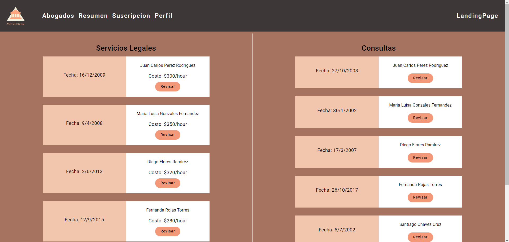

Sección Suscripción:
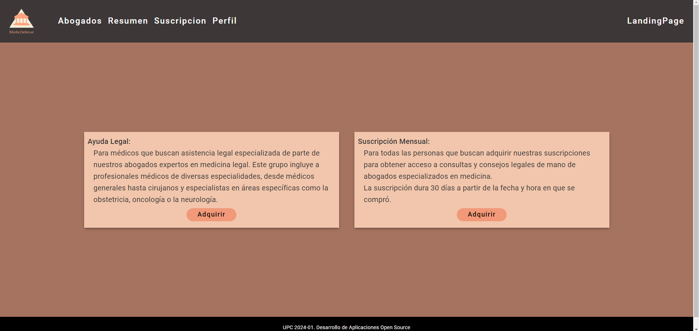

Suscripción Pago:
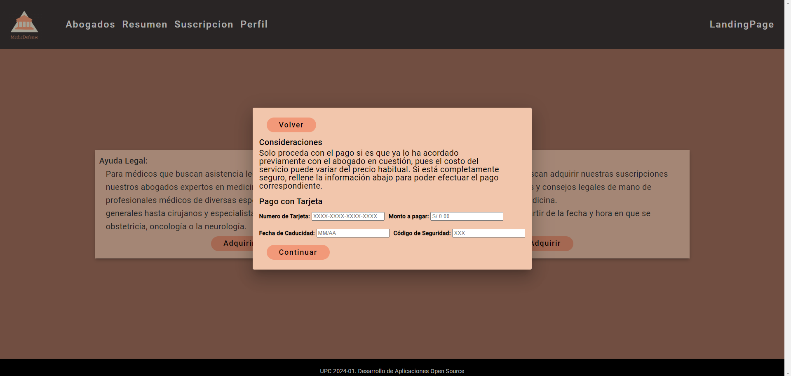

Sección Perfil Usuario:
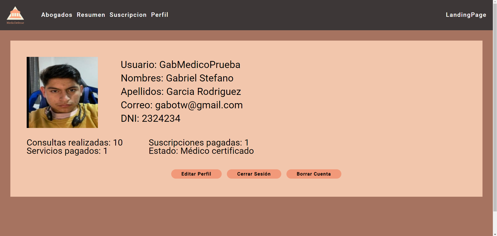

Editar Perfil Usuario:
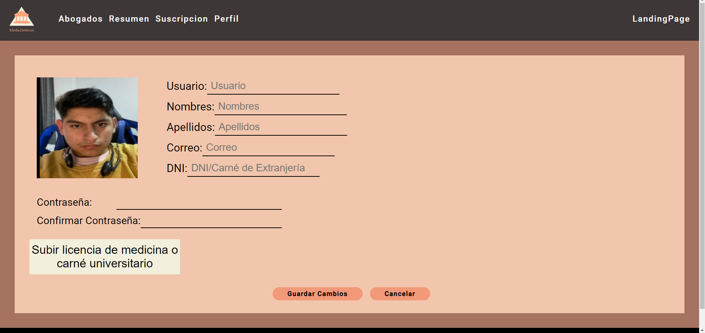

Enlace al video de Evidencia: https://upcedupe-my.sharepoint.com/:v:/g/personal/u201922146_upc_edu_pe/EcsD7o4DfFpPnvygTgabW9EBfx9hWmLUNARniRmaaV33MA?e=65UnnM&nav=eyJyZWZlcnJhbEluZm8iOnsicmVmZXJyYWxBcHAiOiJTdHJlYW1XZWJBcHAiLCJyZWZlcnJhbFZpZXciOiJTaGFyZURpYWxvZy1MaW5rIiwicmVmZXJyYWxBcHBQbGF0Zm9ybSI6IldlYiIsInJlZmVycmFsTW9kZSI6InZpZXcifX0%3D

### 5.2.2.6. Services Documentation Evidence for Sprint Review

Durante este sprint, se ha desarrollado una Fake API de abogados que proporciona información sobre abogados ficticios. La API incluye detalles como el nombre del abogado, años de experiencia, especialización, casos ganados, tarifa por hora, correo electrónico y número de teléfono.

<table>
  <tr>
    <th>Endpoint</th>
    <th>Acción</th>
    <th>Verbo HTTP</th>
    <th>Sintaxis de Llamada</th>
    <th>Parámetros</th>
    <th>Ejemplo de Llamada</th>
    <th>Explicación del Response</th>
  </tr>
  <tr>
    <td>/api/lawyers</td>
    <td>Listar</td>
    <td>GET</td>
    <td>/api/lawyers</td>
    <td>-</td>
    <td>GET /api/lawyers</td>
    <td>200 OK: Devuelve una lista de todos los abogados.</td>
  </tr>
  <tr>
    <td>/api/lawyers/{id}</td>
    <td>Obtener</td>
    <td>GET</td>
    <td>/api/lawyers/{id}</td>
    <td>ID del abogado</td>
    <td>GET /api/lawyers/1</td>
    <td>200 OK: Devuelve los detalles del abogado con el ID especificado.</td>
  </tr>
</table>

Capturas de interaccion: 

-Creacion del Fake API

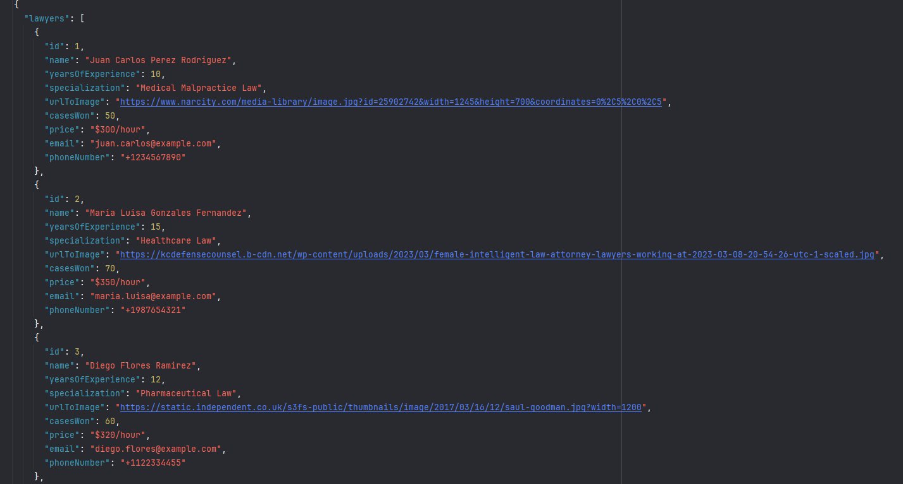

-Configuracion del servico HTTPClient

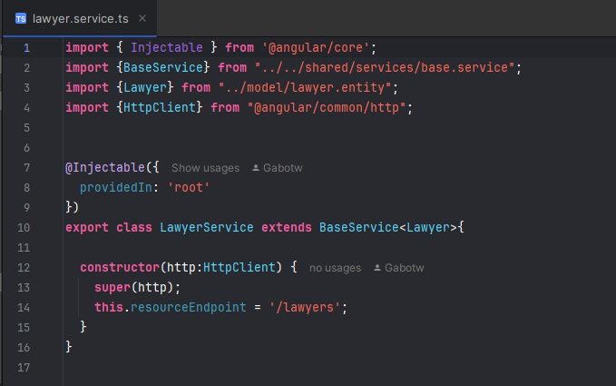

-Uso en el componente lawyer-list

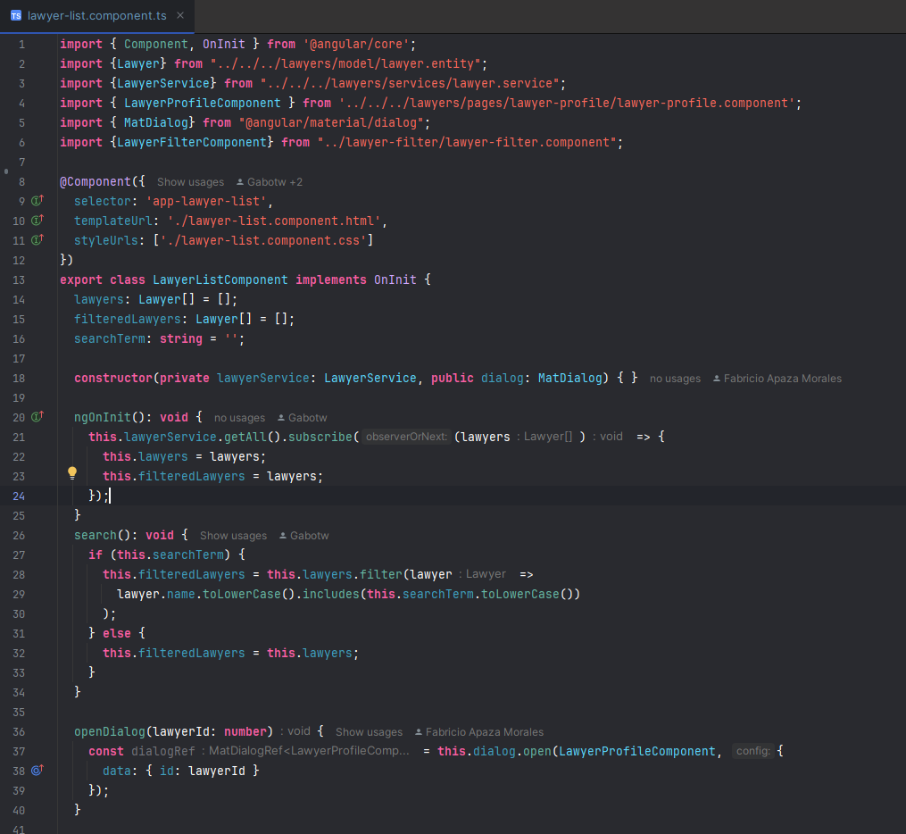
-Iteracion en la vista HTML

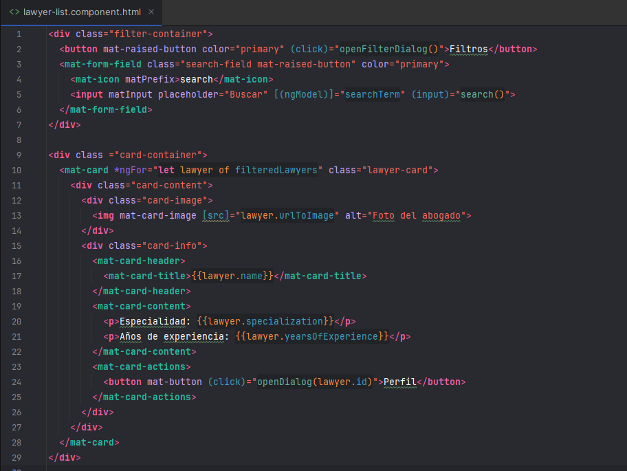

Url del repositorio: https://github.com/Open-Source-Grupo-Testigos-de-Jehova/frontend-app

Commits relacionados: 

<table>
    <tr>
        <th colspan="2">Repository</th>
        <th colspan="2">Branch</th>
        <th colspan="2">Commit Id</th>
        <th colspan="2">Commit Message</th>
    </tr>
        <tr>
        <td colspan="2">Open-Source-Grupo-Testigos-de-Jehova/Landing-page-MedicDefense</td>
        <td colspan="2">Develop</td>
        <td colspan="2">56853799d2969ae246d7b161ba4e729451f6e577</td>
        <td colspan="2">feat: added db.json and start.sh</td>
    </tr>
        <tr>
        <td colspan="2">Open-Source-Grupo-Testigos-de-Jehova/Landing-page-MedicDefense</td>
        <td colspan="2">Develop</td>
        <td colspan="2">eb08f314c976895d3b6b61955c81cdf96e3849fa</td>
        <td colspan="2">feat(static-content): added lawyers list</td>
    </tr>
</table>    

### 5.2.2.7. Software Deployment Evidence for Sprint Review
Para el despliegue de la primera version del Frontend Web Application hemos utilizado la plataforma de terceros llamada Netlify. Esta plataforma nos permite el facil acceso a nuestro repositorio de Github, el cual por medio de ciertas configuraciones podemos tener como resultado el despliegue de nuestra primera version del Frontend Web Application.

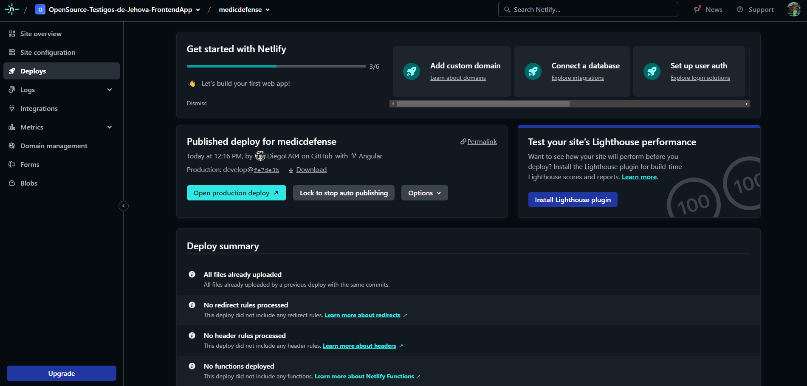

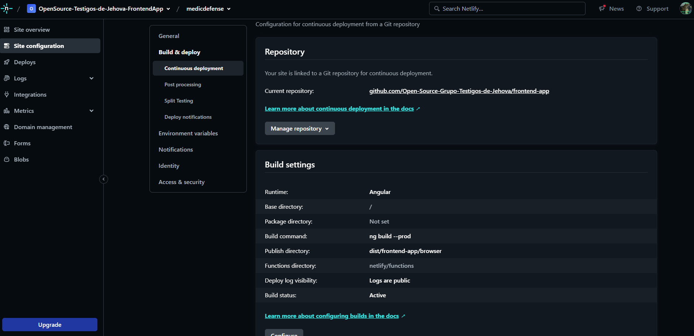

### 5.2.2.8. Team Collaboration Insights during Sprint

Para el desarrollo de este segundo sprint, todos los miembros del equipo desarrollaron y colaboraron de manera activa y continua. De tal modo, se muestra como evidencia los insights de cada miembro del equipo.

Commits:
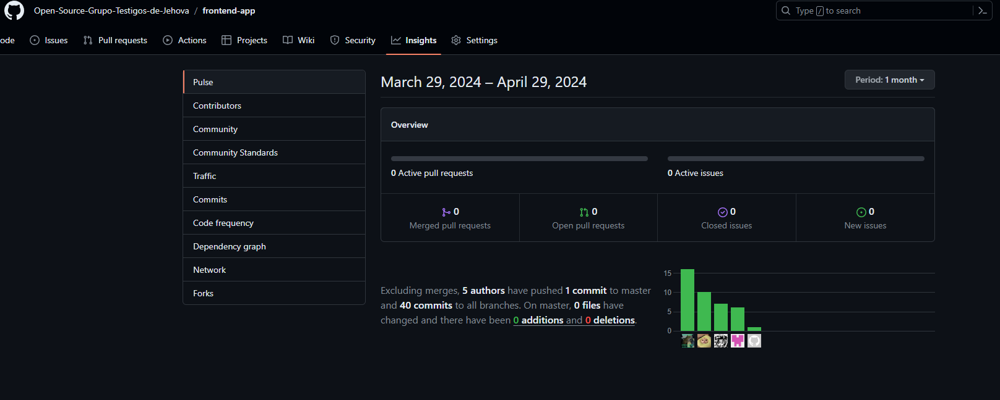

Network Graph:
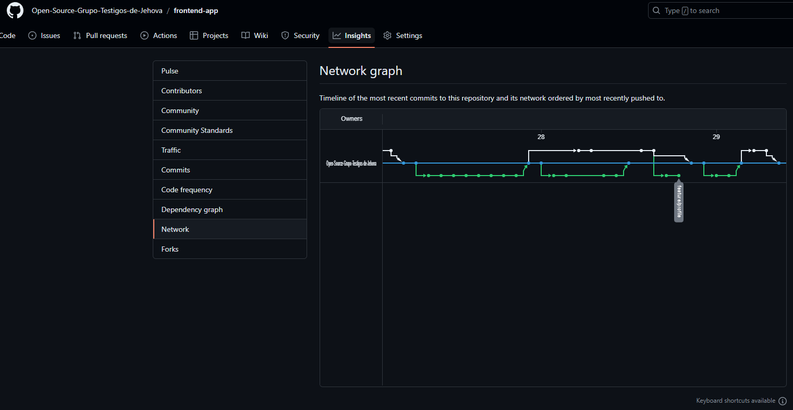

### 5.2.3. Sprint 3

### 5.2.3.1. Sprint Planning 3

<table>
<tr>
    <th colspan="5">Sprint #</th>
    <th colspan="9">Sprint 3</th>
  </tr>
      <tr>
    <td colspan="13">Sprint Planning Background</td>
  </tr>
  <tr>
    <td colspan="5">Date</td>
    <td colspan="8">2024-06-05</td>
</tr>
  <tr>
    <td colspan="5">Time</td>
    <td colspan="8">4:20 PM</td>
  </tr>
  <tr>
    <td colspan="5">Location</td>
    <td colspan="8">Via Discord y Google Meet</td>
<tr>
    <td colspan="5">Prepared By</td>
    <td colspan="8">Gabriel Garcia</td>
</tr>
<tr>
    <td colspan="5">Attendees (to planning meeting)</td>
    <td colspan="8">Gabriel Garcia, Diego Flores, Fabricio Apaza, Anatoly Noriega, Mathias Vasquez, Carlos Avellaneda</td>
</tr>
<tr>
    <td colspan="5">Sprint n – 3 Review Summary</td>
    <td colspan="8">En esta seccion se planteo el desarrollo de los Web Services para nuestro proyecto llamado MedicDefense</td>
</tr>
<tr>
    <td colspan="5">Sprint n – 3 Retrospective Summary</td>
    <td colspan="8">En esta seccion todos los integrantes mencionaron tener aciertos en algunas partes del codigo desarrollado. Sin embargo, se pudo hacer un concenso, y a la vez, mejoramos nuestras habilidades realizando el Web Services</td>
</tr>
<tr>
    <td colspan="13">Sprint Goal & User Stories</td>
</tr>
<tr>
    <td colspan="5">Sprint n Goal</td>
    <td colspan="8">Desplegar la primera version de Web Services.</td>
</tr>
<tr>
    <td colspan="5">Sprint n Velocity</td>
    <td colspan="8">51 story points</td>
</tr>
<tr>
    <td colspan="5">Sum of Story Points</td>
    <td colspan="8">51 Story Points</td>
</tr>
</table>

### 5.2.1.2. Sprint Backlog 3

<table>
<tr>
    <th colspan="3">Sprint #</th>
    <th colspan="10">Sprint 3</th>
  </tr>
      <tr>
    <td colspan="3">User Story</td>
    <td colspan="10">Work-Item/Task</td>
  </tr>
  <tr>
    <td colspan="1">Id</td>
    <td colspan="2">Title</td>
    <td colspan="1">Id</td>
    <td colspan="2">Title</td>
    <td colspan="3">Description</td>
    <td colspan="1"> Estimation</td>
    <td colspan="2">Assigned To</td>
    <td colspan="1">Status(To-do /InProcess /To-Review /Done)</td>
</tr>
  <tr>
    <td colspan="1">46</td>
    <td colspan="2">Creación y gestión de recursos de casos legales</td>
    <td colspan="1">1</td>
    <td colspan="2">Creación y gestión de recursos de casos legales</td>
    <td colspan="3">Como desarrollador backend, quiero implementar la creación y gestión de casos legales para que los administradores puedan gestionar los casos legales.</td>
    <td colspan="1">5</td>
    <td colspan="2">Fabricio and Gabriel</td>
    <td colspan="1">Done</td>
  </tr>
  <tr>
    <td colspan="1">40</td>
    <td colspan="2">Creación y Gestión de Recursos Educativos</td>
    <td colspan="1">2</td>
    <td colspan="2">Creación y Gestión de Recursos Educativos</td>
    <td colspan="3">Como desarrollador backend, quiero implementar la creación y gestión de recursos educativos en la base de datos para que los administradores puedan añadir, actualizar y eliminar recursos.</td>
    <td colspan="1">5</td>
    <td colspan="2">Anatoly</td>
    <td colspan="1">Done</td>
<tr>
<tr>
    <td colspan="1">41</td>
    <td colspan="2">Implementación de Categorías de Recursos</td>
    <td colspan="1">3</td>
    <td colspan="2">Implementación de Categorías de Recursos</td>
    <td colspan="3">Como desarrollador backend, quiero implementar la funcionalidad para gestionar categorías y etiquetas de recursos educativos para organizar los recursos de manera eficiente.</td>
    <td colspan="1">3</td>
    <td colspan="2">Anatoly</td>
    <td colspan="1">Done</td>
<tr>
<tr>
    <td colspan="1">42</td>
    <td colspan="2">Funcionalidad de Búsqueda Avanzada de Recursos Educativos</td>
    <td colspan="1">4</td>
    <td colspan="2">Funcionalidad de Búsqueda Avanzada de Recursos Educativos</td>
    <td colspan="3">Como desarrollador backend, quiero implementar una funcionalidad de búsqueda avanzada para que los usuarios puedan buscar recursos educativos por diferentes criterios.</td>
    <td colspan="1">5</td>
    <td colspan="2">Anatoly</td>
    <td colspan="1">Done</td>
<tr>
<tr>
    <td colspan="1">43</td>
    <td colspan="2">Obtener todas las notificaciones</td>
    <td colspan="1">5</td>
    <td colspan="2">Obtener todas las notificaciones</td>
    <td colspan="3">Como desarrollador backend, quiero implementar un endpoint GET para obtener todas las notificaciones para permitir a los usuarios recuperar la lista completa de notificaciones almacenadas en el sistema.</td>
    <td colspan="1">5</td>
    <td colspan="2">Diego</td>
    <td colspan="1">Done</td>
<tr>
<tr>
    <td colspan="1">44</td>
    <td colspan="2">Crear una nueva notificación</td>
    <td colspan="1">6</td>
    <td colspan="2">Crear una nueva notificación</td>
    <td colspan="3">Como desarrollador backend, quiero implementar un endpoint POST para crear una nueva notificación para permitir a los usuarios enviar nuevas notificaciones que se almacenarán en el sistema.</td>
    <td colspan="1">5</td>
    <td colspan="2">Diego</td>
    <td colspan="1">Done</td>
<tr>
<tr>
    <td colspan="1">45</td>
    <td colspan="2">Obtener una notificación por ID</td>
    <td colspan="1">7</td>
    <td colspan="2">Obtener una notificación por ID</td>
    <td colspan="3">Como desarrollador backend, quiero implementar un endpoint GET para obtener una notificación específica por su ID para permitir a los usuarios recuperar los detalles de una notificación particular basada en su identificador único.</td>
    <td colspan="1">5</td>
    <td colspan="2">Diego</td>
    <td colspan="1">Done</td>
<tr>
<tr>
    <td colspan="1">18</td>
    <td colspan="2">Integración de pagos</td>
    <td colspan="1">8</td>
    <td colspan="2">Integración de pagos</td>
    <td colspan="3">Como administrador, quiero integrar un sistema de pagos seguro para gestionar las suscripciones y compras en la plataforma.</td>
    <td colspan="1">8</td>
    <td colspan="2">Mathias</td>
    <td colspan="1">Done</td>
<tr>
<tr>
    <td colspan="1">47</td>
    <td colspan="2">Creación y gestión de recursos de consultas</td>
    <td colspan="1">9</td>
    <td colspan="2">Creación y gestión de recursos de consultas</td>
    <td colspan="3">Como desarrollador backend, quiero implementar la creación y gestión de consultas para que los administradores puedan gestionar las consultas necesarias.</td>
    <td colspan="1">5</td>
    <td colspan="2">Carlos</td>
    <td colspan="1">Done</td>
<tr>
<tr>
    <td colspan="1">48</td>
    <td colspan="2">Creación y gestión de asuntos legales</td>
    <td colspan="1">10</td>
    <td colspan="2">Creación y gestión de asuntos legales</td>
    <td colspan="3">Como desarrollador backend, quiero implementar la creación y gestión de asuntos legales para que los administradores puedan gestionar los asuntos legales.</td>
    <td colspan="1">5</td>
    <td colspan="2">Carlos</td>
    <td colspan="1">Done</td>
<tr>

</table>

### 5.2.3.3. Development Evidence for Sprint Review

<table>
  <thead>
    <tr>
      <th>Repository</th>
      <th>Branch</th>
      <th>Commit Id</th>
      <th>Commit Message</th>
      <th>Commit Message Body</th>
      <th>Committed on (Date)</th>
    </tr>
  </thead>
  <tbody>
    <tr>
      <td>Open-Source-Grupo-Testigos-de-Jehova/Backend-MedicDefense</td>
      <td>Carlos Avellaneda</td>
      <td>ef480ccd255b89447523f90e8efc7a947a490001</td>
      <td>Merge Bounded Context of Consultation</td>
      <td>-</td>
      <td>05/06/2024</td>
    </tr>
    <tr>
      <td>Open-Source-Grupo-Testigos-de-Jehova/Backend-MedicDefense</td>
      <td>Anatoly Noriega</td>
      <td>b268969f824061e227a7d9c98ed91b53f0b11d66</td>
      <td>Merge Bounded Context of Educational</td>
      <td>-</td>
      <td>05/06/2024</td>
    </tr>
    <tr>
      <td>Open-Source-Grupo-Testigos-de-Jehova/Backend-MedicDefense</td>
      <td>Augusto Vasquez</td>
      <td>6e6603067d73c88a7e96dd0ecec0a71fd2f683aa</td>
      <td>Merge Bounded Context of Payment</td>
      <td>-</td>
      <td>05/06/2024</td>
    </tr>
    <tr>
      <td>Open-Source-Grupo-Testigos-de-Jehova/Backend-MedicDefense</td>
      <td>Diego Flores</td>
      <td>4b47b3d13182b9ad5f00b1eb2603b3e9fb5c3fe1</td>
      <td>Merge Bounded Context of Communication</td>
      <td>-</td>
      <td>05/06/2024</td>
    </tr>
     <tr>
      <td>Open-Source-Grupo-Testigos-de-Jehova/Backend-MedicDefense</td>
      <td>Gabriel Garcia and Fabricio Apaza</td>
      <td>df35dfbd4c1b012e244eb905bb03d8cde62e29f7</td>
      <td>Merge Bounded Context of Legal Case</td>
      <td>-</td>
      <td>05/06/2024</td>
    </tr>
  </tbody>
</table>

### 5.2.3.4. Testing Suite Evidence for Sprint Review

<table>
  <thead>
    <tr>
      <th>Repository</th>
      <th>Branch</th>
      <th>Commit Id</th>
      <th>Commit Message</th>
      <th>Commit Message Body</th>
      <th>Committed on (Date)</th>
    </tr>
  </thead>
  <tbody>
    <tr>
      <td>Open-Source-Grupo-Testigos-de-Jehova/Backend-MedicDefense</td>
      <td>Carlos Avellaneda</td>
      <td>ef480ccd255b89447523f90e8efc7a947a490001</td>
      <td>Merge Bounded Context of Consultation</td>
      <td>-</td>
      <td>05/06/2024</td>
    </tr>
    <tr>
      <td>Open-Source-Grupo-Testigos-de-Jehova/Backend-MedicDefense</td>
      <td>Anatoly Noriega</td>
      <td>b268969f824061e227a7d9c98ed91b53f0b11d66</td>
      <td>Merge Bounded Context of Educational</td>
      <td>-</td>
      <td>05/06/2024</td>
    </tr>
    <tr>
      <td>Open-Source-Grupo-Testigos-de-Jehova/Backend-MedicDefense</td>
      <td>Augusto Vasquez</td>
      <td>6e6603067d73c88a7e96dd0ecec0a71fd2f683aa</td>
      <td>Merge Bounded Context of Payment</td>
      <td>-</td>
      <td>05/06/2024</td>
    </tr>
    <tr>
      <td>Open-Source-Grupo-Testigos-de-Jehova/Backend-MedicDefense</td>
      <td>Diego Flores</td>
      <td>4b47b3d13182b9ad5f00b1eb2603b3e9fb5c3fe1</td>
      <td>Merge Bounded Context of Communication</td>
      <td>-</td>
      <td>05/06/2024</td>
    </tr>
     <tr>
      <td>Open-Source-Grupo-Testigos-de-Jehova/Backend-MedicDefense</td>
      <td>Gabriel Garcia and Fabricio Apaza</td>
      <td>df35dfbd4c1b012e244eb905bb03d8cde62e29f7</td>
      <td>Merge Bounded Context of Legal Case</td>
      <td>-</td>
      <td>05/06/2024</td>
    </tr>
  </tbody>
</table>

### 5.2.3.5. Execution Evidence for Sprint Review
Para esta tercera entrega, nuestro equipo a conseguido elaborar la primera versión del Web Services del proyecto "MedicDefense". El cual utilizamos la plataforma "Swagger" para poder visualizar los endpoints realizados.

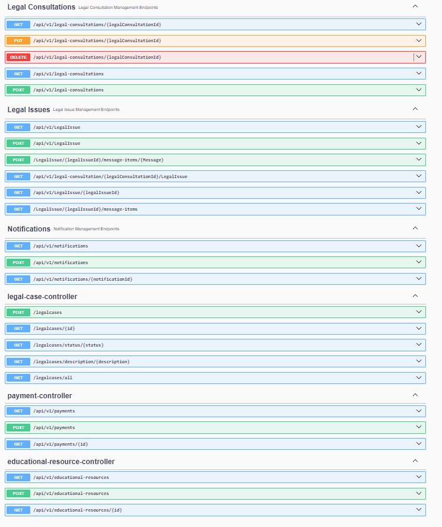

### 5.2.3.6. Services Documentation Evidence for Sprint Review

Durante este sprint, se ha desarrollado el back-end de una API de abogados utilizando Java, JPA (Java Persistence API), y siguiendo los principios de Domain-Driven Design (DDD). La API proporciona información sobre abogados ficticios, incluyendo detalles como el nombre del abogado, años de experiencia, especialización, casos ganados, tarifa por hora, correo electrónico y número de teléfono, utilizando la convención de nomenclatura snake_case para los campos. Además, la API también proporciona información sobre recursos educativos (educational_resources), pagos (payments), casos legales (legal_cases) y consultas (consultations).

<table>
  <tr>
    <th>Endpoint</th>
    <th>Acción</th>
    <th>Verbo HTTP</th>
    <th>Sintaxis de Llamada</th>
    <th>Parámetros</th>
    <th>Ejemplo de Llamada</th>
    <th>Explicación del Response</th>
  </tr>
  <tr>
    <td>/api/v1/lawyers</td>
    <td>Listar</td>
    <td>GET</td>
    <td>/api/lawyers</td>
    <td>-</td>
    <td>GET /api/lawyers</td>
    <td>200 OK: Devuelve una lista de todos los abogados.</td>
  </tr>
  <tr>
    <td>/api/v1/lawyers/{id}</td>
    <td>Obtener</td>
    <td>GET</td>
    <td>/api/lawyers/{id}</td>
    <td>ID del abogado</td>
    <td>GET /api/lawyers/1</td>
    <td>200 OK: Devuelve los detalles del abogado con el ID especificado.</td>
  </tr>
  <tr>
    <td>/api/v1/legal-consultations/{legalConsultaationId}</td>
    <td>Obtener</td>
    <td>GET</td>
    <td>/api/v1/legal-consultations/{legalConsultaationId}</td>
    <td>ID del legal consultation</td>
    <td>GET /api/legal-consultations/{legalConsultaationId}</td>
    <td>200 OK: Devuelve los detalles de los legal consultations.</td>
  </tr>
  <tr>
    <td>/api/v1/legal-consultations/{legalConsultaationId}</td>
    <td>Recibir</td>
    <td>POST</td>
    <td>/api/v1/legal-consultations/{legalConsultaationId}</td>
    <td>ID del legal consultations</td>
    <td>POST/api/legal-consultations/{legalConsultaationId}</td>
    <td>200 OK: Devuelve los detalles del abogado con el ID especificado.</td>
  </tr>
  <tr>
    <td>/api/v1/legal-consultations/{legalConsultaationId}</td>
    <td>Eliminar</td>
    <td>Delete</td>
    <td>/api/v1/legal-consultations/{legalConsultaationId}</td>
    <td>ID del legaal consultations</td>
    <td>Delete /api/lawyers/1</td>
    <td>200 OK: Devuelve los detalles del abogado con el ID especificado.</td>
  </tr>
  <tr>
    <td>/api/v1/notifications/{notificationId}</td>
    <td>Obtener</td>
    <td>GET</td>
    <td>/api/v1/notifications/{notificationId}</td>
    <td>ID del notification</td>
    <td>GET /api/notifications/1</td>
    <td>200 OK: Devuelve los detalles del abogado con el ID especificado.</td>
  </tr>
  <tr>
    <td>/api/v1/notifications/{notificationId}</td>
    <td>Recibir</td>
    <td>POST</td>
    <td>/api/v1/notifications/{notificationId}</td>
    <td>ID de la notificacion</td>
    <td>POST /api/v1/notifications/1</td>
    <td>200 OK: Devuelve los detalles del abogado con el ID especificado.</td>
  </tr>
  <tr>
    <td>/api/v1/legalcases/{Id}</td>
    <td>Recibir</td>
    <td>POST</td>
    <td>/api/v1/legalcases/{Id}</td>
    <td>ID del legal cases</td>
    <td>POST /api/v1/legalcases/1</td>
    <td>200 OK: Devuelve los detalles del abogado con el ID especificado.</td>
  </tr>
  <tr>
    <td>/api/v1/payment/{id}</td>
    <td>Obtener</td>
    <td>GET</td>
    <td>/api/v1/payment/{id}</td>
    <td>ID del payment</td>
    <td>POST /api/v1/payment/1</td>
    <td>200 OK: Devuelve los detalles del abogado con el ID especificado.</td>
  </tr>
  <tr>
    <td>/api/v1/educaational-resources/{id}</td>
    <td>Recibir</td>
    <td>POST</td>
    <td>/api/v1/educaational-resources/{notificationId}</td>
    <td>ID del educational resource</td>
    <td>GET /api/v1/educaational-resources/1</td>
    <td>200 OK: Devuelve los detalles del abogado con el ID especificado.</td>
  </tr>

</table>

Capturas de interaccion:

- Visualización de los endpoints:

- Controller del bounded context Notification

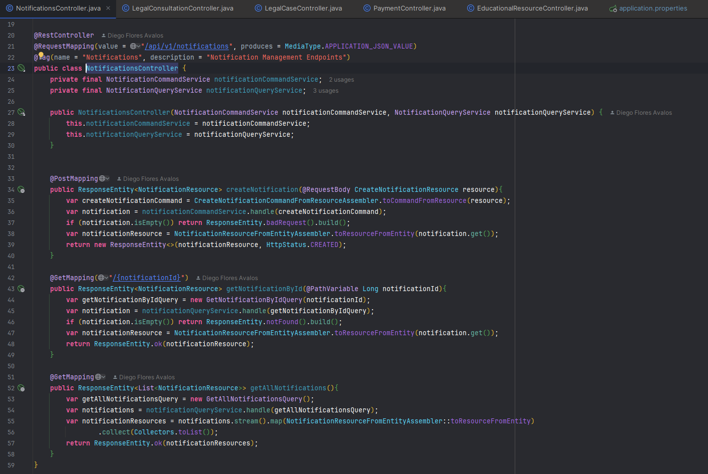

- Controller del bounded context Consultation

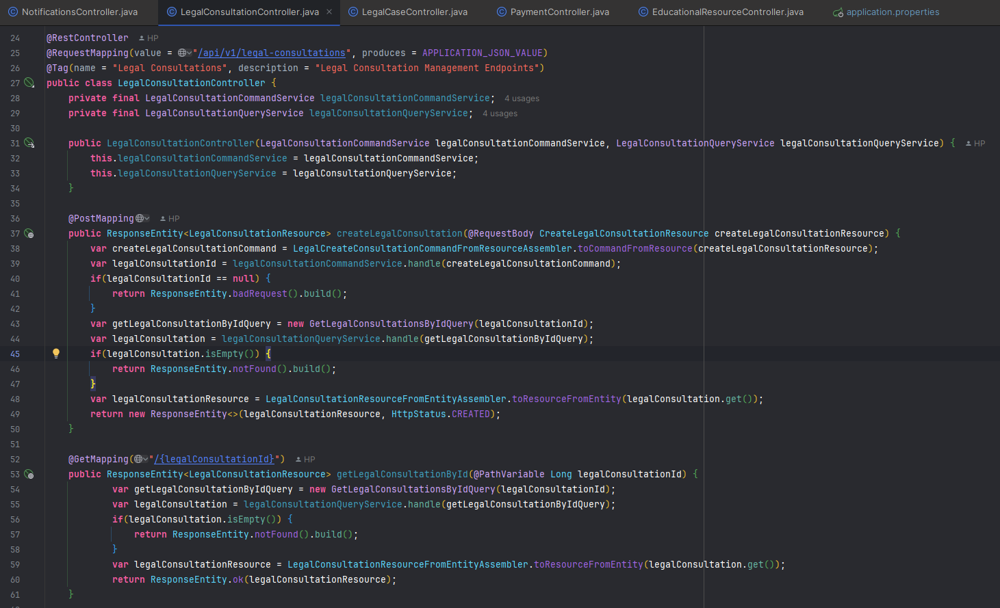

- Controller del bounded context legal case

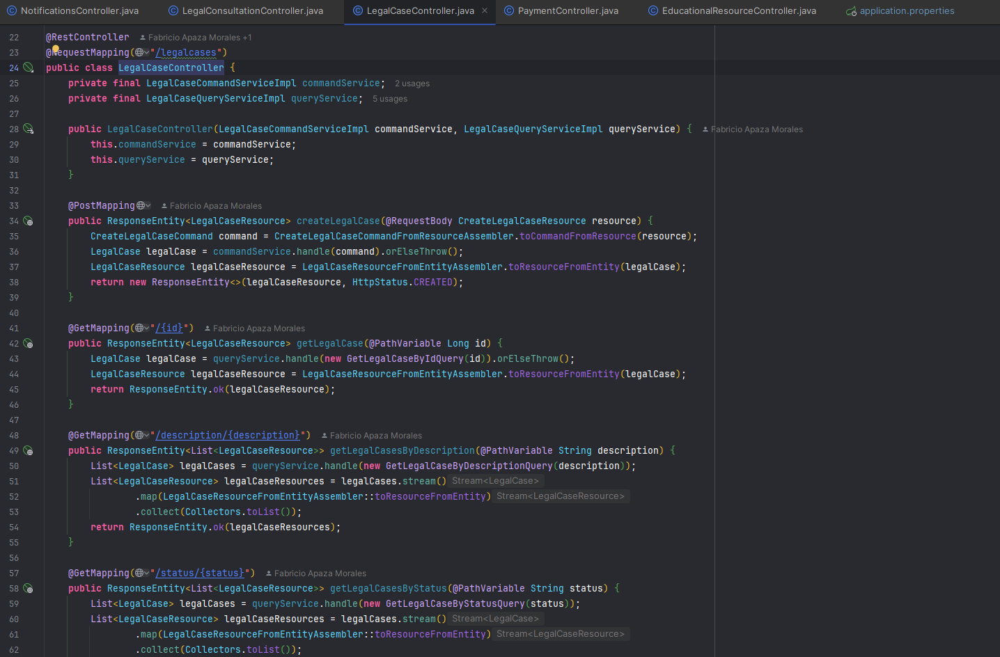

- Controller del bounded context payment

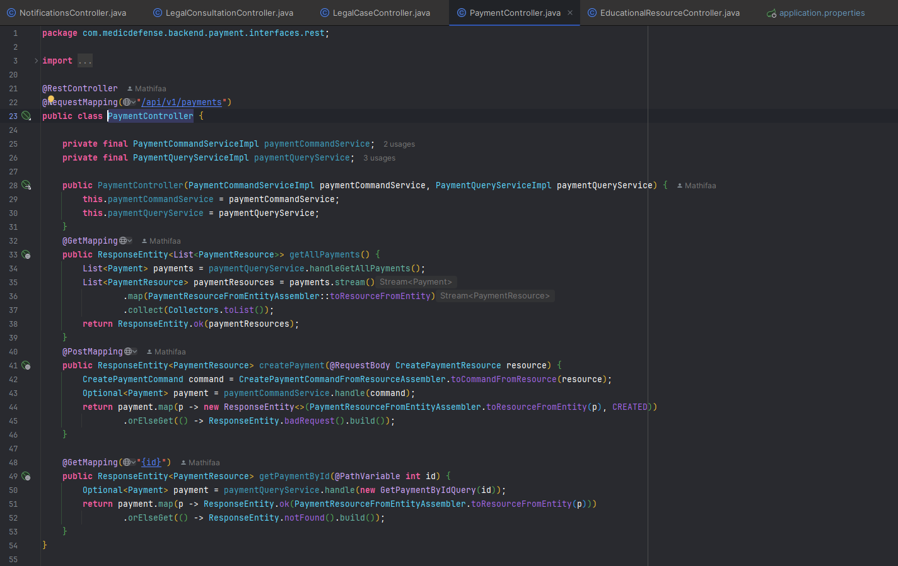

Url del repositorio: https://github.com/Open-Source-Grupo-Testigos-de-Jehova/backend-Medic-Defense

Commits relacionados: 

<table>
    <tr>
        <th colspan="2">Repository</th>
        <th colspan="2">Branch</th>
        <th colspan="2">Commit Id</th>
        <th colspan="2">Commit Message</th>
    </tr>
        <tr>
        <td colspan="2">Open-Source-Grupo-Testigos-de-Jehova/backend-Medic-Defense</td>
        <td colspan="2">Carlos_Avellaneda</td>
        <td colspan="2">ef480ccd255b89447523f90e8efc7a947a490001</td>
        <td colspan="2">Merge pull request</td>
    </tr>
        <tr>
        <td colspan="2">Open-Source-Grupo-Testigos-de-Jehova/backend-Medic-Defense</td>
        <td colspan="2">Anatoly_noriega</td>
        <td colspan="2">b268969f824061e227a7d9c98ed91b53f0b11d66</td>
        <td colspan="2">Merge pull request</td>
    </tr>
    <tr>
        <td colspan="2">Open-Source-Grupo-Testigos-de-Jehova/backend-Medic-Defense</td>
        <td colspan="2">Augusto_Vasquez</td>
        <td colspan="2">6e6603067d73c88a7e96dd0ecec0a71fd2f683aa</td>
        <td colspan="2">Merge pull request</td>
    </tr>
    <tr>
        <td colspan="2">Open-Source-Grupo-Testigos-de-Jehova/backend-Medic-Defense</td>
        <td colspan="2">Diego_Flores</td>
        <td colspan="2">4b47b3d13182b9ad5f00b1eb2603b3e9fb5c3fe1</td>
        <td colspan="2">Merge pull request</td>
    </tr>
    <tr>
        <td colspan="2">Open-Source-Grupo-Testigos-de-Jehova/backend-Medic-Defense</td>
        <td colspan="2">Gabriel_Garcia-and-Fabricio_Apaza</td>
        <td colspan="2">df35dfbd4c1b012e244eb905bb03d8cde62e29f7</td>
        <td colspan="2">Merge pull request</td>
    </tr>
</table>    

### 5.2.3.7. Software Deployment Evidence for Sprint Review
Para el desarrollo de la primera version de Web Services, hemos utilizado la plataforma Github para poder almacenar el avance realizado.

### 5.2.3.8. Team Collaboration Insights during Sprint
Para el desarrollo de este tercer sprint, todos los miembros del equipo desarrollaron y colaboraron de manera activa y continua. De tal modo, se muestra como evidencia los insights de cada miembro del equipo.

**Commits:**

**Analiticas de Colaboración:**

### 5.2.4. Sprint 4

### 5.2.4.1. Sprint Planning 4

<table>
<tr>
    <th colspan="5">Sprint #</th>
    <th colspan="9">Sprint 4</th>
  </tr>
      <tr>
    <td colspan="13">Sprint Planning Background</td>
  </tr>
  <tr>
    <td colspan="5">Date</td>
    <td colspan="8">2024-06-19</td>
</tr>
  <tr>
    <td colspan="5">Time</td>
    <td colspan="8">8:30 PM</td>
  </tr>
  <tr>
    <td colspan="5">Location</td>
    <td colspan="8">Via Discord</td>
<tr>
    <td colspan="5">Prepared By</td>
    <td colspan="8">Gabriel Garcia</td>
</tr>
<tr>
    <td colspan="5">Attendees (to planning meeting)</td>
    <td colspan="8">Gabriel Garcia, Diego Flores, Fabricio Apaza, Anatoly Noriega, Mathias Vasquez, Carlos Avellaneda</td>
</tr>
<tr>
    <td colspan="5">Sprint n – 4 Review Summary</td>
    <td colspan="8">En esta sección se corrigieron los errores dentro del informe, se mejoró el front y el back para hacer la conexión con la API y el sitio web.</td>
</tr>
<tr>
    <td colspan="5">Sprint n – 4 Retrospective Summary</td>
    <td colspan="8">En esta sección todos los integrantes mencionaron tener aciertos en algunas partes del código desarrollado. Sin embargo, se pudo hacer un consenso y mejorar nuestras habilidades al realizar la conexión con la API y el sitio web.</td>
</tr>
<tr>
    <td colspan="13">Sprint Goal & User Stories</td>
</tr>
<tr>
    <td colspan="5">Sprint n Goal</td>
    <td colspan="8">Corregir errores e implementar la conexión entre el front y el back con la API y el sitio web.</td>
</tr>
<tr>
    <td colspan="5">Sprint n Velocity</td>
    <td colspan="8">51 story points</td>
</tr>
<tr>
    <td colspan="5">Sum of Story Points</td>
    <td colspan="8">51 Story Points</td>
</tr>
</table>

### 5.2.4.2. Sprint Backlog 4

<table>
<tr>
    <th colspan="3">Sprint #</th>
    <th colspan="10">Sprint 4</th>
</tr>
<tr>
    <td colspan="3">User Story</td>
    <td colspan="10">Work-Item/Task</td>
</tr>
<tr>
    <td colspan="1">Id</td>
    <td colspan="2">Title</td>
    <td colspan="1">Id</td>
    <td colspan="2">Title</td>
    <td colspan="3">Description</td>
    <td colspan="1">Estimation</td>
    <td colspan="2">Assigned To</td>
    <td colspan="1">Status (To-do /InProcess /To-Review /Done)</td>
</tr>
<tr>
    <td colspan="1">24</td>
    <td colspan="2">Soporte para múltiples navegadores</td>
    <td colspan="1">1</td>
    <td colspan="2">Soporte para múltiples navegadores</td>
    <td colspan="3">Como desarrollador, quiero garantizar la compatibilidad en múltiples navegadores, para una experiencia de usuario uniforme.</td>
    <td colspan="1">3</td>
    <td colspan="2">Gabriel</td>
    <td colspan="1">Done</td>
</tr>
<tr>
    <td colspan="1">33</td>
    <td colspan="2">Obtener todas las notificaciones</td>
    <td colspan="1">2</td>
    <td colspan="2">Obtener todas las notificaciones</td>
    <td colspan="3">Como desarrollador backend, quiero implementar un endpoint GET para obtener todas las notificaciones para permitir a los usuarios recuperar la lista completa de notificaciones almacenadas en el sistema.</td>
    <td colspan="1">5</td>
    <td colspan="2">Gabriel</td>
    <td colspan="1">Done</td>
</tr>
<tr>
    <td colspan="1">34</td>
    <td colspan="2">Crear una nueva notificación</td>
    <td colspan="1">3</td>
    <td colspan="2">Crear una nueva notificación</td>
    <td colspan="3">Como desarrollador backend, quiero implementar un endpoint POST para crear una nueva notificación para permitir a los usuarios enviar nuevas notificaciones que se almacenarán en el sistema.</td>
    <td colspan="1">5</td>
    <td colspan="2">Gabriel</td>
    <td colspan="1">Done</td>
</tr>
<tr>
    <td colspan="1">35</td>
    <td colspan="2">Obtener una notificación por ID</td>
    <td colspan="1">4</td>
    <td colspan="2">Obtener una notificación por ID</td>
    <td colspan="3">Como desarrollador backend, quiero implementar un endpoint GET para obtener una notificación específica por su ID para permitir a los usuarios recuperar los detalles de una notificación particular basada en su identificador único.</td>
    <td colspan="1">5</td>
    <td colspan="2">Gabriel</td>
    <td colspan="1">Done</td>
</tr>
<tr>
    <td colspan="1">19</td>
    <td colspan="2">Base de datos de usuarios</td>
    <td colspan="1">5</td>
    <td colspan="2">Base de datos de usuarios</td>
    <td colspan="3">Como administrador, quiero implementar una base de datos segura y escalable, para proteger y gestionar eficazmente la información de los usuarios.</td>
    <td colspan="1">5</td>
    <td colspan="2">Diego</td>
    <td colspan="1">Done</td>
</tr>
<tr>
    <td colspan="1">25</td>
    <td colspan="2">Configuración de la base de datos</td>
    <td colspan="1">6</td>
    <td colspan="2">Configuración de la base de datos</td>
    <td colspan="3">Como desarrollador, quiero diseñar y configurar la estructura de la base de datos para almacenar la información de los abogados, incluyendo campos como nombre, especialidad y ubicación.</td>
    <td colspan="1">3</td>
    <td colspan="2">Diego</td>
    <td colspan="1">Done</td>
</tr>
<tr>
    <td colspan="1">20</td>
    <td colspan="2">API para gestión de perfiles</td>
    <td colspan="1">7</td>
    <td colspan="2">API para gestión de perfiles</td>
    <td colspan="3">Como desarrollador, quiero APIs robustas para crear, editar y eliminar perfiles de usuario.</td>
    <td colspan="1">5</td>
    <td colspan="2">Diego</td>
    <td colspan="1">Done</td>
</tr>
<tr>
    <td colspan="1">22</td>
    <td colspan="2">API para búsqueda por filtros</td>
    <td colspan="1">8</td>
    <td colspan="2">API para búsqueda por filtros</td>
    <td colspan="3">Como desarrollador, quiero crear una API para búsquedas por filtros, para mejorar la accesibilidad de la información.</td>
    <td colspan="1">5</td>
    <td colspan="2">Diego</td>
    <td colspan="1">Done</td>
</tr>
<tr>
    <td colspan="1">27</td>
    <td colspan="2">Creación y Gestión de la Entidad de Abogados</td>
    <td colspan="1">9</td>
    <td colspan="2">Creación y Gestión de la Entidad de Abogados</td>
    <td colspan="3">Como desarrollador backend, quiero implementar la creación y gestión de la entidad de abogados en la base de datos para almacenar información detallada de los abogados.</td>
    <td colspan="1">5</td>
    <td colspan="2">Diego</td>
    <td colspan="1">Done</td>
</tr>
<tr>
    <td colspan="1">03</td>
    <td colspan="2">Gestión de Roles de Cuentas</td>
    <td colspan="1">10</td>
    <td colspan="2">Gestión de Roles de Cuentas</td>
    <td colspan="3">Como administrador de la plataforma, necesito poder asignar, modificar y revocar roles de usuario para gestionar adecuadamente el acceso a diversas áreas de la plataforma.</td>
    <td colspan="1">3</td>
    <td colspan="2">Fabricio</td>
    <td colspan="1">Done</td>
</tr>
<tr>
    <td colspan="1">37</td>
    <td colspan="2">Creación y gestión de recursos de consultas</td>
    <td colspan="1">11</td>
    <td colspan="2">Creación y gestión de recursos de consultas</td>
    <td colspan="3">Como desarrollador backend, quiero implementar la creación y gestión de consultas para que los administradores puedan gestionar las consultas necesarias.</td>
    <td colspan="1">5</td>
    <td colspan="2">Fabricio</td>
    <td colspan="1">Done</td>
</tr>
<tr>
    <td colspan="1">01</td>
    <td colspan="2">Gestión de las cuentas de los usuarios</td>
    <td colspan="1">12</td>
    <td colspan="2">Gestión de las cuentas de los usuarios</td>
    <td colspan="3">Como usuario de la plataforma de MedicDefense, quiero tener la capacidad de gestionar mi cuenta personal, para mantener mi información profesional actualizada y asegurar que la experiencia de la plataforma sea lo más relevante y segura posible.</td>
    <td colspan="1">3</td>
    <td colspan="2">Carlos</td>
    <td colspan="1">Done</td>
</tr>
<tr>
    <td colspan="1">36</td>
    <td colspan="2">Creación y gestión de recursos de casos legales</td>
    <td colspan="1">13</td>
    <td colspan="2">Creación y gestión de recursos de casos legales</td>
    <td colspan="3">Como desarrollador backend, quiero implementar la creación y gestión de casos legales para que los administradores puedan gestionar los casos legales.</td>
    <td colspan="1">5</td>
    <td colspan="2">Carlos</td>
    <td colspan="1">Done</td>
</tr>
<tr>
    <td colspan="1">06</td>
    <td colspan="2">Visualizar actividades del Usuario</td>
    <td colspan="1">14</td>
    <td colspan="2">Visualizar actividades del Usuario</td>
    <td colspan="3">Como usuario de la plataforma de MedicDefense, quiero visualizar la lista de las actividades que realizo para tener un control y orden en las acciones que realizo.</td>
    <td colspan="1">5</td>
    <td colspan="2">Anatoly</td>
    <td colspan="1">Done</td>
</tr>
<tr>
    <td colspan="1">31</td>
    <td colspan="2">Implementación de Categorías de Recursos</td>
    <td colspan="1">15</td>
    <td colspan="2">Implementación de Categorías de Recursos</td>
    <td colspan="3">Como desarrollador backend, quiero implementar la funcionalidad para gestionar categorías de los recursos educativos para organizar los recursos de manera eficiente.</td>
    <td colspan="1">3</td>
    <td colspan="2">Anatoly</td>
    <td colspan="1">Done</td>
</tr>
<tr>
    <td colspan="1">30</td>
    <td colspan="2">Creación y Gestión de Recursos Educativos</td>
    <td colspan="1">16</td>
    <td colspan="2">Creación y Gestión de Recursos Educativos</td>
    <td colspan="3">Como desarrollador backend, quiero implementar la creación y gestión de recursos educativos en la base de datos para que los administradores puedan añadir, actualizar y eliminar recursos.</td>
    <td colspan="1">5</td>
    <td colspan="2">Anatoly</td>
    <td colspan="1">Done</td>
</tr>
<tr>
    <td colspan="1">32</td>
    <td colspan="2">Funcionalidad de Búsqueda Avanzada de Recursos Educativos</td>
    <td colspan="1">17</td>
    <td colspan="2">Funcionalidad de Búsqueda Avanzada de Recursos Educativos</td>
    <td colspan="3">Como desarrollador backend, quiero implementar una funcionalidad de búsqueda avanzada para que los usuarios puedan buscar recursos educativos por diferentes criterios.</td>
    <td colspan="1">5</td>
    <td colspan="2">Anatoly</td>
    <td colspan="1">Done</td>
</tr>
<tr>
    <td colspan="1">29</td>
    <td colspan="2">Gestión de Suscripciones</td>
    <td colspan="1">18</td>
    <td colspan="2">Gestión de Suscripciones</td>
    <td colspan="3">Como desarrollador, quiero implementar la gestión de suscripciones para que los usuarios puedan ver, seleccionar y administrar sus planes de suscripción en la plataforma.</td>
    <td colspan="1">5</td>
    <td colspan="2">Mathias</td>
    <td colspan="1">Done</td>
</tr>
<tr>
    <td colspan="1">18</td>
    <td colspan="2">Integración de pagos</td>
    <td colspan="1">19</td>
    <td colspan="2">Integración de pagos</td>
    <td colspan="3">Como administrador, quiero integrar un sistema de pagos seguro para gestionar las suscripciones y compras en la plataforma.</td>
    <td colspan="1">8</td>
    <td colspan="2">Mathias</td>
    <td colspan="1">Done</td>
</tr>
</table>

### 5.2.4.3. Development Evidence for Sprint Review

<table>
  <thead>
    <tr>
      <th>Repository</th>
      <th>Branch</th>
      <th>Commit Id</th>
      <th>Commit Message</th>
      <th>Commit Message Body</th>
      <th>Committed on (Date)</th>
    </tr>
  </thead>
  <tbody>
    <tr>
      <td>Open-Source-Grupo-Testigos-de-Jehova/Backend-MedicDefense</td>
      <td>Carlos Avellaneda</td>
      <td>ef480ccd255b89447523f90e8efc7a947a490001</td>
      <td>Merge Bounded Context of Consultation</td>
      <td>-</td>
      <td>05/06/2024</td>
    </tr>
    <tr>
      <td>Open-Source-Grupo-Testigos-de-Jehova/Backend-MedicDefense</td>
      <td>Anatoly Noriega</td>
      <td>b268969f824061e227a7d9c98ed91b53f0b11d66</td>
      <td>Merge Bounded Context of Educational</td>
      <td>-</td>
      <td>05/06/2024</td>
    </tr>
    <tr>
      <td>Open-Source-Grupo-Testigos-de-Jehova/Backend-MedicDefense</td>
      <td>Augusto Vasquez</td>
      <td>6e6603067d73c88a7e96dd0ecec0a71fd2f683aa</td>
      <td>Merge Bounded Context of Payment</td>
      <td>-</td>
      <td>05/06/2024</td>
    </tr>
    <tr>
      <td>Open-Source-Grupo-Testigos-de-Jehova/Backend-MedicDefense</td>
      <td>Diego Flores</td>
      <td>4b47b3d13182b9ad5f00b1eb2603b3e9fb5c3fe1</td>
      <td>Merge Bounded Context of Communication</td>
      <td>-</td>
      <td>05/06/2024</td>
    </tr>
     <tr>
      <td>Open-Source-Grupo-Testigos-de-Jehova/Backend-MedicDefense</td>
      <td>Gabriel Garcia and Fabricio Apaza</td>
      <td>df35dfbd4c1b012e244eb905bb03d8cde62e29f7</td>
      <td>Merge Bounded Context of Legal Case</td>
      <td>-</td>
      <td>05/06/2024</td>
    </tr>
  </tbody>
</table>

### 5.2.4.4. Testing Suite Evidence for Sprint Review

<table>
  <thead>
    <tr>
      <th>Repository</th>
      <th>Branch</th>
      <th>Commit Id</th>
      <th>Commit Message</th>
      <th>Commit Message Body</th>
      <th>Committed on (Date)</th>
    </tr>
  </thead>
  <tbody>
    <tr>
      <td>Open-Source-Grupo-Testigos-de-Jehova/Backend-MedicDefense</td>
      <td>Carlos Avellaneda</td>
      <td>ef480ccd255b89447523f90e8efc7a947a490001</td>
      <td>Merge Bounded Context of Consultation</td>
      <td>-</td>
      <td>05/06/2024</td>
    </tr>
    <tr>
      <td>Open-Source-Grupo-Testigos-de-Jehova/Backend-MedicDefense</td>
      <td>Anatoly Noriega</td>
      <td>b268969f824061e227a7d9c98ed91b53f0b11d66</td>
      <td>Merge Bounded Context of Educational</td>
      <td>-</td>
      <td>05/06/2024</td>
    </tr>
    <tr>
      <td>Open-Source-Grupo-Testigos-de-Jehova/Backend-MedicDefense</td>
      <td>Augusto Vasquez</td>
      <td>6e6603067d73c88a7e96dd0ecec0a71fd2f683aa</td>
      <td>Merge Bounded Context of Payment</td>
      <td>-</td>
      <td>05/06/2024</td>
    </tr>
    <tr>
      <td>Open-Source-Grupo-Testigos-de-Jehova/Backend-MedicDefense</td>
      <td>Diego Flores</td>
      <td>4b47b3d13182b9ad5f00b1eb2603b3e9fb5c3fe1</td>
      <td>Merge Bounded Context of Communication</td>
      <td>-</td>
      <td>05/06/2024</td>
    </tr>
     <tr>
      <td>Open-Source-Grupo-Testigos-de-Jehova/Backend-MedicDefense</td>
      <td>Gabriel Garcia and Fabricio Apaza</td>
      <td>df35dfbd4c1b012e244eb905bb03d8cde62e29f7</td>
      <td>Merge Bounded Context of Legal Case</td>
      <td>-</td>
      <td>05/06/2024</td>
    </tr>
  </tbody>
</table>

### 5.2.4.5. Execution Evidence for Sprint Review
Para esta cuarta entrega, nuestro equipo ha mejorado y pulido tanto la parte de backend como la de frontend del proyecto "MedicDefense". Además, hemos logrado la conexión entre ambas partes, asegurando una integración fluida y funcional. Esto permite a los usuarios interactuar con las funcionalidades de la plataforma de manera eficiente y coherente.

Enpoints:

Sing-In:

Sing-Up:

Lawyers:

Search Lawyers:

Summary:

Profile:

Educational Resources:

### 5.2.4.6. Services Documentation Evidence for Sprint Review

Durante este sprint, se ha mejorado el back-end y front-end de una API integral utilizando Java, JPA (Java Persistence API) y siguiendo los principios de Domain-Driven Design (DDD). Además, se ha realizado la conexión entre ambos. Esta API proporciona una amplia gama de funcionalidades, incluyendo la gestión de abogados, recursos educativos, pagos, casos legales, consultas, notificaciones, perfiles, especialidades, roles, usuarios y universidades. La información detallada sobre estos elementos se maneja mediante diversos endpoints que permiten operaciones como listar, crear, actualizar y eliminar registros, utilizando la convención de nomenclatura snake_case para los campos. Estas mejoras aseguran una cobertura completa y eficiente de las necesidades del sistema, facilitando tanto la interacción de los usuarios con la plataforma como la gestión interna de los datos.

<table>
  <tr>
    <th>Endpoint</th>
    <th>Acción</th>
    <th>Verbo HTTP</th>
    <th>Sintaxis de Llamada</th>
    <th>Parámetros</th>
    <th>Ejemplo de Llamada</th>
    <th>Explicación del Response</th>
  </tr>
  <tr>
    <td>/api/v1/medic/{recordId}/add-one-to-paid-service</td>
    <td>Añadir servicio pagado</td>
    <td>PUT</td>
    <td>/api/v1/medic/{recordId}/add-one-to-paid-service</td>
    <td>recordId</td>
    <td>PUT /api/v1/medic/1/add-one-to-paid-service</td>
    <td>200 OK: Añade un servicio pagado al registro especificado.</td>
  </tr>
  <tr>
    <td>/api/v1/medic/{recordId}/add-one-to-consultation</td>
    <td>Añadir consulta</td>
    <td>PUT</td>
    <td>/api/v1/medic/{recordId}/add-one-to-consultation</td>
    <td>recordId</td>
    <td>PUT /api/v1/medic/1/add-one-to-consultation</td>
    <td>200 OK: Añade una consulta al registro especificado.</td>
  </tr>
  <tr>
    <td>/api/v1/medic</td>
    <td>Listar</td>
    <td>GET</td>
    <td>/api/v1/medic</td>
    <td>-</td>
    <td>GET /api/v1/medic</td>
    <td>200 OK: Devuelve una lista de todos los médicos.</td>
  </tr>
  <tr>
    <td>/api/v1/medic</td>
    <td>Crear</td>
    <td>POST</td>
    <td>/api/v1/medic</td>
    <td>-</td>
    <td>POST /api/v1/medic</td>
    <td>201 Created: Crea un nuevo médico.</td>
  </tr>
  <tr>
    <td>/api/v1/medic/{userId}/user</td>
    <td>Obtener por usuario</td>
    <td>GET</td>
    <td>/api/v1/medic/{userId}/user</td>
    <td>userId</td>
    <td>GET /api/v1/medic/1/user</td>
    <td>200 OK: Devuelve los detalles del médico para el usuario especificado.</td>
  </tr>
  <tr>
    <td>/api/v1/medic/{recordId}/medic-defense-record</td>
    <td>Obtener registro de defensa médica</td>
    <td>GET</td>
    <td>/api/v1/medic/{recordId}/medic-defense-record</td>
    <td>recordId</td>
    <td>GET /api/v1/medic/1/medic-defense-record</td>
    <td>200 OK: Devuelve el registro de defensa médica para el ID especificado.</td>
  </tr>
  <tr>
    <td>/api/v1/medic/{profileId}/profile</td>
    <td>Obtener perfil</td>
    <td>GET</td>
    <td>/api/v1/medic/{profileId}/profile</td>
    <td>profileId</td>
    <td>GET /api/v1/medic/1/profile</td>
    <td>200 OK: Devuelve el perfil del médico para el ID especificado.</td>
  </tr>
  <tr>
    <td>/api/v1/legal-consultation/{legalConsultationId}/LegalIssue/{legalIssueId}/{respond}</td>
    <td>Responder a una cuestión legal</td>
    <td>PUT</td>
    <td>/api/v1/legal-consultation/{legalConsultationId}/LegalIssue/{legalIssueId}/{respond}</td>
    <td>legalConsultationId, legalIssueId, respond</td>
    <td>PUT /api/v1/legal-consultation/1/LegalIssue/1/respond</td>
    <td>200 OK: Responde a la cuestión legal especificada.</td>
  </tr>
  <tr>
    <td>/api/v1/legal-consultation/{legalConsultationId}/LegalIssue/{legalIssueId}/close</td>
    <td>Cerrar cuestión legal</td>
    <td>PUT</td>
    <td>/api/v1/legal-consultation/{legalConsultationId}/LegalIssue/{legalIssueId}/close</td>
    <td>legalConsultationId, legalIssueId</td>
    <td>PUT /api/v1/legal-consultation/1/LegalIssue/1/close</td>
    <td>200 OK: Cierra la cuestión legal especificada.</td>
  </tr>
  <tr>
    <td>/api/v1/legal-consultation/{legalConsultationId}/LegalIssue/{issueName}</td>
    <td>Crear cuestión legal</td>
    <td>POST</td>
    <td>/api/v1/legal-consultation/{legalConsultationId}/LegalIssue/{issueName}</td>
    <td>legalConsultationId, issueName</td>
    <td>POST /api/v1/legal-consultation/1/LegalIssue/nueva-cuestion</td>
    <td>201 Created: Crea una nueva cuestión legal para la consulta especificada.</td>
  </tr>
  <tr>
    <td>/api/v1/legal-consultation/{legalConsultationId}/LegalIssue</td>
    <td>Listar cuestiones legales</td>
    <td>GET</td>
    <td>/api/v1/legal-consultation/{legalConsultationId}/LegalIssue</td>
    <td>legalConsultationId</td>
    <td>GET /api/v1/legal-consultation/1/LegalIssue</td>
    <td>200 OK: Devuelve una lista de cuestiones legales para la consulta especificada.</td>
  </tr>
  <tr>
    <td>/api/v1/LegalIssue</td>
    <td>Listar todas las cuestiones legales</td>
    <td>GET</td>
    <td>/api/v1/LegalIssue</td>
    <td>-</td>
    <td>GET /api/v1/LegalIssue</td>
    <td>200 OK: Devuelve una lista de todas las cuestiones legales.</td>
  </tr>
  <tr>
    <td>/api/v1/LegalIssue/{legalIssueId}</td>
    <td>Obtener cuestión legal</td>
    <td>GET</td>
    <td>/api/v1/LegalIssue/{legalIssueId}</td>
    <td>legalIssueId</td>
    <td>GET /api/v1/LegalIssue/1</td>
    <td>200 OK: Devuelve los detalles de la cuestión legal con el ID especificado.</td>
  </tr>
  <tr>
    <td>/api/v1/legalcases</td>
    <td>Listar casos legales</td>
    <td>GET</td>
    <td>/api/v1/legalcases</td>
    <td>-</td>
    <td>GET /api/v1/legalcases</td>
    <td>200 OK: Devuelve una lista de todos los casos legales.</td>
  </tr>
  <tr>
    <td>/api/v1/legalcases</td>
    <td>Crear caso legal</td>
    <td>POST</td>
    <td>/api/v1/legalcases</td>
    <td>-</td>
    <td>POST /api/v1/legalcases</td>
    <td>201 Created: Crea un nuevo caso legal.</td>
  </tr>
  <tr>
    <td>/api/v1/legalcases/{legalCaseId}/close</td>
    <td>Cerrar caso legal</td>
    <td>POST</td>
    <td>/api/v1/legalcases/{legalCaseId}/close</td>
    <td>legalCaseId</td>
    <td>POST /api/v1/legalcases/1/close</td>
    <td>200 OK: Cierra el caso legal especificado.</td>
  </tr>
  <tr>
    <td>/api/v1/legalcases/{status}</td>
    <td>Obtener casos legales por estado</td>
    <td>GET</td>
    <td>/api/v1/legalcases/{status}</td>
    <td>status</td>
    <td>GET /api/v1/legalcases/abierto</td>
    <td>200 OK: Devuelve una lista de casos legales con el estado especificado.</td>
  </tr>
  <tr>
    <td>/api/v1/legalcases/{legalCaseId}</td>
    <td>Obtener caso legal</td>
    <td>GET</td>
    <td>/api/v1/legalcases/{legalCaseId}</td>
    <td>legalCaseId</td>
    <td>GET /api/v1/legalcases/1</td>
    <td>200 OK: Devuelve los detalles del caso legal con el ID especificado.</td>
  </tr>
  <tr>
    <td>/api/v1/notifications</td>
    <td>Listar notificaciones</td>
    <td>GET</td>
    <td>/api/v1/notifications</td>
    <td>-</td>
    <td>GET /api/v1/notifications</td>
    <td>200 OK: Devuelve una lista de todas las notificaciones.</td>
  </tr>
  <tr>
    <td>/api/v1/notifications</td>
    <td>Crear notificación</td>
    <td>POST</td>
    <td>/api/v1/notifications</td>
    <td>-</td>
    <td>POST /api/v1/notifications</td>
    <td>201 Created: Crea una nueva notificación.</td>
  </tr>
  <tr>
    <td>/api/v1/notifications/{notificationId}</td>
    <td>Obtener notificación</td>
    <td>GET</td>
    <td>/api/v1/notifications/{notificationId}</td>
    <td>notificationId</td>
    <td>GET /api/v1/notifications/1</td>
    <td>200 OK: Devuelve los detalles de la notificación con el ID especificado.</td>
  </tr>
  <tr>
    <td>/api/v1/legal-consultations</td>
    <td>Listar consultas legales</td>
    <td>GET</td>
    <td>/api/v1/legal-consultations</td>
    <td>-</td>
    <td>GET /api/v1/legal-consultations</td>
    <td>200 OK: Devuelve una lista de todas las consultas legales.</td>
  </tr>
  <tr>
    <td>/api/v1/legal-consultations</td>
    <td>Crear consulta legal</td>
    <td>POST</td>
    <td>/api/v1/legal-consultations</td>
    <td>-</td>
    <td>POST /api/v1/legal-consultations</td>
    <td>201 Created: Crea una nueva consulta legal.</td>
  </tr>
  <tr>
    <td>/api/v1/legal-consultations/{legalConsultationId}</td>
    <td>Obtener consulta legal</td>
    <td>GET</td>
    <td>/api/v1/legal-consultations/{legalConsultationId}</td>
    <td>legalConsultationId</td>
    <td>GET /api/v1/legal-consultations/1</td>
    <td>200 OK: Devuelve los detalles de la consulta legal con el ID especificado.</td>
  </tr>
  <tr>
    <td>/api/v1/legal-consultations/{legalConsultationId}</td>
    <td>Eliminar consulta legal</td>
    <td>DELETE</td>
    <td>/api/v1/legal-consultations/{legalConsultationId}</td>
    <td>legalConsultationId</td>
    <td>DELETE /api/v1/legal-consultations/1</td>
    <td>200 OK: Elimina la consulta legal con el ID especificado.</td>
  </tr>
  <tr>
    <td>/api/v1/medic_student/{recordId}/add-one-to-paid-service</td>
    <td>Añadir servicio pagado</td>
    <td>PUT</td>
    <td>/api/v1/medic_student/{recordId}/add-one-to-paid-service</td>
    <td>recordId</td>
    <td>PUT /api/v1/medic_student/1/add-one-to-paid-service</td>
    <td>200 OK: Añade un servicio pagado al registro especificado.</td>
  </tr>
  <tr>
    <td>/api/v1/medic_student/{recordId}/add-one-to-consultation</td>
    <td>Añadir consulta</td>
    <td>PUT</td>
    <td>/api/v1/medic_student/{recordId}/add-one-to-consultation</td>
    <td>recordId</td>
    <td>PUT /api/v1/medic_student/1/add-one-to-consultation</td>
    <td>200 OK: Añade una consulta al registro especificado.</td>
  </tr>
  <tr>
    <td>/api/v1/medic_student</td>
    <td>Listar</td>
    <td>GET</td>
    <td>/api/v1/medic_student</td>
    <td>-</td>
    <td>GET /api/v1/medic_student</td>
    <td>200 OK: Devuelve una lista de todos los estudiantes de medicina.</td>
  </tr>
  <tr>
    <td>/api/v1/medic_student</td>
    <td>Crear</td>
    <td>POST</td>
    <td>/api/v1/medic_student</td>
    <td>-</td>
    <td>POST /api/v1/medic_student</td>
    <td>201 Created: Crea un nuevo estudiante de medicina.</td>
  </tr>
  <tr>
    <td>/api/v1/medic_student/{recordId}/universities/{universityName}</td>
    <td>Añadir universidad</td>
    <td>POST</td>
    <td>/api/v1/medic_student/{recordId}/universities/{universityName}</td>
    <td>recordId, universityName</td>
    <td>POST /api/v1/medic_student/1/universities/Harvard</td>
    <td>200 OK: Añade una universidad al registro especificado.</td>
  </tr>
  <tr>
    <td>/api/v1/medic_student/{userId}/user</td>
    <td>Obtener por usuario</td>
    <td>GET</td>
    <td>/api/v1/medic_student/{userId}/user</td>
    <td>userId</td>
    <td>GET /api/v1/medic_student/1/user</td>
    <td>200 OK: Devuelve los detalles del estudiante de medicina para el usuario especificado.</td>
  </tr>
  <tr>
    <td>/api/v1/medic_student/{recordId}/medic-defense-record</td>
    <td>Obtener registro de defensa médica</td>
    <td>GET</td>
    <td>/api/v1/medic_student/{recordId}/medic-defense-record</td>
    <td>recordId</td>
    <td>GET /api/v1/medic_student/1/medic-defense-record</td>
    <td>200 OK: Devuelve el registro de defensa médica para el ID especificado.</td>
  </tr>
  <tr>
    <td>/api/v1/authentication/sign-up</td>
    <td>Registrarse</td>
    <td>POST</td>
    <td>/api/v1/authentication/sign-up</td>
    <td>-</td>
    <td>POST /api/v1/authentication/sign-up</td>
    <td>201 Created: Registra un nuevo usuario.</td>
  </tr>
  <tr>
    <td>/api/v1/authentication/sign-in</td>
    <td>Iniciar sesión</td>
    <td>POST</td>
    <td>/api/v1/authentication/sign-in</td>
    <td>-</td>
    <td>POST /api/v1/authentication/sign-in</td>
    <td>200 OK: Inicia sesión un usuario.</td>
  </tr>
  <tr>
    <td>/api/v1/profiles/{profileId}/Phone</td>
    <td>Actualizar teléfono</td>
    <td>PUT</td>
    <td>/api/v1/profiles/{profileId}/Phone</td>
    <td>profileId</td>
    <td>PUT /api/v1/profiles/1/Phone</td>
    <td>200 OK: Actualiza el número de teléfono del perfil especificado.</td>
  </tr>
  <tr>
    <td>/api/v1/profiles/{profileId}/Name</td>
    <td>Actualizar nombre</td>
    <td>PUT</td>
    <td>/api/v1/profiles/{profileId}/Name</td>
    <td>profileId</td>
    <td>PUT /api/v1/profiles/1/Name</td>
    <td>200 OK: Actualiza el nombre del perfil especificado.</td>
  </tr>
  <tr>
    <td>/api/v1/profiles/{profileId}/ImgUrl</td>
    <td>Actualizar imagen de perfil</td>
    <td>PUT</td>
    <td>/api/v1/profiles/{profileId}/ImgUrl</td>
    <td>profileId</td>
    <td>PUT /api/v1/profiles/1/ImgUrl</td>
    <td>200 OK: Actualiza la imagen de perfil del perfil especificado.</td>
  </tr>
  <tr>
    <td>/api/v1/profiles/{profileId}/Email</td>
    <td>Actualizar correo electrónico</td>
    <td>PUT</td>
    <td>/api/v1/profiles/{profileId}/Email</td>
    <td>profileId</td>
    <td>PUT /api/v1/profiles/1/Email</td>
    <td>200 OK: Actualiza el correo electrónico del perfil especificado.</td>
  </tr>
  <tr>
    <td>/api/v1/profiles/{profileId}/DNI</td>
    <td>Actualizar DNI</td>
    <td>PUT</td>
    <td>/api/v1/profiles/{profileId}/DNI</td>
    <td>profileId</td>
    <td>PUT /api/v1/profiles/1/DNI</td>
    <td>200 OK: Actualiza el DNI del perfil especificado.</td>
  </tr>
  <tr>
    <td>/api/v1/profiles</td>
    <td>Listar perfiles</td>
    <td>GET</td>
    <td>/api/v1/profiles</td>
    <td>-</td>
    <td>GET /api/v1/profiles</td>
    <td>200 OK: Devuelve una lista de todos los perfiles.</td>
  </tr>
  <tr>
    <td>/api/v1/profiles</td>
    <td>Crear perfil</td>
    <td>POST</td>
    <td>/api/v1/profiles</td>
    <td>-</td>
    <td>POST /api/v1/profiles</td>
    <td>201 Created: Crea un nuevo perfil.</td>
  </tr>
  <tr>
    <td>/api/v1/profiles/{profileId}/specialitys/{specialityName}</td>
    <td>Añadir especialidad</td>
    <td>POST</td>
    <td>/api/v1/profiles/{profileId}/specialitys/{specialityName}</td>
    <td>profileId, specialityName</td>
    <td>POST /api/v1/profiles/1/specialitys/dermatología</td>
    <td>200 OK: Añade una especialidad al perfil especificado.</td>
  </tr>
  <tr>
    <td>/api/v1/profiles/{profileId}</td>
    <td>Obtener perfil</td>
    <td>GET</td>
    <td>/api/v1/profiles/{profileId}</td>
    <td>profileId</td>
    <td>GET /api/v1/profiles/1</td>
    <td>200 OK: Devuelve los detalles del perfil con el ID especificado.</td>
  </tr>
  <tr>
    <td>/api/v1/educational-resources</td>
    <td>Listar recursos educativos</td>
    <td>GET</td>
    <td>/api/v1/educational-resources</td>
    <td>-</td>
    <td>GET /api/v1/educational-resources</td>
    <td>200 OK: Devuelve una lista de todos los recursos educativos.</td>
  </tr>
  <tr>
    <td>/api/v1/educational-resources</td>
    <td>Crear recurso educativo</td>
    <td>POST</td>
    <td>/api/v1/educational-resources</td>
    <td>-</td>
    <td>POST /api/v1/educational-resources</td>
    <td>201 Created: Crea un nuevo recurso educativo.</td>
  </tr>
  <tr>
    <td>/api/v1/educational-resources/{id}</td>
    <td>Obtener recurso educativo</td>
    <td>GET</td>
    <td>/api/v1/educational-resources/{id}</td>
    <td>id</td>
    <td>GET /api/v1/educational-resources/1</td>
    <td>200 OK: Devuelve los detalles del recurso educativo con el ID especificado.</td>
  </tr>
  <tr>
    <td>/api/v1/educational-resources/all</td>
    <td>Listar todos los recursos educativos</td>
    <td>GET</td>
    <td>/api/v1/educational-resources/all</td>
    <td>-</td>
    <td>GET /api/v1/educational-resources/all</td>
    <td>200 OK: Devuelve una lista de todos los recursos educativos.</td>
  </tr>
  <tr>
    <td>/api/v1/lawyers/{recordId}/price</td>
    <td>Actualizar precio</td>
    <td>PUT</td>
    <td>/api/v1/lawyers/{recordId}/price</td>
    <td>recordId</td>
    <td>PUT /api/v1/lawyers/1/price</td>
    <td>200 OK: Actualiza el precio del abogado especificado.</td>
  </tr>
  <tr>
    <td>/api/v1/lawyers/{recordId}/YearExperience</td>
    <td>Actualizar años de experiencia</td>
    <td>PUT</td>
    <td>/api/v1/lawyers/{recordId}/YearExperience</td>
    <td>recordId</td>
    <td>PUT /api/v1/lawyers/1/YearExperience</td>
    <td>200 OK: Actualiza los años de experiencia del abogado especificado.</td>
  </tr>
  <tr>
    <td>/api/v1/lawyers/{recordId}/WonCases</td>
    <td>Actualizar casos ganados</td>
    <td>PUT</td>
    <td>/api/v1/lawyers/{recordId}/WonCases</td>
    <td>recordId</td>
    <td>PUT /api/v1/lawyers/1/WonCases</td>
    <td>200 OK: Actualiza los casos ganados del abogado especificado.</td>
  </tr>
  <tr>
    <td>/api/v1/lawyers</td>
    <td>Listar abogados</td>
    <td>GET</td>
    <td>/api/v1/lawyers</td>
    <td>-</td>
    <td>GET /api/v1/lawyers</td>
    <td>200 OK: Devuelve una lista de todos los abogados.</td>
  </tr>
  <tr>
    <td>/api/v1/lawyers</td>
    <td>Crear abogado</td>
    <td>POST</td>
    <td>/api/v1/lawyers</td>
    <td>-</td>
    <td>POST /api/v1/lawyers</td>
    <td>201 Created: Crea un nuevo abogado.</td>
  </tr>
  <tr>
    <td>/api/v1/lawyers/{userId}/user</td>
    <td>Obtener abogado por usuario</td>
    <td>GET</td>
    <td>/api/v1/lawyers/{userId}/user</td>
    <td>userId</td>
    <td>GET /api/v1/lawyers/1/user</td>
    <td>200 OK: Devuelve los detalles del abogado para el usuario especificado.</td>
  </tr>
  <tr>
    <td>/api/v1/lawyers/{recordId}/medic-defense-record</td>
    <td>Obtener registro de defensa médica</td>
    <td>GET</td>
    <td>/api/v1/lawyers/{recordId}/medic-defense-record</td>
    <td>recordId</td>
    <td>GET /api/v1/lawyers/1/medic-defense-record</td>
    <td>200 OK: Devuelve el registro de defensa médica del abogado especificado.</td>
  </tr>
  <tr>
    <td>/api/v1/lawyers/{profileId}/profile</td>
    <td>Obtener perfil del abogado</td>
    <td>GET</td>
    <td>/api/v1/lawyers/{profileId}/profile</td>
    <td>profileId</td>
    <td>GET /api/v1/lawyers/1/profile</td>
    <td>200 OK: Devuelve el perfil del abogado especificado.</td>
  </tr>
  <tr>
    <td>/api/v1/speciality</td>
    <td>Listar especialidades</td>
    <td>GET</td>
    <td>/api/v1/speciality</td>
    <td>-</td>
    <td>GET /api/v1/speciality</td>
    <td>200 OK: Devuelve una lista de todas las especialidades.</td>
  </tr>
  <tr>
    <td>/ap/v1/roles</td>
    <td>Listar roles</td>
    <td>GET</td>
    <td>/ap/v1/roles</td>
    <td>-</td>
    <td>GET /ap/v1/roles</td>
    <td>200 OK: Devuelve una lista de todos los roles.</td>
  </tr>
  <tr>
    <td>/api/v1/users</td>
    <td>Listar usuarios</td>
    <td>GET</td>
    <td>/api/v1/users</td>
    <td>-</td>
    <td>GET /api/v1/users</td>
    <td>200 OK: Devuelve una lista de todos los usuarios.</td>
  </tr>
  <tr>
    <td>/api/v1/users/{userId}</td>
    <td>Obtener usuario</td>
    <td>GET</td>
    <td>/api/v1/users/{userId}</td>
    <td>userId</td>
    <td>GET /api/v1/users/1</td>
    <td>200 OK: Devuelve los detalles del usuario con el ID especificado.</td>
  </tr>
  <tr>
    <td>/api/v1/universities</td>
    <td>Listar universidades</td>
    <td>GET</td>
    <td>/api/v1/universities</td>
    <td>-</td>
    <td>GET /api/v1/universities</td>
    <td>200 OK: Devuelve una lista de todas las universidades.</td>
  </tr>
  <tr>
    <td>/api/v1/universities</td>
    <td>Crear universidad</td>
    <td>POST</td>
    <td>/api/v1/universities</td>
    <td>-</td>
    <td>POST /api/v1/universities</td>
    <td>201 Created: Crea una nueva universidad.</td>
  </tr>
</table>

Capturas de interaccion:

Enpoints:

Sing-In:

Sing-Up:

Lawyers:

Search Lawyers:

Summary:

Profile:

Educational Resources:

Url del repositorio Frontend: https://github.com/Open-Source-Grupo-Testigos-de-Jehova/frontend-app
Url del repositorio Backend: https://github.com/Open-Source-Grupo-Testigos-de-Jehova/backend-Medic-Defense

Commits relacionados: 

<table>
    <tr>
        <th colspan="2">Repository</th>
        <th colspan="2">Branch</th>
        <th colspan="2">Commit Id</th>
        <th colspan="2">Commit Message</th>
    </tr>
        <tr>
        <td colspan="2">Open-Source-Grupo-Testigos-de-Jehova/backend-Medic-Defense</td>
        <td colspan="2">Carlos_Avellaneda</td>
        <td colspan="2">ef480ccd255b89447523f90e8efc7a947a490001</td>
        <td colspan="2">Merge pull request</td>
    </tr>
        <tr>
        <td colspan="2">Open-Source-Grupo-Testigos-de-Jehova/backend-Medic-Defense</td>
        <td colspan="2">Anatoly_noriega</td>
        <td colspan="2">b268969f824061e227a7d9c98ed91b53f0b11d66</td>
        <td colspan="2">Merge pull request</td>
    </tr>
    <tr>
        <td colspan="2">Open-Source-Grupo-Testigos-de-Jehova/backend-Medic-Defense</td>
        <td colspan="2">Augusto_Vasquez</td>
        <td colspan="2">6e6603067d73c88a7e96dd0ecec0a71fd2f683aa</td>
        <td colspan="2">Merge pull request</td>
    </tr>
    <tr>
        <td colspan="2">Open-Source-Grupo-Testigos-de-Jehova/backend-Medic-Defense</td>
        <td colspan="2">Diego_Flores</td>
        <td colspan="2">4b47b3d13182b9ad5f00b1eb2603b3e9fb5c3fe1</td>
        <td colspan="2">Merge pull request</td>
    </tr>
    <tr>
        <td colspan="2">Open-Source-Grupo-Testigos-de-Jehova/backend-Medic-Defense</td>
        <td colspan="2">Gabriel_Garcia-and-Fabricio_Apaza</td>
        <td colspan="2">df35dfbd4c1b012e244eb905bb03d8cde62e29f7</td>
        <td colspan="2">Merge pull request</td>
    </tr>
</table>    

### 5.2.4.7. Software Deployment Evidence for Sprint Review
Para el desarrollo de la segunda version de Web Services y el Frontend Web Application, hemos utilizado la plataforma Github para poder almacenar el avance realizado.

### 5.2.4.8. Team Collaboration Insights during Sprint
Para el desarrollo de este tercer sprint, todos los miembros del equipo desarrollaron y colaboraron de manera activa y continua. De tal modo, se muestra como evidencia los insights de cada miembro del equipo.

**Commits:**

**Analiticas de Colaboración:**

## 5.3 Validation Interviews

### 5.3.1. Diseño de Entrevistas

Para el diseño de entrevistas hemos optado por mostrar nuestra Landing Page y nuestro proceso del Frontend a nuestros segmentos objetivos, con tal de tener una retroalimentación por parte de ellos y ver los puntos positivos y negativos. De tal modo, se realizaron ciertas preguntas de acorde a lo solicitado:

- ¿Que opinas acerca de nuestra propuesta?
- ¿Acudirias a nosotros si pasaras por una situacion similar? ¿Por que si o por que no?
- ¿Que opinas acerca de la interfaz de nuestra plataforma? 
- ¿Tienes alguna sugerencia sobre nuestra plataforma en la que crees que debamos mejorar?
- ¿Que funciones crees que podriamos implementar en el futuro?

### 5.3.2. Registro de Entrevistas

En el proceso de investigación para nuestro proyecto, se llevaron a cabo entrevistas del público objetivo. Cada entrevista se documentó en video y se registraron los siguientes detalles:

Enlace de la entrevista: https://upcedupe-my.sharepoint.com/:v:/g/personal/u201922146_upc_edu_pe/EY6BY7W2r-5MrgGySTtZle0BT872c7cyh_jclUp2aCeAMg?e=XgJtkO&nav=eyJyZWZlcnJhbEluZm8iOnsicmVmZXJyYWxBcHAiOiJTdHJlYW1XZWJBcHAiLCJyZWZlcnJhbFZpZXciOiJTaGFyZURpYWxvZy1MaW5rIiwicmVmZXJyYWxBcHBQbGF0Zm9ybSI6IldlYiIsInJlZmVycmFsTW9kZSI6InZpZXcifX0%3D

**Entrevista 1: Liliana Edith Requejo Lozada (Medico)**

**Nombre y Apellido:** Liliana Edith Requejo Lozada

**Edad:** 48

**Distrito:** San Borja

**Screenshot de la Entrevista:**

**Timelapse:** [Inicio: 00:00, Fin: 04:44]

**Entrevista 2: Mision Augusto Noriega Ambulodegui (Medico)**

**Nombre y Apellido:** Mision Augusto Noriega Ambulodegui

**Edad:** 54

**Distrito:** Breña

**Screenshot de la Entrevista:**

**Timelapse:** [Inicio: 04:44, Fin: 14:18]

**Entrevista 3: Augusto Manuel Vasquez Carrasco (Medico)**

**Nombre y Apellido:** Augusto Manuel Vasquez Carrasco

**Edad:** 46

**Distrito:** San Borja

**Screenshot de la Entrevista:**

**Timelapse:** [Inicio: 14:18, Fin: 20:18]

**Entrevista 4: Patrick Gómez (Estudiante de Medicina)**

**Nombre y Apellido:** Patrick Gómez

**Edad:** 20 años

**Distrito:** San Luis

**Screenshot de la Entrevista:**

**Timelapse:** [Inicio: 20:18, Fin: 43:24]

### 5.3.3. Evaluaciones según heurísticas

**UX Heuristics & Principles Evaluation**

**SITE o APP A EVALUAR:** Medic Defense

**TAREAS A EVALUAR:**

El alcance de esta evaluación incluye la revisión de la usabilidad de las siguientes tareas:

1. Ver la lista de abogados con información relevante (precios, años de experiencia, especialización).
1. Utilizar los filtros para encontrar abogados específicos.
1. Realizar una búsqueda de abogados.
1. Ver el resumen de los casos legales y consultas.
1. Seleccionar y revisar los planes de suscripción.
1. Realizar el pago de la suscripción.
1. Acceder y actualizar el perfil de usuario (médico/estudiante).
1. Usar el botón para acceder a la página de inicio (landing page).

No están incluidas en esta versión de la evaluación las siguientes tareas:

1. Acceder a recursos educacionales.
1. Registrar nuevos usuarios.
1. Guardar información del usuario.
1. Implementación de la lógica backend al frontend.

**ESCALA DE SEVERIDAD:**

Los errores serán puntuados tomando en cuenta la siguiente escala de severidad

|Nivel|Descripción|
| :- | :- |
|1|Problema superficial: puede ser fácilmente superador por el usuario ó ocurre con muy poco frecuencia. No necesita ser arreglado a no ser que exista disponibilidad de tiempo.|
|2|Problema menor: puede ocurrir un poco más frecuentemente o es un poco más difícil de superar para el usuario. Se le debería asignar una prioridad baja resolverlo de cara al siguiente reléase|
|3|Problema mayor: ocurre frecuentemente o los usuarios no son capaces de resolverlos. Es importante que sean corregidos y se les debe asignar una prioridad alta.|
|4|Problema muy grave: un error de gran impacto que impide al usuario continuar con el uso de la herramienta. Es imperativo que sea corregido antes del lanzamiento.|

## Entrevista 1: Liliana Edith Requejo Lozada (Medico)
### **TABLA RESUMEN:**

|*#*|*Problema*|*Escala de severidad*|*Heurística/Principio violada(o)*|
| :-: | :-: | :-: | :-: |
|*1*|*No hay un control que permita regresar a la parte de iniciar sesión o registro si en caso hay algún error en “Username” o “Contraseña” o limitadas opciones en este primer apartado.* |*2*|*Usability: Libertad y control del usuario*|
|*2*|*Opciones que se ven en el apartado de “Profile” pero que no llevan a nada.*|*3*|*Usability: Libertad y control del usuario*|
|*3*|*Opciones de Legal Services limitadas* |*3*|*Usability: Consistencia y estándares*|
|*4*|*Imágenes muy bruscas, podrían ser más pequeñas o dinámicas.*|*2*|*Inclusive Design: Proporciona experiencias comparables*|
|*5*|*Incluye algunas opciones no explicadas por lo que se toma a interpretación, nada de forma literal.* |*3*|*Information Architecture: Is it usable?*|
|*6*|*Sección de filtros muestra opciones pero no lleva a algún contenido.*|*3*|*Information Architecture: Is it findable?*|

## **DESCRIPCIÓN DE PROBLEMAS:**

**PROBLEMA #1:** No hay un control que permita regresar a la parte de iniciar sesión o registro si en caso hay algún error en “Username” o “Contraseña” o limitadas opciones en este primer apartado.*

**Severidad:** 2

**Heurística violada:** Usabilidad - Libertad y control del usuario

**Problema:**

Al momento de ingresar nuestros datos, no podemos regresar al formulario en caso nos hayamos equivocado de credenciales, en caso de que el usuario quiera cambiarlos, no hay un botón que le de esta opción, lo cual nos obliga a efectuar la acción de salir y cerrar la app, realizar el formulario de inicio de sesión otra vez. Esto se traduce en una falta de control y flexibilidad para el usuario, lo cual afecta negativamente la usabilidad de la aplicación.

**Recomendación:**

La más práctica es que al momento en que queramos realizar dicho cuestionario las opciones sean mas variadas, como un ingreso de invitado para conocer un poco la app y su funcionamiento. Se sugiere implementar un botón o enlace claramente visible en el formulario de inicio de sesión o registro que permita a los usuarios regresar y corregir cualquier error o modificar la información ingresada. Además, se debe considerar la posibilidad de proporcionar mensajes de error claros y descriptivos para ayudar a los usuarios a comprender y corregir sus errores de manera efectiva.

**PROBLEMA #2:**  Todos tienen el mismo tipo de cuenta al registrarse, podría haber una clasificación desde el momento de creación de cuenta.

**Severidad:** 3

**Heurística violada:** Usability: Libertad y control del usuario

**Problema:**

Existen las opciones como “Edit Profile”, “Sign off” y “Delete Account” que son útiles para el usuario pero aún carecen de funcionalidad.

**Recomendación:**

Se recomienda que estas opciones se encuentren operativas para el usuario y a su vez este pueda poner su perfil en privado o publico si así este lo desea.

**PROBLEMA #3:** Opciones de Legal Services limitadas

**Severidad:** 3

**Heurística violada:** Usability: Consistencia y estándares

**Problema:**

El problema identificado se relaciona con la falta de algún atractivo visual para cada uno de los servicios que ofrecemos y con una mayor claridad en las opciones.

**Recomendación:**

Se recomienda revisar la aplicación y añadir algún atractivo visual para esta sección ya sea alguna imagen del perito medico o algo llamativo y alguna opción que algunos usuarios podrían llegar a usar.

**PROBLEMA #4:** Imágenes muy bruscas, podrían ser más pequeñas o dinámicas.

**Severidad:** 2

**Heurística violada:** Inclusive Design: Proporciona experiencias comparables

**Problema:**

El problema identificado en este punto es la “suavidad” de las imágenes y el tamaño que tienen estas, siendo muy “toscas” para algunos usuarios y más si es lo primero que se ve al ingresar al sitio web.* 

**Recomendación:**

Se recomienda que las imágenes deben ser ligeramente más pequeñas y añadir algún otro atractivo visual.

**PROBLEMA #5:** Incluye algunas opciones no explicadas por lo que se toma a interpretación, nada de forma literal.

**Severidad:** 3

**Heurística violada:** Information Architecture: Is it findable?

**Problema:**

El problema identificado se refiere a la inclusión de opciones en la aplicación que carecen de una explicación clara, lo que lleva a que los usuarios tengan que interpretar su función de forma literal. La falta de explicaciones claras para ciertas opciones puede hacer que los usuarios se sientan perdidos y desorientados al no comprender su utilidad.

**Recomendación:**

Se recomienda proporcionar explicaciones claras y concisas para todas las opciones dentro de la aplicación. Las descripciones deberían ser informativas y ayudar a los usuarios a comprender el propósito y la función de cada opción. En este caso sería: ¿Qué son Legal Services? Y ¿Qué son “Consultation” y cuales son las diferencias entre ambas secciones.

**PROBLEMA #6:** Sección de filtros muestra opciones pero no lleva a algún contenido.

**Severidad:** 3

**Heurística violada:** Information Architecture: Is it findable?

**Problema:**

El problema identificado presenta una falta de funcionalidad en la sección de filtros que suele ser una sección muy utilizada por los usuarios cuando quieren ahorrar tiempo en los procesos que estos necesiten hacer.

**Recomendación:**

Se recomienda que esta sección y todas las opciones que ofrece estén operativas al lanzamiento del sitio web.

## **Entrevista 3: Augusto Manuel Vasquez Carrasco (Medico)**

### **TABLA RESUMEN:**

|*#*|*Problema*|*Escala de severidad*|*Heurística/Principio violada(o)*|
| :-: | :-: | :-: | :-: |
|*1*|*Mayor rigidez en el caso para iniciar sesión para corroborar que sean médicos legítimos o no existan suplantaciones de identidad*|*2*|*Usability: Libertad y control del usuario*|
|*2*|*Opciones que se ven en el apartado de “Profile” pero que no llevan a nada.*|*3*|*Usability: Libertad y control del usuario*|
|*3*|*Opciones de Legal Services poco claras o llamativas*|*3*|*Usability: Consistencia y estándares*|
|*4*|*Imágenes muy bruscas, podrían ser más pequeñas o dinámicas.*|*2*|*Inclusive Design: Proporciona experiencias comparables*|
|*5*|*Falta de explicación del funcionamiento de alguna funciones* |*3*|*Information Architecture: Is it usable?*|

## **DESCRIPCIÓN DE PROBLEMAS:**

**PROBLEMA #1:** Mayor rigidez en el caso para iniciar sesión para corroborar que sean médicos legítimos o no existan suplantaciones de identidad

**Severidad:** 2

**Heurística violada:** Usabilidad - Libertad y control del usuario

**Problema:**

Al momento de ingresar nuestros datos, no se pide en caso de ser medico alguna referencia o algún certificado para corroborar que este sea un medico legítimo.

**Recomendación:**

La más práctica es que al momento en el que un nuevo usuario se registra pueda ingresar su DNI u otro documento oficial internacional para identificarla

**PROBLEMA #2:**  Todos tienen el mismo tipo de cuenta al registrarse, podría haber una clasificación desde el momento de creación de cuenta.

**Severidad:** 3

**Heurística violada:** Usability: Libertad y control del usuario

**Problema:**

Existen las opciones como “Edit Profile”, “Sign off” y “Delete Account” que son útiles para el usuario pero aún carecen de funcionalidad.

**Recomendación:**

Se recomienda que estas opciones se encuentren operativas para el usuario y a su vez este pueda poner su perfil en privado o publico si así este lo desea.

**PROBLEMA #3:** Opciones de Legal Services limitadas

**Severidad:** 3

**Heurística violada: Usability:** Consistencia y estándares

**Problema:**

El problema identificado se relaciona con la falta de algún atractivo visual para cada uno de los servicios que ofrecemos y con una mayor claridad en las opciones.

**Recomendación:**

Se recomienda revisar la aplicación y añadir algún atractivo visual para esta sección ya sea alguna imagen del perito medico o algo llamativo y alguna opción que algunos usuarios podrían llegar a usar. También verificar que es lo que ofrece cada opción con un cuadro de texto claro o elementos dinámicos.

**PROBLEMA #4:** Imágenes muy bruscas, podrían ser más pequeñas o dinámicas.

**Severidad:** 2

**Heurística violada:** Inclusive Design: Proporciona experiencias comparables

**Problema:**

El problema identificado en este punto es la “suavidad” de las imágenes y el tamaño que tienen estas, siendo muy “toscas” para algunos usuarios y más si es lo primero que se ve al ingresar al sitio web.* 

**Recomendación:**

Se recomienda que las imágenes deben ser ligeramente más pequeñas y añadir algún otro atractivo visual.

**PROBLEMA #5:** Incluye algunas opciones no explicadas por lo que se toma a interpretación, nada de forma literal.

**Severidad:** 3

**Heurística violada:** Information Architecture: Is it findable?

**Problema:**

El problema identificado se refiere a la inclusión de opciones en la aplicación que carecen de una explicación clara, lo que lleva a que los usuarios tengan que interpretar su función de forma literal. La falta de explicaciones claras para ciertas opciones puede hacer que los usuarios se sientan perdidos y desorientados al no comprender su utilidad.

**Recomendación:**

Se recomienda proporcionar explicaciones claras y concisas para todas las opciones dentro de la aplicación. Las descripciones deberían ser informativas y ayudar a los usuarios a comprender el propósito y la función de cada opción. En este caso sería: ¿Qué son Legal Services? Y ¿Qué son “Consultation” y cuales son las diferencias entre ambas secciones.

## **Entrevista 3: Mision Augusto Noriega Ambulodegui (Medico)**

**TABLA RESUMEN:**

|#|Problema|Escala de Serveridad|Heurística/Principio violada(o)|
| :- | :-: | :-: | :-: |
|1|No hay una forma de conocer a los abogados directamente desde la página|3|Usability: Flexibilidad y eficiencia de uso|
|2|Falta de comunicación directa con los abogados desde la plataforma|4|Usability: Libertad y control del usuario|
|3|No se muestra el CV de los abogados para una relación más personalizada|3|Usability: Información y ayuda|

**DESCRIPCIÓN DE PROBLEMAS:**

**PROBLEMA #1:** No hay una forma de conocer a los abogados directamente desde la página

**Severidad:** 3

**Heurística violada:** Usabilidad - Flexibilidad y eficiencia de uso

**Problema:** Los usuarios no tienen una forma clara de conocer más sobre los abogados desde la página, lo que dificulta la elección del abogado adecuado.

**Recomendación:** Incluir una sección con información detallada sobre los abogados, como videos de presentación, entrevistas o testimonios de clientes anteriores.

**PROBLEMA #2:** Falta de comunicación directa con los abogados desde la plataforma

**Severidad:** 4

**Heurística violada:** Usabilidad - Libertad y control del usuario

**Problema:** Los usuarios no tienen una forma clara y directa de comunicarse con los abogados desde la propia plataforma, lo que puede generar desconfianza y dificultar la relación cliente-abogado.

**Recomendación:** Agregar funcionalidades de chat o contacto directo con los abogados a través de la plataforma.

**PROBLEMA #3:** No se muestra el CV de los abogados para una relación más personalizada

**Severidad:** 3

**Heurística violada:** Usabilidad - Información y ayuda

**Problema:** Los usuarios no pueden ver el CV de los abogados, lo que limita la cantidad de información disponible para tomar una decisión informada y personalizada.

**Recomendación:** Mostrar el CV detallado de los abogados en sus perfiles para que los usuarios puedan conocer más sobre su formación y experiencia.

## **Entrevista 4: Patrick Gómez (Estudiante de Medicina)**

**TABLA RESUMEN:**

|#|Problema|Escala de Serveridad|Heurística/Principio violada(o)|
| :- | :-: | :-: | :-: |
|1|Falta información sobre leyes médicas o material educativo medico|2|Information Architecture: Is it findable?|
|2|Hay botones que no funcionan o llevan a ningun lado |4|Information Architecture: Is it usable?|
|3|No se muestra la informacion primordial de los abogados como la licencia médica o algo que valide su status como abogado médico |3|Usability: Información y ayuda|

**DESCRIPCIÓN DE PROBLEMAS:**

**PROBLEMA #1:** Falta información sobre leyes médicas o material educativo medico

**Severidad:** 2

**Heurística violada:** Information Architecture: Is it findable?

**Problema:** Los usuarios no tienen una forma clara de conocer la información sobre leyes medicas o material educativo.

**Recomendación:** Incluir una sección con información detallada sobre leyes medicas, como videos de presentación, entrevistas o materiales informativos.

**PROBLEMA #2:** Hay botones que no funcionan o llevan a ningun lado

**Severidad:** 4

**Heurística violada:** Information Architecture: Is it usable?

**Problema:** Los usuarios al momento de interactuar con el Landing Page y el frontend encuentrar botones el cual no tienen ninguna funcionalidad.

**Recomendación:** Agregar funcionalidades en los botones, el cual lleven a otro apartado o cumplan una función.

**PROBLEMA #3:** No se muestra la informacion primordial de los abogados como la licencia médica o algo que valide su status como abogado médico

**Severidad:** 3

**Heurística violada:** Usabilidad - Información y ayuda

**Problema:** Los usuarios no pueden ver la información primordial de los abogados como su licencia médica, lo que limita la cantidad de información disponible para tomar una decisión informada y personalizada.

**Recomendación:** Añadir información detallada que verifique el status del abogado.

## 5.4 Video About-the-Product
**Captura del About-the-Product**
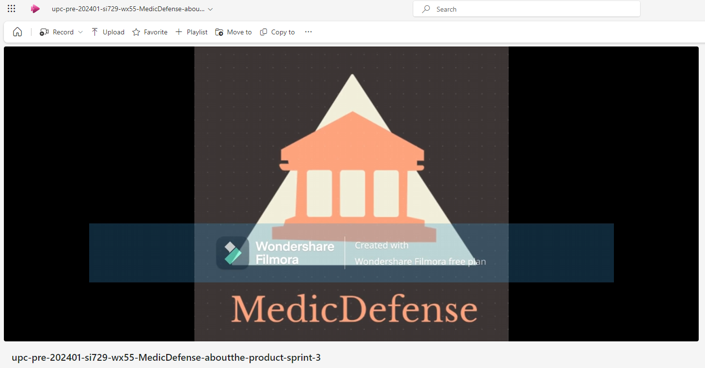

**Enlace del video en Microsoft Stream**: https://upcedupe-my.sharepoint.com/:v:/g/personal/u201922146_upc_edu_pe/EZe_EhcxKgdEkprwnSB2xkYBzAVx31Rxmv5W6OdQyMIGvQ?e=gNhYwA&nav=eyJyZWZlcnJhbEluZm8iOnsicmVmZXJyYWxBcHAiOiJTdHJlYW1XZWJBcHAiLCJyZWZlcnJhbFZpZXciOiJTaGFyZURpYWxvZy1MaW5rIiwicmVmZXJyYWxBcHBQbGF0Zm9ybSI6IldlYiIsInJlZmVycmFsTW9kZSI6InZpZXcifX0%3D

**Enlace del video en Youtube**: https://www.youtube.com/watch?v=sFzDCzFW6g4

## 5.5 Video About-the-Team

**Captura del About-the-Team**

**Enlace del video en Microsoft Stream**: https://upcedupe-my.sharepoint.com/:v:/g/personal/u201922146_upc_edu_pe/ESa2l1PhMVlCimuVke4ecpUBFZTBIBPNwj2X8OXxeJG6AA?e=YDvz98&nav=eyJyZWZlcnJhbEluZm8iOnsicmVmZXJyYWxBcHAiOiJTdHJlYW1XZWJBcHAiLCJyZWZlcnJhbFZpZXciOiJTaGFyZURpYWxvZy1MaW5rIiwicmVmZXJyYWxBcHBQbGF0Zm9ybSI6IldlYiIsInJlZmVycmFsTW9kZSI6InZpZXcifX0%3D

**Enlace del video en Youtube**: https://www.youtube.com/watch?v=2UWytSnFzU0

**Timelapse Total:** [Inicio:00:00, Fin: 19:36]

**Timelapse Gabriel García:** [Inicio: 00:00, Fin: 02:13]

**Timelapse Carlos Avellaneda:** [Inicio: 02:13, Fin: 04:10]

**Timelapse Diego Flores:** [Inicio: 04:10, Fin: 07:58]

**Timelapse Mathias Vasquez:** [Inicio: 07:58, Fin: 11:35]

**Timelapse Anatoly Noriega:** [Inicio: 11:35, Fin: 15:12]

**Timelapse Fabricio Apaza:** [Inicio: 15:12, Fin: 18:31]

**Timelapse Reunión + Voz en Off:** [Inicio: 18:31, Fin: 19:36]

# Conclusiones 

1. Existe una clara necesidad en el mercado médico de servicios especializados en asesoramiento legal y oportunidades laborales específicas en el campo de la anestesiología. La falta de acceso a expertos legales especializados y recursos para una defensa adecuada crea un ambiente de incertidumbre y estrés para los médicos que enfrentan desafíos legales, lo que afecta negativamente su bienestar emocional, su calidad de atención médica y la confianza del paciente. Esta necesidad presenta una oportunidad para la startup de llenar este vacío en el mercado, proporcionando una plataforma tecnológica que conecte a médicos, estudiantes y profesionales del peritaje en anestesiología con peritos, recursos educativos y oportunidades laborales.

2. La estrategia de la startup, que incluye ofrecer opciones de suscripción flexibles y asequibles, establecer asociaciones estratégicas con instituciones médicas y empresas del sector de la salud, y optimizar la experiencia de usuario, está diseñada para abordar las necesidades identificadas en el mercado y lograr el éxito comercial. Al centrarse en proporcionar un valor significativo a los usuarios a través de servicios especializados, contenido de alta calidad y una experiencia de usuario excepcional, la startup puede diferenciarse de la competencia y establecerse como líder en el mercado de servicios de anestesiología.

# Bibliografia
- Tuesta, P(2023). _Existe un déficit de 2417 médicos anestesiólogos en 20 regiones del país_. Convoca.pe. Recuperado de: https://convoca.pe/agenda-propia/existe-un-deficit-de-2417-medicos-anestesiologos-en-20-regiones-del-pais

- Conne, M(2024). _The Markdown Guide_. MarkdownGuide. Recuperado de: https://www.markdownguide.org/
