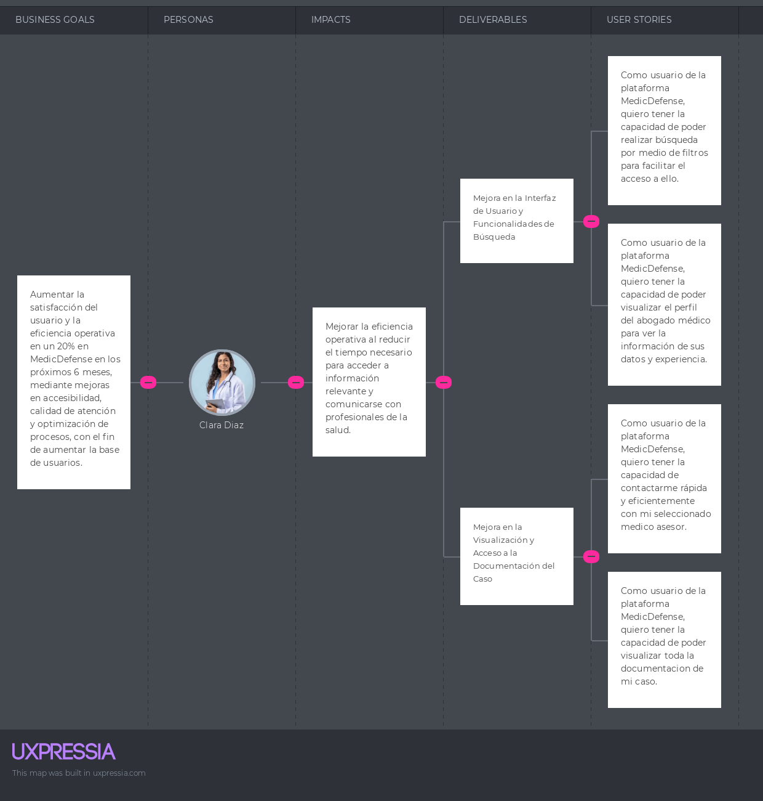
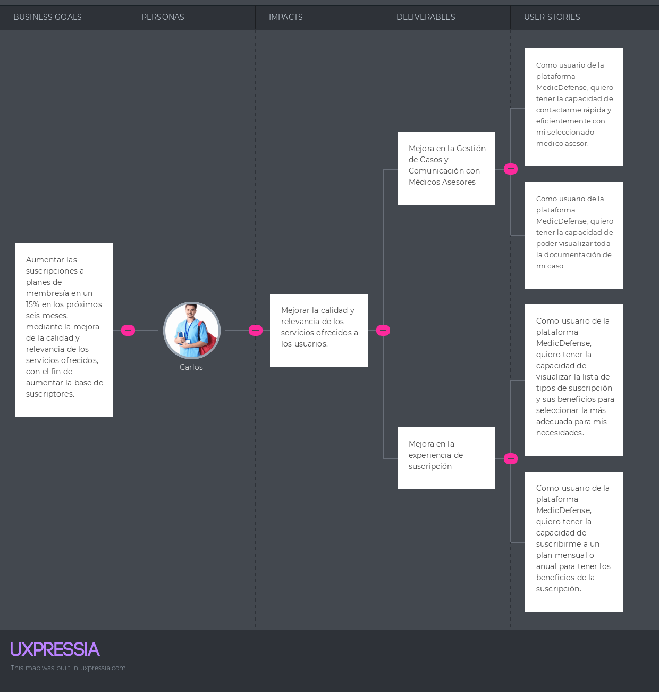

# Capítulo III: Requirements Specification

## 3.1. To-Be Scenario Mapping

Luego de realizar el ai-is con sus fases propuestas, para el to-be se realizaron nuevos procesos enfocados en mejorar las fases de los segmentos objetivos con nuestro proyecto.

**_Segmento Objetivo 1: Clara Diaz - Doctora_**

**_Segmento Objetivo 2: Carlos Orbegozo - Estudiante de Medicina_**

## 3.2. User Stories

Los User Stories sirven para describir de manera más detallada las diferentes funciones de la aplicación, adaptándolas a las necesidades y prioridades de los usuarios. Estas historias también capturan el propósito de uso de las personas, brindando una comprensión más completa de cómo se relacionan con la aplicación y qué esperan lograr con ella.

<table>
    <tr>
        <th>Epic / Story ID</th>
        <th>Título</th>
        <th>Descripción</th>
        <th>Criterios de Aceptación</th>
        <th>Relacionado con (Epic ID)</th>
    </tr>
    <tr>
        <td>EP01</td>
        <td>Funciones de Usuario</td>
        <td>Como médico, deseo tener funciones y opciones relacionadas a mi usuario para manejar mis datos y acciones en la cuenta.</td>
        <td></td>
        <td></td>
    </tr>
    <tr>
        <td>EP02</td>
        <td>Visualizacion de Apartados</td>
        <td>Como médico, deseo tener opciones de detalles y búsqueda para visualizar los datos que me interesan en la plataforma.</td>
        <td></td>
        <td></td>
    </tr>
    <tr>
        <td>EP03</td>
        <td>Landing Page</td>
        <td>Como médico, deseo visitar una Landing Page para informarme sobre MedicDefense y lo que ofrece.</td>
        <td></td>
        <td></td>
    </tr>
    <tr>
        <td>EP04</td>
        <td>Interacción con Abogado</td>
        <td>Como médico, deseo tener funciones y opciones relacionadas al abogado para tratar con él u opinar de sus servicios.</td>
        <td></td>
        <td></td>
    </tr>
    <tr>
    <tr>
        <td>EP05</td>
        <td>Infraestructura y Seguridad</td>
        <td>Como administrador, quiero que la plataforma integre robustos sistemas de seguridad y manejo de datos, para proteger la información de los usuarios.</td>
        <td></td>
        <td></td>
    </tr>
    <tr>
        <td>EP06</td>
        <td>Interacción y Accesibilidad</td>
        <td>Como desarrollador, quiero implementar interfaces y funcionalidades accesibles para mejorar la interacción del usuario con la plataforma.</td>
        <td></td>
        <td></td>
    </tr>
        <td>HU01</td>
        <td>Gestión de las cuentas de los usuarios</td>
        <td>Como usuario de la plataforma de MedicDefense, quiero tener la capacidad de gestionar mi cuenta personal, para mantener mi información profesional actualizada y asegurar que la experiencia de la plataforma sea lo más relevante y segura posible.</td>
        <td>Scenario: Creación y Actualización de Cuenta por el Usuario  GIVEN el usuario necesita crear y actualizar su cuenta para acceder a sus servicios personalizados   WHEN selecciona la opción de crear una nueva cuenta o editar su cuenta existente en la aplicación,  AND completa la información requerida como su nombre, especialidad, correo electrónico, y contraseña,  THEN la aplicación procesa y confirma la creación o actualización de su cuenta.</td>
        <td>EP01</td>
    </tr>
    <tr>
        <td>HU02</td>
        <td>Verificación de Credenciales Médicas</td>
        <td>Como médico registrado en la plataforma, quiero que mi perfil pase por un proceso de verificación de credenciales médicas para aumentar mi credibilidad dentro de la comunidad y tener acceso a recursos especializados.</td>
        <td>Scenario: Subida y Verificación de Credenciales Médicas por el Usuario  GIVEN que el médico se registra en la plataforma y necesita verificar su identidad profesional,  WHEN suba sus documentos de credenciales médicas a través de la interfaz de usuario designada para ello,  AND envíe la documentación para su revisión,  THEN la plataforma inicia el proceso de verificación de manera automática, y una vez verificadas, su perfil se actualiza con un distintivo que indica su estatus verificado.</td>
        <td>EP01</td>
    </tr>
    <tr>
        <td>HU03</td>
        <td>Gestión de Roles de Cuentas</td>
        <td>Como administrador de la plataforma, necesito poder asignar, modificar y revocar roles de usuario para gestionar adecuadamente el acceso a diversas áreas de la plataforma.</td>
        <td>Scenario: Asignación de Rol a un Usuario Nuevo por el Administrador   GIVEN que el administrador de la plataforma necesita asignar roles adecuados a los usuarios según su perfil profesional,   WHEN un usuario nuevo se registra y completa su perfil,  AND revisa la información de perfil y documentos subidos del usuario,  THEN se asigna un rol correspondiente a su perfil (como 'Estudiante de Medicina', 'Médico General', 'Asesor Legal').</td>
        <td>EP01</td>
    </tr>
    <tr>
        <td>HU04</td>
        <td>Eliminar cuenta Usuario</td>
        <td>Como usuario de la plataforma de MedicDefense, quiero poder eliminar mi cuenta para no tener vinculo con el sitio web.</td>
        <td>Scenario: El Usuario elimina una cuenta 
         GIVEN el Cliente quiere eliminar su cuenta del sitio web 
         WHEN complete las verificaciones para ver que sea el usuario de la cuenta,  AND presione el botón "eliminar cuenta" del apartado de configuración,  THEN se eliminara su cuenta exitosamente.</td>
        <td>EP01</td>
    </tr>
    <tr>
        <td>HU05</td>
        <td>Visualización de lista de tipos de suscripción</td>
        <td>Como visitante de la landing page de MedicDefense, quiero visitar la lista de tipos de suscripción para seleccionar alguno.</td>
        <td>Scenario: El Usuario quiere visualizar tipos de suscripciones 
         GIVEN el Cliente quiere visualizar los tipos de suscripciones enl sitio web 
         WHEN tiene curiosidad sobre los precios de las suscripciones para usar el sitio web, 
         AND complete las acciones para dirigirse al apartado, 
         THEN irá al apartado "suscripciones" dentro del sitio web y podrá ver las promociones que tiene el sitio web.</td>
        <td>EP01</td>
    </tr>
    <tr>
        <td>HU06</td>
        <td>Visualizar actividades del Usuario</td>
        <td>Como usuario de la plataforma de MedicDefense,quiero visualizar la lista de las actividades que realizo para tener un control y orden en las acciones que realizo.</td>
        <td>Scenario: El Cliente quiere visualizar sus actividades en el sitio web 
     GIVEN el Cliente quiere visualizar sus actividades 
     WHEN se le asignen en las asesorias y/o reuniones 
     AND complete las acciones para dirigirse al apartado, 
     THEN irá al apartado de "actividades" dentro del sitio web y podrá visualizarlos.</td>
        <td>EP02</td>
    </tr>
    <tr>
    <td>HU07</td>
        <td>Búsqueda por Filtros</td>
        <td>Como usuario de la plataforma MedicDefense, quiero tener la capacidad de poder realizar búsqueda por medio de filtros para facilitar el acceso a ello.</td>
        <td>Scenario: Busqueda de Abogado Médico por el Usuario 
     GIVEN que el usuario necesite realizar una búsqueda de abogado médico, 
     WHEN seleccione la búsqueda por filtros, 
     THEN escoje los parámetros de filtro y la búsqueda será exitosa de acuerdo a lo seleccionado.</td>
        <td>EP02</td>
    </tr>
    <tr>
    <td>HU08</td>
        <td>Suscripción a un plan</td>
        <td>Como usuario de la plataforma MedicDefense, quiero tener la capacidad de suscribirme a un plan mensual o anual para tener los beneficios de la suscripción.</td>
        <td>Scenario: Suscripción a un plan de usuario 
     GIVEN que el usuario quiere inscribirse en la plataforma MedicDefense, 
     WHEN escoje el tipo de suscripción (mensual o anual) de acuerdo a lo que se beneficie, 
     THEN realizara el pago y podra recibir los beneficios de la suscripción escogida.</td>
        <td>EP04</td>
    </tr>
    <tr>
    <td>HU09</td>
        <td>Visualización de Perfil de Abogado Médico</td>
        <td>Como usuario de la plataforma MedicDefense, quiero tener la capacidad de poder visualizar el perfil del abogado médico para ver la información de sus datos y experiencia.</td>
        <td>Scenario: Visualización de perfil 
     GIVEN un usuario quiere ver los perfiles de los abogados médicos en MedicDefense y tiene curiosidad sobre los perfiles de los abogados médicos, 
     WHEN entra a la sección “Perfiles de Abogados” dentro del sitio web, 
     THEN podrá visualizar los perfiles.</td>
        <td>EP02</td>
    </tr>
    <tr>
    <td>HU10</td>
        <td>Visualización del caso y documentos</td>
        <td>Como usuario de la plataforma MedicDefense, quiero tener la capacidad de poder visualizar toda la documentacion de mi caso.</td>
        <td>Scenario: Visualización de documentacion 
     GIVEN un usuario quiere ver su caso con su respectiva documentacion en MedicDefense, 
     WHEN entre a la sección “Resumen”, 
     AND seleccione su caso, 
     THEN podrá visualizar toda la documentacion de su caso.</td>
        <td>EP02</td>
    </tr>
    <tr>
    <td>HU11</td>
        <td>Contacto directo con mi medico asesor</td>
        <td>Como usuario de la plataforma MedicDefense, quiero tener la capacidad de contactarme rapida y eficientemente con mi seleccionado medico asesor.</td>
        <td>Scenario: Contacto con el medido asesor seleccionado 
     GIVEN un usuario quiere contactarse con su medico asesor en MedicDefense, 
     WHEN entre a la sección “Perfiles de Abogados” dentro del sitio web, 
     THEN tendrá la informacion del medico asesor que seleccionó para poder tener contacto con él.</td>
        <td>EP04</td>
    </tr>
    <tr>
    <td>HU12</td>
        <td>Cambiar de medico asesor</td>
        <td>Como usuario de la plataforma MedicDefense, quiero tener la capacidad de poder cambiar de medico asesor si asi lo deseara por motivos personales o reservados.</td>
        <td>Scenario: Cambio de medico defensor/asesor 
     GIVEN que el usuario que quiere cambiar de medico defensor o asesor 
     WHEN  asi lo desee el usuario poder tener contacto con el sitio web y solicitarles personalmente un cambio en el medico que me esta defendiendo o asesorando, 
     THEN entra a la sección "Contacto", esperando que se acepte la solicitud de cambio.</td>
        <td>EP01</td>
    </tr>
    <tr>
    <td>HU13</td>
        <td>Visualización de servicios</td>
        <td>Como visitante de la landing page de MedicDefense, quiero ver una sección donde se expliquen los servicios para estar mejor informado a la hora de confiar en su servicio.</td>
        <td>Scenario: Visualizar información sobre los servicios  GIVEN un usuario visita la landing page,  WHEN se encuentre navegando por la landing page,  THEN encuentra una sección con información acerca de los servicios de MedicDefense.</td>
        <td>EP03</td>
    </tr>
    <tr>
    <td>HU14</td>
        <td>Sección de contacto</td>
        <td>Como visitante de la landing page de MedicDefense, quiero ver una sección de contacto para facilitar la comunicación al momento de solicitar el servicio.</td>
        <td>Scenario: Visualización de una sección de contacto  GIVEN un usuario visita la landing page,  WHEN se encuentre navegando por la landing page,  THEN encuentra una sección de contacto con campos como nombre, correo, teléfono, mensaje para solicitar información.</td>
        <td>EP03</td>
    </tr>
    <tr>
    <td>HU15</td>
        <td>Sección about us</td>
        <td>Como visitante de la landing page de MedicDefense, quiero ver una sección de about us para informarme sobre la empresa que está brindando los servicios.</td>
        <td>Scenario: Visualización de una sección about us  GIVEN un usuario visita la landing page,  WHEN se encuentre navegando por la landing page,  THEN encuentra una sección about us que le brinda información acerca de la empresa cuyos servicios le interesan.</td>
        <td>EP03</td>
    </tr>
    <tr>
    <td>HU16</td>
        <td>Sección de Creadores</td>
        <td>CComo visitante de la landing page de MedicDefense, quiero ver una sección de creadores para facilitar tener el conocimiento de los creadores de la empresa.</td>
        <td>Scenario: Visualización de una sección creadores 
     GIVEN un usuario visita la landing page,
 
     WHEN se encuentre navegando por la landing page,  
    THEN encuentra una sección creadores que le brinda información acerca de los creadores de la empresa.</td>
        <td>EP03</td>
    </tr>
    <tr>
    <td>HU17</td>
        <td>Sección de inicio</td>
        <td>Como visitante de la landing page de MedicDefense, quiero ver una sección de inicio con una barra de navegación para poder desplazarme mejor por la landing page.</td>
        <td>Scenario: Visualización de una sección inicio 
     GIVEN un usuario visita la landing page, 
     WHEN se encuentre navegando por la landing page, 
     THEN encuentra una sección inicio que tenga una barra de navegación donde puede ver el logo para poder desplazarse mejor.</td>
        <td>EP03</td>
    </tr>
    <tr>
    <td>HU18</td>
        <td>Integración de pagos</td>
        <td>Como administrador, quiero integrar un sistema de pagos seguro para gestionar las suscripciones y compras en la plataforma.</td>
        <td>Scenario: Implementar un proceso de pago seguro para las suscripciones. 
     GIVEN un usuario ha elegido un plan de suscripción y desea pagar, 
     WHEN introduce la información de su método de pago y confirma la transacción, 
     AND el sistema verifica la validez de la información de pago, 
     THEN el sistema procesa el pago de forma segura y actualiza el estatus de la suscripción en la base de datos.</td>
        <td>EP05</td>
    </tr>
    <td>HU19</td>
        <td>Base de datos de usuarios</td>
        <td>Como administrador, quiero implementar una base de datos segura y escalable, para proteger y gestionar eficazmente la información de los usuarios.</td>
        <td>Scenario: Acceder a datos de usuario para auditorías internas. 
     GIVEN que el administrador necesita verificar la integridad de los datos de los usuarios, 
     WHEN realiza una consulta en la base de datos, 
     THEN la base de datos valida los permisos del administrador, 
     AND proporciona los datos solicitados de manera rápida y segura.</td>
        <td>EP05</td>
    </tr>
    <td>HU20</td>
        <td>API para gestión de perfiles</td>
        <td>Como desarrollador, quiero APIs robustas para crear, editar y eliminar perfiles de usuario.</td>
        <td>Scenario: Un administrador necesita actualizar información de un perfil por motivos de seguridad. 
     GIVEN que un perfil de usuario necesita actualización urgente, 
     WHEN el administrador modifica y guarda los cambios en el perfil, 
     AND confirma la operación, 
     THEN la API actualiza los datos en la base de datos, 
     AND notifica al administrador que la actualización fue exitosa.
    </td>
        <td>EP06</td>
    </tr>
    <td>HU21</td>
        <td>Logging de Actividades</td>
        <td>Como administrador, quiero un sistema de logging robusto para registrar la actividad en la plataforma, facilitando la auditoría y la detección temprana de problemas.</td>
        <td>Scenario: Registrar una actividad crítica para la auditoría de seguridad. 
     GIVEN que se lleva a cabo una acción crítica en la plataforma, 
     WHEN la acción es ejecutada, 
     THEN el sistema registra detalladamente la acción en los logs de seguridad, 
     AND notifica a los administradores de seguridad sobre la actividad registrada.</td>
        <td>EP05</td>
    </tr>
    <td>HU22</td>
        <td>API para búsqueda por filtros</td>
        <td>Como desarrollador, quiero crear una API para búsquedas por filtros, para mejorar la accesibilidad de la información.</td>
        <td>Scenario: Administrar búsquedas avanzadas para encontrar registros específicos de usuarios. 
     GIVEN que el administrador necesita encontrar perfiles específicos basados en criterios complejos, 
     WHEN utiliza la API de búsqueda por filtros en la interfaz de administración, 
     THEN la API proporciona resultados precisos y rápidos, ayudando al administrador a gestionar eficientemente la información.</td>
        <td>EP06</td>
    </tr>
    <td>HU23</td>
        <td>Servicio de notificaciones</td>
        <td>Como desarrollador, quiero implementar un servicio de notificaciones, para mantener a los usuarios informados.</td>
        <td>Scenario: Notificar a los usuarios sobre una actualización de seguridad importante. 
     GIVEN que se ha emitido una actualización de seguridad, 
     WHEN el sistema procesa la actualización, 
     AND identifica los usuarios afectados, 
     THEN el servicio de notificaciones envía automáticamente alertas, 
     AND los usuarios reciben las notificaciones en tiempo real.</td>
        <td>EP06</td>
    </tr>
    <td>HU24</td>
        <td>Soporte para múltiples navegadores</td>
        <td>Como desarrollador, quiero garantizar la compatibilidad en múltiples navegadores, para una experiencia de usuario uniforme.</td>
        <td>Scenario: Verificar y asegurar la compatibilidad de la plataforma en diferentes navegadores. 
     GIVEN que los administradores y usuarios acceden a la plataforma desde diversos navegadores, 
     WHEN navegan y realizan operaciones críticas, 
     THEN el sistema mantiene una funcionalidad consistente y segura, sin importar el navegador utilizado.</td>
        <td>EP06</td>
    </tr>
</table>

## 3.3. Impact Mapping

En esta sección, se plantearon metas de negocio utilizando los criterios SMART para elaborar el Impact Mapping en base a nuestras User Personas y User Stories.

**Segmento 1**

**Segmento 2**

## 3.4. Product Backlog

<table>
    <tr>
        <th>#Orden</th>
        <th>User Story/Technical Story Id</th>
        <th>Título</th>
        <th>Descripción</th>
        <th>Story Points (1 / 2 / 3 / 5 / 8)</th>
    </tr>
    <tr>
        <td>1</td>
        <td>US01</td>
        <td>Gestión de las cuentas de los usuarios</td>
        <td>Como usuario de la plataforma de MedicDefense, quiero tener la capacidad de gestionar mi cuenta personal, para mantener mi información profesional actualizada y asegurar que la experiencia de la plataforma sea lo más relevante y segura posible.</td>
        <td>3</td>
    </tr>
    <tr>
        <td>2</td>
        <td>US02</td>
        <td>Verificación de credenciales médicas</td>
        <td>Como médico registrado en la plataforma, quiero que mi perfil pase por un proceso de verificación de credenciales médicas para aumentar mi credibilidad dentro de la comunidad y tener acceso a recursos especializados.</td>
        <td>5</td>
    </tr>
    <tr>
        <td>3</td>
        <td>US03</td>
        <td>Gestión de roles de cuentas</td>
        <td>Como administrador de la plataforma, necesito poder asignar, modificar y revocar roles de usuario para gestionar adecuadamente el acceso a diversas áreas de la plataforma.</td>
        <td>5</td>
    </tr>
    <tr>
        <td>4</td>
        <td>US04</td>
        <td>Eliminar cuenta Usuario</td>
        <td>Como usuario de la plataforma de MedicDefense,necesito poder eliminar mi cuenta en caso sea necesario para no tener vinculo con el sitio web.</td>
        <td>3</td>
    </tr>
     <tr>
        <td>5</td>
        <td>US05</td>
        <td>Visualización de lista de tipos de suscripción</td>
        <td>Como usuario de la plataforma de MedicDefense,quiero visualizar la lista de tipos de suscripción para seleccionar alguno.</td>
        <td>2</td>
    </tr>
    <tr>
        <td>6</td>
        <td>US06</td>
        <td>Visualizar actividades del Usuario</td>
        <td>Como usuario de la plataforma de MedicDefense,quiero visualizar la lista de las actividades que realizo para tener un control y orden en las acciones que realizo.</td>
        <td>5</td>
    </tr>
    <tr>
        <td>7</td>
        <td>US07</td>
        <td>Búsqueda por Filtros</td>
        <td>Como usuario de la plataforma MedicDefense, quiero tener la capacidad de poder realizar búsqueda por medio de filtros para facilitar el acceso a ello.</td>
        <td>5</td>
    </tr>
    <tr>
        <td>8</td>
        <td>US08</td>
        <td>Suscripción a un plan</td>
        <td>Como usuario de la plataforma MedicDefense, quiero tener la capacidad de suscribirme a un plan mensual o anual para tener los beneficios de la suscripción.</td>
        <td>5</td>
    </tr>
    <tr>
        <td>9</td>
        <td>US09</td>
        <td>Visualización de Perfil de Abogado Médico</td>
        <td>Como usuario de la plataforma MedicDefense, quiero tener la capacidad de poder visualizar el perfil del abogado médico para ver la información de sus datos y experiencia.</td>
        <td>5</td>
    </tr>
    <tr>
        <td>10</td>
        <td>US10</td>
        <td>Visualización del caso y documentos</td>
        <td>Como usuario de la plataforma MedicDefense, quiero tener la capacidad de poder visualizar toda la documentacion de mi caso.</td>
        <td>5</td>
    </tr>
    <tr>
        <td>11</td>
        <td>US11</td>
        <td>Contacto directo con mi medico asesor</td>
        <td>Como usuario de la plataforma MedicDefense, quiero tener la capacidad de contactarme rapida y eficientemente con mi seleccionado medico asesor.</td>
        <td>5</td>
    </tr>
    <tr>
        <td>12</td>
        <td>US12</td>
        <td>Cambiar de medico asesor</td>
        <td>Como usuario de la plataforma MedicDefense, quiero tener la capacidad de poder cambiar de medico asesor si asi lo deseara por motivos personales o reservados.</td>
        <td>3</td>
    </tr>
    <tr>
        <td>13</td>
        <td>US13</td>
        <td>Visualización de servicios</td>
        <td>Como visitante de la landing page de MedicDefense, quiero ver una sección donde se expliquen los servicios para estar mejor informado a la hora de confiar en su servicio.</td>
        <td>5</td>
    </tr>
    <tr>
        <td>14</td>
        <td>US14</td>
        <td>Sección de contacto</td>
        <td>Como visitante de la landing page de MedicDefense, quiero ver una sección de contacto para facilitar la comunicación al momento de solicitar el servicio.</td>
        <td>5</td>
    </tr>
    <tr>
        <td>15</td>
        <td>US15</td>
        <td>Sección de about us</td>
        <td>Como visitante de la landing page de MedicDefense, quiero ver una sección de about us para informarme sobre la empresa que está brindando los servicios.</td>
        <td>3</td>
    <tr>
        <td>16</td>
        <td>US16</td>
        <td>Sección de contacto</td>
        <td>Como visitante de la landing page de MedicDefense, quiero ver una sección de creadores para facilitar tener el conocimiento de los creadores de la empresa.</td>
        <td>3</td>
    </tr>
    <tr>
    <td>17</td>
        <td>US17</td>
        <td>Sección de inicio</td>
        <td>Como visitante de la landing page de MedicDefense, quiero ver una sección de inicio con una barra de navegación para poder desplazarme mejor por la landing page.</td>
        <td>3</td>
    </tr>
</table>
